# Right Ventricular Dilation in Previously Athletic Individuals Distinguishing Physiologic Adaptation from Pathology
## A Comprehensive Review
## Author
Tushar N. Shah, MD, FACC, FAHA, FACP, FASE

241 Summerford Place
Centerville, Ohio 45458, USA
Email: tushar.shah@mac.com
Phone: 937-371-1677

## Disclosures
The author has no conflicts of interest to disclose.

## Funding
No external funding was received for this work.

## Keywords
Right ventricular dilation; athlete's heart; arrhythmogenic right ventricular cardiomyopathy; ARVC; sports cardiology; cardiac magnetic resonance imaging; sudden cardiac death; detraining; physiologic remodeling; inherited cardiomyopathy

## Abstract
Right ventricular (RV) dilation in previously athletic individuals presents a diagnostic challenge, requiring differentiation between physiologic remodeling ("athlete's heart") and early pathologic processes such as arrhythmogenic right ventricular cardiomyopathy (ARVC). Physiologic RV remodeling occurs as an adaptive response to sustained endurance training, characterized by global biventricular enlargement, preserved systolic function (RVEF >45%), and absence of tissue abnormalities on cardiac magnetic resonance imaging. In contrast, pathologic dilation typically manifests with disproportionate RV enlargement (RV/LV end-diastolic volume ratio >1.2), regional wall motion abnormalities, reduced RV ejection fraction, late gadolinium enhancement, and increased arrhythmic burden. This review provides a comprehensive framework for clinical assessment, incorporating detailed athletic and family history, electrocardiographic interpretation using athlete-specific criteria, multimodality imaging protocols, and risk stratification strategies. Key diagnostic discriminators include the pattern of chamber remodeling (global vs focal), tissue characterization findings, arrhythmia profile with exercise testing, and reversibility with detraining. We present evidence-based algorithms for initial evaluation, indications for advanced imaging and genetic testing, and risk-stratified follow-up protocols. Exercise recommendations must balance athlete autonomy with emerging data on exercise-induced disease progression in genotype-positive individuals. Shared decision-making, meticulous documentation, and appropriate specialist referral for high-risk features remain cornerstones of optimal care. This review synthesizes current evidence and consensus guidelines to guide clinicians managing this complex intersection of sports cardiology and inherited cardiomyopathy.

## Introduction
Right ventricular (RV) dilation detected on echocardiography in an asymptomatic previously athletic individual presents a challenging clinical scenario at the intersection of sports cardiology, inherited cardiomyopathy, and preventive cardiovascular medicine. The fundamental question is whether RV enlargement represents benign training-induced adaptation ("athlete's heart") or early pathology, most notably arrhythmogenic right ventricular cardiomyopathy (ARVC).

The clinical stakes are substantial. Misclassifying physiologic remodeling as pathology may lead to unnecessary athletic restrictions, psychological distress, and costly investigations. Conversely, failing to recognize early ARVC or other pathologic RV disease exposes athletes to risk of ventricular arrhythmias and sudden cardiac death (SCD), particularly during high-intensity exercise.

Chronic endurance exercise induces predictable cardiac remodeling, including RV dilation, as an adaptive response to volume overload. However, the magnitude and pattern of RV remodeling exists along a continuum, and the distinction between "normal athletic adaptation" and "early cardiomyopathy" is not always clear-cut. This challenge is compounded by several factors: (1) athlete-specific reference ranges for RV dimensions are less well-established than for left ventricular parameters; (2) physiologic RV remodeling may regress only partially or slowly after detraining; (3) genetic predisposition to ARVC may be unmasked or accelerated by intensive exercise; and (4) overlap exists between imaging and electrocardiographic findings in elite athletes and early ARVC.[^1] [^2] [^3]

Recent advances in multimodality cardiovascular imaging, refined electrocardiographic criteria, emerging genetic testing paradigms, and longitudinal athlete cohort studies have improved diagnostic discrimination. Cardiac magnetic resonance (CMR) imaging has enhanced the ability to characterize RV tissue properties, detect regional wall motion abnormalities, and quantify chamber volumes with precision. International consensus statements from the Heart Rhythm Society (HRS), American College of Cardiology (ACC), American Heart Association (AHA), and European Society of Cardiology have provided updated frameworks for arrhythmia evaluation in athletes and management of inherited arrhythmogenic cardiomyopathies.[^4] [^5] [^6]

This comprehensive review synthesizes current evidence and consensus guidelines to provide a practical, structured approach for evaluating previously athletic individuals with RV dilation. We address four key clinical questions: (1) What features reliably distinguish physiologic RV remodeling from pathologic dilation? (2) What is the expected time course and extent of RV regression after detraining? (3) What constitutes an evidence-based diagnostic evaluation strategy? (4) How should follow-up, exercise counseling, and specialist referral be managed?

## Physiologic RV Remodeling in Athletes
Physiologic RV remodeling represents an adaptive structural and functional response to sustained volume and pressure loads from endurance or mixed aerobic-anaerobic training. These changes reflect the heart's capacity to accommodate markedly increased cardiac output demands of regular high-intensity exercise.

### Mechanisms and Structural Features
Chronic exercise leads to mild-to-moderate RV dilation, typically accompanied by balanced left ventricular (LV) remodeling. Key characteristics include: (1) chamber enlargement without disproportionate hypertrophy—the thin-walled RV adapts predominantly by increasing end-diastolic volume rather than developing marked concentric hypertrophy; (2) global, not focal, remodeling—structural changes involve diffuse cavity enlargement with preserved geometry, without sacculations, aneurysms, or discrete regional wall motion abnormalities; and (3) coupled biventricular adaptation—LV and RV enlargement are usually proportionate, with preserved or only mildly reduced biventricular systolic function.[^7] [^8] [^9]

The degree of RV remodeling scales with training volume and intensity, career duration, age, and body surface area. Marked RV enlargement without LV involvement should prompt careful reassessment for pathology.

### Imaging Characteristics
Echocardiography: Physiologic RV remodeling is characterized by RV dimensions above general-population reference limits but within athlete-specific normative ranges, preserved or mildly reduced systolic function (normal TAPSE, RV S', fractional area change), balanced biventricular enlargement, and absence of focal abnormalities. Advanced 2D speckle-tracking demonstrates normal global and regional RV strain, even when the RV outflow tract appears enlarged.[^10] [^11] [^12]

Cardiac MRI: CMR provides superior anatomic and tissue characterization. Physiologic remodeling shows global RV dilation with preserved geometry (diffuse rather than segmental enlargement), RV ejection fraction typically >45%, proportionate RV-LV volumes (RV/LV end-diastolic volume ratio usually ≤1.2), and absence of tissue abnormalities (no late gadolinium enhancement, fibro-fatty infiltration, or edema).[^13] [^14] [^15]

Application of athlete-specific reference values is critical to avoid overdiagnosis. When available, clinicians should consult athlete-centric normative datasets and multimodality imaging recommendations for young adult competitive athletes.

### Risk Profile
Physiologic RV remodeling is not associated with increased arrhythmia or SCD risk when remodeling is symmetric and balanced between RV and LV, systolic function is preserved or only mildly reduced without focal wall motion abnormalities, and no high-risk clinical features are present (exertional syncope, family history of arrhythmogenic cardiomyopathy or SCD, marked ECG abnormalities, or frequent ventricular ectopy).[^16] [^17] [^18]

## Pathologic RV Dilation
Pathologic RV dilation reflects structural and functional remodeling driven by underlying disease rather than physiologic adaptation to exercise. The key challenge is recognizing when RV enlargement signals ARVC, pulmonary hypertension, or other disease entities rather than benign "athlete's heart."

### Arrhythmogenic Right Ventricular Cardiomyopathy
ARVC is a heritable cardiomyopathy characterized by fibro-fatty replacement of RV myocardium, regional wall motion abnormalities, and high risk of ventricular arrhythmias and SCD in young adults and athletes. Intense endurance exercise may unmask or accelerate disease expression.[^19] [^20] [^21]

Pathophysiology: Progressive loss of RV myocytes with fibro-fatty replacement, often beginning in the RV inflow, outflow, and apex (the "triangle of dysplasia"), leads to regional akinesia, dyskinesia, or aneurysmal segments. RV dilation is often disproportionate to LV remodeling, with RV/LV EDV ratio frequently >1.2. As disease advances, global RV systolic dysfunction emerges (RVEF often ≤45%), with late biventricular involvement and heart failure common.[^22] [^23] [^24]

Clinical Features: Symptoms include palpitations, presyncope, syncope, and ventricular arrhythmias, often with left bundle branch block morphology and exercise-related onset. Family history may reveal ARVC or premature SCD in first-degree relatives. ECG features include T-wave inversions in V1-V3 or V1-V4 (beyond age/training expectations), epsilon waves, prolonged terminal QRS activation, and frequent ventricular ectopy or NSVT with LBBB morphology.[^25] [^26] [^27]

Imaging: Echocardiography shows global or regional RV dilation often exceeding athlete-specific values, localized bulging/thinning/hypokinesia of RV free wall/outflow tract/apex, RV aneurysms or sacculations in advanced disease, and reduced RV fractional area change with abnormal TAPSE/RV S'. CMR demonstrates regional wall motion abnormalities (akinesia/dyskinesia), aneurysms, segmental dilation, late gadolinium enhancement and/or fibro-fatty infiltration in affected segments, disproportionately increased RV volumes relative to LV, and reduced RVEF.[^28] [^29] [^30]

### Pulmonary Hypertension and RV Pressure Overload
Pulmonary hypertension leads to increased RV afterload, resulting in RV hypertrophy, progressive chamber dilation, and eventual systolic dysfunction. Early response is concentric RV hypertrophy; chronic pressure overload leads to progressive chamber dilation as contractile reserve is exhausted. Interventricular septal flattening or leftward bowing (D-shaped LV) reflects pressure/volume overload.[^31] [^32] [^33]

Echocardiography shows RV and right atrial enlargement with increased RV wall thickness, elevated pulmonary artery systolic pressure estimates, significant tricuspid regurgitation, septal flattening or paradoxical motion, and reduced RV systolic function (low TAPSE, RV S', fractional area change) in later stages. Right heart catheterization is required to confirm PH and characterize hemodynamic subtype.[^34] [^35]

### Other Causes
Myocarditis (viral, immune-mediated, or drug-induced) can involve the RV, leading to dilation and dysfunction, with clinical presentation ranging from chest pain and troponin elevation to heart failure and malignant arrhythmias. CMR demonstrates edema and late gadolinium enhancement in non-ischemic patterns.[^36]

Congenital heart disease (atrial septal defects, partial anomalous pulmonary venous return, Ebstein anomaly, repaired tetralogy of Fallot with significant pulmonary regurgitation) can result in chronic RV volume or pressure overload and progressive dilation.[^37] [^38]

## Differentiating Physiologic from Pathologic RV Dilation
Distinguishing physiologic from pathologic RV dilation requires systematic, multiparametric assessment integrating clinical history, arrhythmia profile, and advanced imaging.

### Clinical History and Family History
Physiologic RV dilation is typically seen in asymptomatic athletes with high-level endurance or mixed training history, and no personal or family history of cardiomyopathy, SCD, or unexplained syncope. Pathologic RV dilation—especially ARVC—is more likely with family history of ARVC or SCD, personal history of syncope, palpitations, or documented ventricular arrhythmias. Familial occurrence and prior syncope or arrhythmic events are major risk factors for ARVC and should prompt further evaluation.[^39] [^40] [^41]

### ECG and Arrhythmia Profile
Athlete's heart is associated with benign ECG findings: sinus bradycardia, early repolarization, and isolated ectopy. Pathologic RV dilation, particularly ARVC, is suggested by T-wave inversion in V1-V3, epsilon waves, QRS fragmentation, and ventricular arrhythmias with LBBB morphology. High arrhythmic burden (>1,000 PVCs/24h, especially non-RVOT origin), sustained VT, or syncope are high-risk features. Suppression of PVCs with exercise and absence of symptoms are reassuring; emergence of arrhythmias during exercise/recovery, or polymorphic PVCs, are concerning.[^42] [^43] [^44]

### Structural and Functional Imaging
Physiologic RV dilation is characterized by global, mild-to-moderate RV enlargement with preserved or only mildly reduced systolic function (RVEF >45%), balanced LV remodeling, RV/LV EDV ratio ≤1.2, absence of focal wall motion abnormalities, aneurysms, or late gadolinium enhancement, and normal RV strain. Pathologic RV dilation (ARVC) is indicated by regional wall motion abnormalities, RV aneurysms, sacculations, RVEF ≤45%, RV/LV EDV ratio >1.2, and late gadolinium enhancement. Isolated RV dilation without LV changes, or presence of segmental dysfunction, is highly suspicious for pathology. CMR is superior to echocardiography for detecting regional abnormalities and tissue characterization.[^45] [^46] [^47] [^48]

### Comprehensive Comparison Table
| Feature                 | Physiologic RV Dilation                                  | Pathologic RV Dilation (ARVC)                                    |
|-------------------------|----------------------------------------------------------|------------------------------------------------------------------|
| **Symptoms**        | Asymptomatic, no family history                          | Syncope, palpitations, family history of SCD/ARVC                |
| **ECG**             | Sinus bradycardia, early repolarization, isolated ectopy | TWI V1-V3, epsilon waves, QRS fragmentation, high PVC burden, VT |
| **PVC Burden**      | Low, monomorphic, suppressed with exercise               | High (>1000/24h), polymorphic, not suppressed with exercise     |
| **RV Size Pattern** | Mild-moderate global dilation, RV/LV EDV ratio ≤1.2      | Moderate-severe, RV/LV EDV ratio >1.2, may be focal             |
| **RV Function**     | Preserved or mildly reduced (RVEF >45%)                 | Reduced (RVEF ≤45%)                                              |
| **Wall Motion**     | No regional abnormalities                                | Regional akinesia, dyskinesia, aneurysm                          |
| **CMR Tissue**      | No LGE                                                   | LGE present (fibro-fatty infiltration)                           |
| **LV Involvement**  | Balanced biventricular enlargement                       | Unbalanced, LV often normal or mildly affected                   |
| **Detraining**      | Partial or complete RV size regression                   | No significant regression, may progress                          |

## Reversibility and Time Course of RV Dilation
### Evidence for Reversibility
Athlete's heart is characterized by structural and functional cardiac adaptations that are substantially reversible following detraining. Prospective studies demonstrate that reductions in training load—such as cessation of regular exercise or transition to low-intensity activity—lead to measurable decreases in cardiac chamber dimensions and mass within 4-8 weeks of detraining.[49-51]

LV wall thickness and mass decrease by 10-20%, with LV end-diastolic volume returning toward baseline. RV end-diastolic area and volume decrease by approximately 8-15% after 8 weeks, though the rate of regression may be slower than for LV. Both left and right atrial dimensions also decrease. These changes occur independently of plasma volume shifts, indicating true myocardial remodeling. Balanced biventricular remodeling seen during training is maintained during detraining.[52-54]

In former elite athletes, long-term deconditioning (months to years after retirement) results in normalization of LV and RV chamber sizes and wall thicknesses approaching sedentary, age-matched controls. The extent of regression is proportional to reduction in exercise capacity and VO₂peak.[^55]

The reversibility reflects the dynamic nature of cardiac adaptation to hemodynamic load. The LV tends to regress more rapidly than the RV, possibly due to differences in wall thickness and response to volume versus pressure load. Regression is not solely explained by changes in plasma volume; true myocardial remodeling occurs with reductions in myocyte size and extracellular matrix.[^56]

### Evidence Gaps
Significant evidence gaps remain regarding the exact time course and mechanisms of detraining-induced reversibility, particularly for RV remodeling. Most studies show LV mass and wall thickness regress within 4-8 weeks, while RV size reduction may lag, but precise sequence and duration for full normalization are not well defined. The impact of training intensity, duration, and sport discipline on rate and completeness of regression is poorly characterized. There is insufficient understanding of how age, sex, body size, genetic background, and comorbidities affect reversibility. The relative contributions of plasma volume contraction, myocyte remodeling, and neurohormonal changes are incompletely understood. It is unknown whether all exercise-induced changes fully regress or if some adaptations persist indefinitely. The optimal duration and frequency of serial imaging during detraining to distinguish physiologic adaptation from early cardiomyopathy is not established.[57-59]

### Factors Affecting Reversibility
The reversibility and time course of RV dilation depend on training intensity and duration, age, body size, sex, and comorbidities. RV dilation is most pronounced in athletes with high-volume, long-duration endurance training. The greater the cumulative training load, the more marked the RV adaptation and slower the regression. Initial reductions in LV mass and wall thickness occur within 4 weeks, while significant RV size reduction typically follows at 8 weeks or later. Athletes with more extensive training histories may require longer periods for full normalization, and some residual enlargement may persist. Older athletes and those with larger body surface area tend to exhibit greater RV and RA dimensions associated with slower regression. Female athletes generally show less pronounced RV remodeling and may experience more rapid regression. Underlying cardiac or systemic conditions and genetic predisposition to cardiomyopathy can alter the pattern and reversibility of RV dilation.[60-62]

### Clinical Application
Detraining is a useful clinical tool to distinguish physiologic adaptation from early cardiomyopathy. Serial imaging during a period of detraining (typically 2-3 months) can clarify whether chamber enlargement and function normalize. A structured approach involves baseline imaging at peak fitness, followed by repeat echocardiography at 4-8 weeks and, if needed, at 3 months of detraining. Persistent or ambiguous findings, especially isolated RV dilation or reduced function, warrant CMR for definitive assessment. However, some pathologic changes—such as mild dilation in early ARVC—may also regress, so clinical context, family history, and genetic testing remain essential for definitive diagnosis.[63-65]

## Diagnostic Evaluation Strategy
### Initial Clinical Assessment
Comprehensive evaluation begins with structured history anchoring RV findings within the athlete's training phenotype and risk profile. Key elements include: type of sport (endurance, mixed, or strength-based), cumulative training load (hours per week, years of participation, competition level), and timeline and extent of detraining, as physiologic RV remodeling is most pronounced in long-standing, high-volume endurance or mixed-sport athletes and may partially regress after several weeks to months of training reduction.[66-68]

Symptom screening should explicitly explore palpitations, exertional or unexplained syncope/presyncope, exertional intolerance, atypical chest discomfort, and abrupt performance decline, as these may signal arrhythmogenic cardiomyopathy, pulmonary hypertension, or myocarditis rather than benign adaptation. A focused review of potential triggers and comorbidities (recent viral illness, autoimmune disease, chemotherapy/immunotherapy, sleep apnea, stimulant use, anabolic steroid exposure) helps contextualize RV findings.[69-71]

Family history should systematically document cardiomyopathy, unexplained heart failure, ICD placement, and SCD <40-50 years in first- and second-degree relatives, along with any known pathogenic variants, as these substantially raise suspicion for inherited conditions such as ARVC. Clarifying whether syncope episodes were clearly vasovagal versus exertional, and whether symptoms cluster around high-intensity exercise, is particularly important.[72-74]

### Baseline Testing
Baseline investigations aim to determine whether the overall phenotype behaves like athlete's heart with balanced adaptation or resembles early cardiomyopathy or pressure/volume overload.

12-lead ECG should be interpreted using athlete-specific criteria, distinguishing "normal" training-related patterns (sinus bradycardia, early repolarization, isolated voltage criteria for LVH) from concerning repolarization or depolarization abnormalities (T-wave inversion beyond V1 in non-Black athletes or beyond V4 in most athletes, epsilon waves, low voltages, pathological Q waves, or frequent PVCs with LBBB morphology), all of which increase pre-test probability for ARVC.[75-77]

Transthoracic echocardiography should carefully quantify RV size (basal/mid diameters, longitudinal dimension), function (TAPSE, RV S', fractional area change), and estimated RVEF, while simultaneously assessing LV dimensions and function to determine whether remodeling is global and biventricular or isolated to the RV. Use of athlete-specific normative data is critical; RV dimensions above population cutoffs may still be physiologic if LV remodeling is proportionate and global function and strain remain preserved.[78-80]

Ambulatory rhythm monitoring (24-48-hour Holter or longer patch monitoring) quantifies PVC burden, complexity, and NSVT, and documents circadian and exercise-related behavior. High PVC burden (especially polymorphic PVCs, couplets, triplets, or NSVT) or runs that intensify with exercise are more concerning than infrequent monomorphic PVCs that suppress with exertion.[81-83]

Exercise stress testing complements ambulatory monitoring by interrogating arrhythmia dynamics and RV contractile reserve. Physiologic remodeling is typically characterized by improved biventricular systolic performance and either suppression or stability of benign ectopy with graded exercise, whereas pathologic substrates may show arrhythmia induction/escalation or failure of RV function to augment appropriately.[84-86]

### Advanced Imaging and Targeted Testing
Cardiac MRI becomes pivotal when the echo-ECG-clinical picture is discordant or when echo suggests segmental wall motion abnormalities, RV/LV EDV ratio >1.2, impaired RVEF, or uncertainty regarding presence of scar or fibro-fatty change. CMR provides high-fidelity quantification of RV and LV volumes, ejection fractions, and RV/LV ratios, and allows tissue characterization with T1/T2 mapping and late gadolinium enhancement.[87-89]

In asymptomatic or minimally symptomatic athletes, a CMR pattern of global, proportionate biventricular enlargement with preserved RVEF and no LGE strongly favors physiologic remodeling, whereas regional dyskinesia/aneurysms, disproportionate RV enlargement, RVEF ≤45%, and LGE in RV free wall or LV subepicardium shift probability toward ARVC or myocarditis.[90-92]

Genetic testing should be pursued selectively, guided by suspicious phenotype or family history, rather than as blanket screening. In line with cardiomyopathy guidelines, systematic genetic evaluation begins with a three-generation pedigree, targeted phenotyping of relatives where possible, and consideration of multi-gene panels including common desmosomal and non-desmosomal genes (PKP2, DSP, DSG2, DSC2, JUP) when ARVC or broader arrhythmogenic cardiomyopathy is suspected. Pre- and post-test genetic counseling is essential to interpret variants of uncertain significance.[93-95]

Referral to an inherited cardiomyopathy/ARVC specialist center is appropriate when diagnostic uncertainty persists, when there is strong family history, when high-risk imaging or arrhythmic features are present, or when decisions around ICD implantation, sports restriction, and cascade screening are being considered.[96-98]

### Risk Stratification
Risk stratification integrates the above data into a coherent phenotype. Features that raise concern for ARVC or other pathology include: isolated or asymmetric RV dilation (especially RV/LV EDV ratio >1.2), RVEF ≤45%, focal wall motion abnormalities or aneurysms, presence of LGE or tissue abnormalities on CMR, high-burden or complex ventricular arrhythmias (NSVT, polymorphic PVCs, exercise-induced VT), and positive family history of cardiomyopathy or SCD.[99-101]

Features supporting diagnosis of physiologic remodeling include: global, proportionate biventricular enlargement; preserved or only mildly reduced RV function without regional abnormalities; benign ECG pattern compatible with training; low arrhythmic burden that remains stable or suppresses with exercise; absence of symptoms; and negative family history.[102-104]

## Diagnostic Algorithm for RV Dilation in Athletes
┌─────────────────────────────────────────────────────────────────┐

│ RV DILATION IDENTIFIED ON ECHOCARDIOGRAPHY IN │

│ ASYMPTOMATIC PREVIOUSLY ATHLETIC INDIVIDUAL │

└────────────────────────────┬────────────────────────────────────┘

│

▼

┌─────────────────────────────────────────────────────────────────┐

│ STEP 1: COMPREHENSIVE CLINICAL ASSESSMENT │

├─────────────────────────────────────────────────────────────────┤

│ • Detailed athletic history (sport, intensity, duration) │

│ • Training status & detraining timeline │

│ • Symptom screen: syncope, palpitations, chest pain │

│ • 3-generation family history (SCD, cardiomyopathy, ICD) │

│ • Exclude secondary causes (PH, congenital, valvular) │

└────────────────────────────┬────────────────────────────────────┘

│

▼

┌─────────────────────────────────────────────────────────────────┐

│ STEP 2: BASELINE INVESTIGATIONS │

├─────────────────────────────────────────────────────────────────┤

│ • 12-lead ECG (athlete-specific interpretation) │

│ • Comprehensive echocardiography with: │

│ - RV dimensions & function (TAPSE, RV S', FAC, RVEF) │

│ - LV dimensions & function │

│ - RV/LV volume ratio assessment │

│ - Strain imaging if available │

│ • 24-48hr Holter monitoring (PVC burden & morphology) │

│ • Exercise stress test (arrhythmia response, RV reserve) │

└────────────────────────────┬────────────────────────────────────┘

│

┌──────────────┴──────────────┐

│ │

▼ ▼

┌─────────────────┐ ┌──────────────────────┐

│ LOW-RISK │ │ HIGH-RISK FEATURES │

│ PHENOTYPE │ │ PRESENT │

└────────┬─────────┘ └──────────┬───────────┘

│ │

▼ ▼

┌──────────────────────────┐ ┌────────────────────────────────┐

│ LOW-RISK FEATURES: │ │ HIGH-RISK FEATURES: │

│ • Global biventricular │ │ • Isolated/asymmetric RV │

│ enlargement │ │ dilation │

│ • RV/LV ratio ≤1.2 │ │ • RV/LV ratio >1.2 │

│ • RVEF >45% │ │ • RVEF ≤45% │

│ • No regional WMA │ │ • Regional WMA/aneurysm │

│ • Benign ECG pattern │ │ • T-wave inv V1-V3, epsilon │

│ • Low PVC burden │ │ • High PVC burden, NSVT/VT │

│ • No family history │ │ • Positive family history │

│ • Asymptomatic │ │ • Syncope, palpitations │

└──────────┬───────────────┘ └────────────┬───────────────────┘

│ │

▼ ▼

┌────────────────────────┐ ┌─────────────────────────────────┐

│ CONSIDER DETRAINING │ │ PROCEED TO STEP 3: │

│ TRIAL (2-3 months) │ │ ADVANCED TESTING │

│ + Repeat Echo │ ├─────────────────────────────────┤

└────────┬───────────────┘ │ • Cardiac MRI with: │

│ │ - RV/LV volumetry │

│ │ - Tissue characterization │

▼ │ - LGE assessment │

┌───────────────────┐ │ - T1/T2 mapping │

│ RV Size │ │ • Genetic testing panel │

│ Regresses? │ │ (PKP2, DSP, DSG2, DSC2, JUP) │

└────┬──────────────┘ │ • Specialist referral: │

│ │ - Inherited cardiomyopathy │

Yes │ No │ - Electrophysiology │

│ └─────────────┬───────────────────┘

▼ │

┌─────────────────┐ ┌──────────────────────────────┐

│ PHYSIOLOGIC │ │ INTEGRATE FINDINGS: │

│ REMODELING │ │ ARVC vs ATHLETE'S HEART │

│ - Continue │ │ - Apply Task Force Criteria │

│ recreational │ │ - Risk stratification │

│ activity │ │ - Exercise restriction │

│ - Annual f/u │ │ - Cascade screening │

│ - Surveillance │ │ - ICD consideration │

│ imaging │ │ - Close follow-up │

└─────────────────┘ └──────────────────────────────┘

Key Decision Points:
- RV/LV EDV ratio >1.2 → High suspicion for pathology
- RVEF ≤45% → Warrants cardiac MRI
- High PVC burden or NSVT → Electrophysiology evaluation
- Positive family history + any abnormality → Genetic testing
- No regression with detraining → Suspect pathology

## Risk Stratification and Management Table
| Risk Category                                    | Clinical Features                                                                                                                        | Imaging Findings                                                                                                                                                                 | ECG/Arrhythmia                                                                                                                                 | Follow-Up Protocol                                                                                                                                                        | Exercise Recommendations                                                                                                                                                             | Escalation Triggers                                                                                                                                                                        |
|--------------------------------------------------|------------------------------------------------------------------------------------------------------------------------------------------|----------------------------------------------------------------------------------------------------------------------------------------------------------------------------------|------------------------------------------------------------------------------------------------------------------------------------------------|---------------------------------------------------------------------------------------------------------------------------------------------------------------------------|--------------------------------------------------------------------------------------------------------------------------------------------------------------------------------------|--------------------------------------------------------------------------------------------------------------------------------------------------------------------------------------------|
| **Low Risk<br>(Physiologic)**              | • Asymptomatic<br>• High-level training history<br>• No family history<br>• Appropriate detraining history                         | • Global biventricular enlargement<br>• RV/LV ratio ≤1.2<br>• RVEF >45%<br>• No regional WMA<br>• No LGE on CMR<br>• Normal strain                                    | • Sinus bradycardia<br>• Early repolarization<br>• Isolated PVCs<br>• <1000 P0VCs/24hr<br>• Exercise suppression of ectopy             | • Annual clinical review<br>• Annual ECG + echo<br>• Ambulatory monitoring if ectopy<br>• Consider detraining trial                                                 | • Continue training/competition<br>• Avoid acute load spikes<br>• Maintain hydration<br>• No restrictions needed                                                               | • New symptoms<br>• Rising PVC burden<br>• Change in RV function<br>• New ECG abnormalities<br>• Positive family history emerges                                                   |
| **Intermediate Risk<br>(Borderline)**      | • Asymptomatic or minimal symptoms<br>• Uncertain family history<br>• Incomplete detraining data<br>• Possible performance decline | • Mild RV enlargement with borderline LV<br>• RV/LV ratio 1.0-1.2<br>• RVEF 45-50%<br>• Equivocal strain<br>• No definite WMA<br>• CMR with uncertain findings         | • Nonspecific TWI V1-V2<br>• PVC burden 1000-5000/24hr<br>• Monomorphic PVCs<br>• Occasional couplets<br>• No NSVT                     | • Q6-12 month clinical review<br>• Q6-12 month echo<br>• Holter Q6-12mo<br>• CMR if not done<br>• Consider detraining trial                                       | • Shared decision-making<br>• Moderate-intensity activity<br>• Avoid extreme endurance<br>• Close monitoring<br>• Reassess with training changes                             | • Development of symptoms<br>• Progressive RV dilation<br>• Worsening function<br>• Increasing ectopy<br>• NSVT on monitoring<br>• Family screening reveals disease              |
| **High Risk<br>(Probable Pathology)**      | • Syncope (especially exertional)<br>• Palpitations<br>• Family history of ARVC/SCD<br>• Known pathogenic variant                  | • Isolated/disproportionate RV dilation<br>• RV/LV ratio >1.2<br>• RVEF ≤45%<br>• Regional dyskinesia/aneurysm<br>• LGE in RV free wall<br>• Fibro-fatty infiltration | • TWI V1-V3 (or beyond)<br>• Epsilon waves<br>• PVC >5000/24hr<br>• Polymorphic PVCs<br>• NSVT/sustained VT<br>• LBBB morphology VT | • Q3-6 month specialist review<br>• Q6-12 month CMR<br>• Repeated Holter/event monitoring<br>• Genetic testing<br>• Family cascade screening<br>• EP evaluation | • Avoid competitive sports<br>• No high-intensity endurance training<br>• Low-moderate recreational activity only<br>• ICD if indicated<br>• Document shared decision-making | • Sustained VT<br>• Syncope<br>• Worsening structural disease<br>• Progressive LV involvement<br>• Heart failure symptoms<br>• → ICD evaluation<br>• → Heart failure therapy   |
| **Definite ARVC<br>(Confirmed Pathology)** | • Meets Task Force Criteria<br>• Pathogenic variant confirmed<br>• Arrhythmic events<br>• Family history positive                  | • Definite ARVC imaging criteria<br>• Severe RV dilation/dysfunction<br>• Multiple regional abnormalities<br>• Extensive LGE<br>• Possible LV involvement                | • Definite ARVC ECG criteria<br>• Documented VT<br>• High arrhythmia burden<br>• ICD implanted                                           | • Q3-6 month cardiomyopathy clinic<br>• Annual CMR<br>• Continuous monitoring PRN<br>• Optimize medical therapy<br>• Family management                            | • **NO competitive sports**<br>• Strictly recreational low-intensity only<br>• AED access recommended<br>• Emergency action plan<br>• Compliance monitoring              | • ICD shocks<br>• Progressive heart failure<br>• Biventricular involvement<br>• Medication non-compliance<br>• → Advanced HF therapies<br>• → Transplant evaluation if indicated |

Notes:
- Risk categories are dynamic and may change with follow-up findings

- Exercise recommendations follow 2024 HRS Consensus and 2025 AHA/ACC guidelines

- Shared decision-making must be documented for all exercise recommendations

- Genotype-positive/phenotype-negative individuals require individualized approach

- Access to AED and emergency action planning recommended for all athletes with arrhythmic risk

## Follow-Up and Management
For asymptomatic, previously athletic individuals with a working diagnosis of physiologic RV remodeling, follow-up should be structured but proportionate to risk. For clearly low-risk phenotypes (global, balanced biventricular remodeling; preserved RV function; normal or benign athlete-type ECG; minimal ectopy; negative family history), annual clinical review with ECG and echocardiography is reasonable, with ambulatory rhythm monitoring reserved for those with ectopy or intermittent palpitations.[105-107]

Individuals with borderline or equivocal features (mildly reduced RVEF, borderline RV/LV volume ratio, low-burden but nontrivial ventricular ectopy, modest uncertainties in family history) merit closer surveillance, typically every 6-12 months, especially during periods of high athletic load, growth (in adolescents), or major training transitions.[108-110]

Echocardiography remains the first-line tool for serial assessment, with consistent use of athlete-specific reference values and standardized measurement protocols. CMR should not be repeated reflexively but targeted to clearly defined indications: evolving or new segmental dysfunction, change in RV/LV volume ratio, deterioration in RV strain or ejection fraction, newly abnormal ECG/arrhythmic findings, or reappraisal of previously indeterminate study. Where diagnostic uncertainty persists or genotype-positive status raises concern for phenotypic conversion, repeating CMR at 6-12-month intervals may be appropriate.[111-113]

A structured detraining trial is often underused but highly informative. For borderline cases, 2-3 months of substantial reduction in training volume and intensity, followed by repeat echocardiography (and CMR if previously abnormal or equivocal), can help distinguish physiologic adaptation from early cardiomyopathy. Regression of RV size and normalization/attenuation of strain or volume ratios strongly favors athlete's heart, whereas stability or progression despite detraining is worrisome for pathology.[114-116]

### Exercise Recommendations
Exercise recommendations should follow a shared decision-making model, integrating disease-specific risk, athlete goals, and evolving data from modern sports-cardiology guidelines. For individuals with definite ARVC or arrhythmogenic cardiomyopathy, evidence that high-intensity and competitive endurance exercise accelerates disease progression and markedly increases arrhythmic and SCD risk is robust; contemporary guidelines recommend avoidance of competitive and frequent high-intensity endurance sports, while allowing carefully supervised, low-intensity recreational activity in many cases.[117-119]

For genotype-positive/phenotype-negative carriers (e.g., PKP2 or other desmosomal variants), recommendations are more nuanced. The 2024 HRS arrhythmia-in-athletes consensus and 2025 AHA/ACC sports statement emphasize individualized, gene- and family-history-informed risk assessment, with a trend toward permitting selected competitive participation at moderate intensities when phenotype is strictly normal, arrhythmic burden is low, and shared decision-making is robust and documented. However, for families with malignant arrhythmic histories or early phenotypic expression, a more conservative stance—favoring recreational, low-to-moderate intensity activity with close surveillance—is justified.[120-122]

In presumed physiologic RV remodeling, continued training is usually acceptable, but it is helpful to avoid abrupt spikes in training load ("acute-on-chronic" changes), reassess during major changes in training volume, and revisit exercise clearance promptly if new symptoms or arrhythmic findings appear.[123-125]

### Specialist Referral and Escalation
Escalation beyond routine sports-cardiology follow-up hinges on appearance of red-flag clinical, electrical, or imaging features. Referral to an electrophysiologist with sports or inherited arrhythmia expertise is warranted with: unexplained or exertional syncope, documented NSVT or sustained VT, high or rising PVC burden (especially complex or multifocal ectopy), exercise-induced ventricular arrhythmias, or worrisome ECG changes (new T-wave inversion beyond accepted athlete patterns, epsilon waves, or abnormal QRS activation).[126-128]

Parallel or subsequent referral to an inherited cardiomyopathy/ARVC clinic is appropriate with: strong family history of cardiomyopathy or SCD, known or suspected pathogenic variant, imaging consistent with early or definite ARVC (regional dyskinesia, aneurysms, disproportionate RV enlargement, LGE), or persistent diagnostic ambiguity with competing explanations despite well-executed workup. These centers can coordinate advanced phenotyping, genetic counseling and testing, cascade screening, and decisions around ICD implantation and sports eligibility.[129-131]

### Documentation and Patient Counseling
High-quality care depends as much on communication and documentation as on diagnostics. Each visit should clearly record: working diagnosis and differential, key imaging and ECG parameters (with numeric values and trend over time), arrhythmia burden and morphology, family-history updates, and explicit risk-benefit discussion underpinning exercise and follow-up recommendations. The 2024 HRS statement specifically highlights importance of documented shared decision-making and emergency action planning (venue access to AEDs, bystander CPR training) for athletes with arrhythmic risk.[132-134]

Counseling should equip the athlete (and family, when appropriate) with clear understanding of: warning symptoms warranting immediate evaluation (new or worsening exertional syncope, sustained palpitations, unexplained dyspnea, chest pain, or abrupt performance decline), rationale for any exercise limits (including links between high-intensity endurance activity, arrhythmic risk, and disease progression in ARVC), planned surveillance schedule (which tests, how often, and what would trigger change), and possibility of phenotypic evolution over time, especially in genotype-positive individuals or those early in disease course.[135-137]

## Conclusions
Right ventricular dilation in previously athletic individuals requires a systematic, multimodality approach integrating clinical history, family pedigree, electrocardiography, echocardiography, cardiac MRI, arrhythmia assessment, and selective genetic testing. The distinction between physiologic adaptation and early pathology—particularly ARVC—rests on comprehensive phenotyping rather than any single test result.

Key differentiating features include: pattern of chamber remodeling (global and proportionate vs isolated and focal), RV/LV end-diastolic volume ratio (typically ≤1.2 in physiologic adaptation vs >1.2 in ARVC), RV ejection fraction (>45% vs ≤45%), presence of regional wall motion abnormalities or aneurysms, tissue characterization findings on CMR (absence vs presence of late gadolinium enhancement or fibro-fatty infiltration), arrhythmia profile and exercise response, and reversibility with detraining.

Risk stratification must integrate these parameters into a coherent clinical phenotype. Low-risk individuals with global biventricular remodeling, preserved function, benign ECG patterns, low arrhythmic burden, and negative family history can be managed with annual surveillance and continued athletic participation. Intermediate-risk individuals with borderline features warrant more frequent follow-up, consideration of detraining trial, and cardiac MRI if not already performed. High-risk features—including isolated RV dilation with RV/LV ratio >1.2, reduced RVEF, regional wall motion abnormalities, LGE, high PVC burden, NSVT, concerning ECG patterns, or positive family history—mandate advanced cardiac MRI, genetic evaluation, and specialist referral to inherited cardiomyopathy and electrophysiology programs.

Exercise recommendations must balance athlete autonomy with emerging evidence of exercise-induced disease acceleration in ARVC. Individuals with definite ARVC should avoid competitive and high-intensity endurance sports. Genotype-positive/phenotype-negative individuals require individualized, gene-specific, and family-history-informed counseling, with a trend toward permitting selected moderate-intensity participation when phenotype is strictly normal and shared decision-making is robust.

Structured follow-up protocols, meticulous documentation, shared decision-making, and appropriate specialist referral for high-risk features remain cornerstones of optimal care. As genetic testing, advanced imaging modalities, and athlete-specific normative data continue to evolve, our ability to distinguish benign athletic adaptation from early cardiomyopathy will continue to improve, enabling more precise risk stratification and individualized management strategies.


<hr style="border: none; height: 8px; background-image: linear-gradient(to right, transparent, #b5d9d0, transparent);">

# References
# Right Ventricular Dilation in Previously Athletic Individuals Normal Variant vs Pathology 1
> [!NOTE]+ Original Proposed Outline
> **Right Ventricular Dilation in Previously Athletic Individuals: Normal Variant vs Pathology**
> - Clinical Scenario & Key Questions
> 	- Typical scenario (asymptomatic previously very athletic adult with RV dilation on echo)
> 	- Core questions
> 		- When is RV dilation “athlete’s heart” vs pathology?
> 		- Does physiologic RV dilation regress, and over what time frame?
> 		- How should an asymptomatic, previously athletic patient with RV dilation be evaluated and followed?
> - Conceptual Framework: Normal vs Pathological RV Dilation
> 	- Physiologic RV remodeling in athletes
> 		- Typical features
> 		- Expected risk profile
> 	- Pathologic RV dilation
> 		- ARVC
> 		- Pulmonary hypertension / RV pressure overload
> 		- Other causes (e.g., myocarditis, congenital lesions)
> 	- Differentiating features
> 		- Clinical history and family history
> 		- ECG/arrhythmia profile
> 		- Structural and functional imaging clues (echo, CMR)
> - Reversibility and Time Course of RV Dilation
> 	- What is known about reversibility of “athlete’s heart”
> 	- Evidence gaps on exact time course of RV de-training
> 	- Practical working assumptions (e.g., variability by training burden, age, comorbidities)
> 	- How to document and monitor regression (serial echo/CMR)
> - Evaluation of an Asymptomatic Previously Athletic Individual with RV Dilation
> 	- Initial clinical assessment
> 		- Detailed exercise and de-training history
> 		- Symptoms (palpitations, syncope, exertional intolerance, chest pain)
> 		- Family history (sudden death, cardiomyopathy, arrhythmias)
> 	- Baseline testing
> 		- ECG and rhythm assessment
> 		- Transthoracic echocardiography
> 		- Holter or extended ambulatory monitoring (PAC/PVC burden, NSVT, etc.)
> 		- Exercise stress testing
> 	- Advanced imaging and targeted testing
> 		- Indications for cardiac MRI
> 		- When to consider genetic testing or specialist ARVC evaluation
> 	- Risk stratification and red flags
> 		- Features that push toward ARVC or other pathology
> 		- Features reassuring for physiologic remodeling
> - Follow-Up and Management Strategy
> 	- Suggested follow-up intervals and repeat imaging strategy
> 	- Role of exercise restriction or modification
> 	- When to escalate (EP consult, inherited cardiomyopathy clinic, etc.)
> 	- Documentation and patient counseling points
> - Evidence Summary and Key Sources
> 	- Brief synthesis of what the cited papers mainly contribute
> 		- Pulmonary HTN / RV dilation data
> 		- ARVC / sudden death risk
> 		- COVID-related RV involvement
> 	- Explicit “evidence gaps” section (what we still don’t know)
> - Appendix: Original AI Interaction
> 	- Collapsible callout containing
> 		- Original Perplexity questions and answers
> 		- Source list as exported
## Clinical Scenario & Key Questions
### Typical Clinical Scenario
You are reviewing an echocardiogram on an asymptomatic adult with a history of high-level endurance or mixed aerobic–anaerobic training (e.g., distance running, cycling, rowing, competitive field or court sports). The patient specifically denies any current cardiopulmonary symptoms. There is no history of syncope or exertional presyncope. The study shows right ventricular (RV) dilation on echocardiography, with preserved RV systolic function and normal left ventricular (LV) parameters. The patient was previously very athletic but has since returned to a more typical level of physical activity.

There is no known history of congenital heart disease, pulmonary hypertension, or prior myocarditis. The resting ECG may reveal sinus bradycardia, isolated ectopy, or nonspecific repolarization changes, but there is no established cardiomyopathy or significant arrhythmia. The referring question is whether this RV dilation represents a benign, training-related adaptation (“athlete’s heart”) or an early manifestation of a pathological process such as arrhythmogenic right ventricular cardiomyopathy (ARVC) or occult pulmonary vascular disease.
### Core Clinical Questions
- When can RV dilation in this setting be safely interpreted as a physiological manifestation of "athlete’s heart" rather than a marker of underlying pathology?
	- The central challenge is distinguishing benign, training-related RV remodeling (“athlete’s heart”) from early pathology such as arrhythmogenic right ventricular cardiomyopathy (ARVC). Physiologic RV dilation is typically accompanied by balanced LV remodeling, preserved or only mildly reduced systolic function, and absence of focal RV wall motion abnormalities or high-risk clinical features (e.g., syncope, family history of sudden cardiac death, documented arrhythmias).
	- Isolated RV dilation without LV involvement, the presence of regional RV wall motion abnormalities, or impaired RV function (e.g., RVEF ≤45%) should raise suspicion for pathology and prompt more intensive evaluation.

- To what extent is physiologic RV remodeling reversible after de-training, and over what approximate time frame should regression of RV size be expected, if at all?
	- Available data suggest that physiologic RV remodeling is at least partially reversible after cessation of intensive training. Regression of RV size and function may begin within weeks of detraining, with significant reductions observed by around 8 weeks, although some structural adaptations can persist longer in previously high-level athletes.

- What is an appropriate, pragmatic evaluation strategy for an asymptomatic, previously very athletic adult with incidentally noted RV dilation on echocardiography, including:
	- Which elements of history, family history, and physical examination are most discriminative?
	- What baseline investigations (ECG, ambulatory monitoring, stress testing, imaging) are essential?
	- When should advanced testing (cardiac MRI, genetic testing, referral to an inherited cardiomyopathy or ARVC program) be pursued?
	- A thorough evaluation should include:
		- **History:** Emphasis on family history of cardiomyopathy or sudden cardiac death, arrhythmic symptoms (palpitations, presyncope, syncope), and prior episodes suggestive of myocarditis or cardiomyopathy.
		- **Physical examination:** Focus on signs of RV failure, arrhythmia, or pulmonary disease (e.g., elevated JVP, peripheral edema, abnormal heart sounds, respiratory findings).
		- **Baseline investigations:** Resting ECG, ambulatory rhythm monitoring, exercise stress testing, and comprehensive echocardiography (including RV size, function, and, where available, strain imaging) to better characterize remodeling and uncover high-risk features.
		- **Advanced testing:** Cardiac MRI for detailed RV morphology, function, and tissue characterization; genetic testing and referral to specialized ARVC or inherited cardiomyopathy programs when clinical suspicion for inherited disease is raised.

- How should such patients be counseled and followed over time with respect to:
	- Ongoing or resumed athletic participation
	- Surveillance imaging or rhythm monitoring
	- Thresholds for escalation of care if new symptoms or high-risk features emerge?
	- Recommendations for athletic participation should be individualized based on risk stratification and, when relevant, genotype. Asymptomatic individuals without high-risk features may be permitted to continue moderate to vigorous exercise with periodic imaging and rhythm surveillance, whereas those with suspected or confirmed pathology warrant tighter activity restrictions and closer follow-up.
	- Escalation of care—including electrophysiology consultation, repeat advanced imaging, or referral to an inherited cardiomyopathy program—is indicated if new symptoms (e.g., syncope, sustained palpitations), high-burden ventricular ectopy, or structural progression on imaging emerges.

## Conceptual Framework: Normal vs Pathological RV Dilation
### Physiologic RV Remodeling in Athletes
Physiologic right ventricular (RV) remodeling in athletes is characterized by adaptive structural and functional changes in response to sustained volume and pressure loads from endurance or mixed training. These changes are generally benign and reflect the heart’s capacity to accommodate the markedly increased cardiac output demands of regular, high-intensity exercise.
#### Mechanisms and Structural Changes
Chronic endurance or mixed aerobic–anaerobic exercise leads to **mild-to-moderate RV dilation**, typically accompanied by **balanced left ventricular (LV) remodeling)**. Key features include:
- **Chamber enlargement without disproportionate hypertrophy**  
	- The thin-walled RV adapts predominantly by increasing end-diastolic volume rather than developing marked concentric hypertrophy, reflecting its exposure to high volume loads during prolonged exercise bouts.

- **Global, not focal, remodeling**  
	- Structural changes involve diffuse cavity enlargement with preserved global geometry.  
	- There are no sacculations, aneurysms, or discrete regional wall motion abnormalities typical of arrhythmogenic cardiomyopathy.

- **Coupled biventricular adaptation**  
	- LV and RV enlargement are usually proportionate, with preserved or only mildly reduced biventricular systolic function.  
	- Marked RV enlargement in the absence of LV involvement should prompt careful reassessment for pathology.

- **Determinants of remodeling magnitude**  
	- The degree of RV remodeling scales with **training volume and intensity**, **duration of the athletic career**, **age**, and **body surface area (BSA)**.[^1] [^2] [^3]

Overall, physiologic RV remodeling represents a global, symmetric adaptation of the right heart (usually with parallel LV changes), rather than a localized or segmental disease process.
#### Typical Imaging Features (Echo, CMR)
##### Echocardiography
On transthoracic echocardiography, physiologic RV remodeling in athletes is typically characterized by:
- **RV dimensions above general-population reference limits**, but within **athlete-specific normative ranges**
- **Preserved or mildly reduced systolic function**, with:
	- Normal or near-normal tricuspid annular plane systolic excursion (TAPSE)
	- Normal RV S′ velocity
	- Preserved RV fractional area change
- **Balanced biventricular enlargement**  
	- LV cavity size and wall thickness increase in parallel, consistent with athlete’s heart rather than isolated RV pathology.
- **Absence of focal abnormalities**  
	- No regional wall motion abnormalities, aneurysms, or sacculations of the RV free wall or outflow tract.
- **Advanced strain imaging**  
	- 2D speckle-tracking can demonstrate **normal global and regional RV strain**, even when the RV outflow tract (RVOT) appears enlarged, helping distinguish physiologic remodeling from early arrhythmogenic cardiomyopathy.


> [!Key Point] Key takeaway for clinicians
> Failure to apply **athlete-specific reference values** may lead to overdiagnosis of RV dilation in otherwise healthy competitors. When available, consult athlete-centric normative datasets and the American Society of Echocardiography multimodality imaging recommendations for young adult competitive athletes.
##### Cardiac Magnetic Resonance (CMR)
Cardiac MRI provides superior anatomic and tissue characterization and is central to differentiating physiologic RV remodeling from pathology:
- **Global RV dilation with preserved geometry**  
	- Cavity enlargement is diffuse rather than segmental, with no localized bulging, sacculations, or dyskinesia.
- **Normal or mildly reduced RV ejection fraction**  
	- RVEF is typically **>45%**; values at or below this threshold warrant closer scrutiny for underlying disease.
- **Proportionate RV–LV volumes**  
	- The **RV/LV end-diastolic volume ratio usually remains ≤1.2** in physiologic remodeling; higher ratios suggest disproportionate RV involvement and raise concern for pathology.
- **Absence of tissue abnormalities**  
	- No late gadolinium enhancement (LGE), fibro-fatty infiltration, or edema in the RV myocardium.  
	- Lack of characteristic arrhythmogenic cardiomyopathy patterns (e.g., regional akinesia/dyskinesia with LGE) supports a benign, training-related phenotype.
#### Expected Risk Profile
In appropriately selected athletes, **physiologic RV remodeling is not associated with an increased risk of arrhythmia or sudden cardiac death** when:
- Remodeling is **symmetric and balanced** between RV and LV.
- **Systolic function is preserved** or only mildly reduced, without focal wall motion abnormalities.
- There are **no high-risk clinical features**, such as:
	- Personal history of exertional syncope, unexplained presyncope, or sustained palpitations
	- Family history of arrhythmogenic cardiomyopathy or sudden cardiac death at a young age
	- Marked ECG abnormalities or frequent ventricular ectopy suggestive of an arrhythmogenic substrate.

From a practical standpoint, several contrasting features help differentiate physiologic RV remodeling from early arrhythmogenic or otherwise pathologic RV dilation:

| Feature / Domain                | Physiologic RV Remodeling (Athlete’s Heart)                                                                                   | Early ARVC / Pathologic RV Remodeling                                                                                                  |
|---------------------------------|-------------------------------------------------------------------------------------------------------------------------------|-----------------------------------------------------------------------------------------------------------------------------------------|
| **RV size / pattern of dilation** | Mild-to-moderate **global** dilation; cavity enlargement is diffuse. RV/LV EDV ratio typically **≤ 1.2**.                     | Moderate-to-severe dilation; may be **focal or segmental** (e.g., RVOT, free wall). RV/LV EDV ratio often **> 1.2**.                  |
| **LV involvement**             | **Balanced biventricular enlargement**: LV and RV remodel in parallel; LV structure/function generally normal or athletic.     | **Unbalanced**: RV disproportionately enlarged; LV often normal or only mildly affected, raising concern for primary RV pathology.     |
| **Global systolic function**   | **Preserved or mildly reduced** global RV function; RVEF typically **> 45%**.                                                 | **Reduced RVEF (≤ 45%)** is common; global impairment may accompany regional dysfunction.                                              |
| **Wall motion pattern**        | **No regional wall motion abnormalities**; remodeling is global and symmetric, without sacculations, aneurysms, or dyskinesia. | **Regional akinesia/dyskinesia or aneurysmal segments** (e.g., RV free wall, RVOT) are characteristic red flags for ARVC.             |
| **Tissue characterization (CMR)** | No late gadolinium enhancement (LGE), fibro-fatty replacement, or edema; myocardium appears structurally normal.              | LGE and/or **fibro-fatty infiltration** and/or edema may be present, especially in regions with abnormal motion, supporting pathology. |
| **ECG findings**               | Sinus bradycardia, isolated ectopy, or nonspecific repolarization changes; no malignant ventricular arrhythmia pattern.        | **T-wave inversions in V1–V3**, epsilon waves, frequent ventricular ectopy or ventricular arrhythmias suggest an arrhythmogenic substrate. |
| **Family history**             | **Negative** for cardiomyopathy or premature sudden cardiac death.                                                             | May be **positive for ARVC or sudden cardiac death** in first-degree relatives.                                                        |
| **Symptoms**                   | Typically **asymptomatic**; no history of exertional syncope, unexplained presyncope, or sustained palpitations.              | May have **palpitations, syncope, presyncope, or documented arrhythmias** (NSVT, VT).                                                 |
| **Response to de-training**    | **Partial or complete regression of RV size** and normalization/attenuation of remodeling with a period of de-training.       | **No significant regression** of RV size or function with de-training; abnormalities persist or progress over time.                    |
| **Overall clinical risk profile** | Low-risk phenotype when imaging is consistent with global physiologic remodeling, function is preserved, and no high-risk clinical/ECG features are present. | Higher-risk phenotype: structural/functional/tissue abnormalities plus symptoms, arrhythmias, or family history → increased risk of ventricular arrhythmias and sudden cardiac death. |
| **Implications for further testing** | Isolated RV dilation with preserved function and no high-risk features is **most often physiologic**; CMR/genetic testing usually not required initially. | Concerning imaging, symptoms, arrhythmias, or family history should prompt **advanced CMR, possible genetic testing, and specialist (inherited cardiomyopathy/ARVC) referral**. |
| **Longitudinal follow-up**     | Periodic clinical review and imaging; de-training (when feasible) used to confirm regression of remodeling and low-risk status. | **Persistent or progressive abnormalities**, especially with arrhythmias or positive family history, warrant close follow-up and management in a specialized inherited cardiomyopathy/ARVC program. |
#### Summary of Physiologic RV Remodeling in Athletes
Taken together, physiologic RV remodeling in athletes represents a global, symmetric, low-risk adaptation to sustained training loads rather than a primary cardiomyopathic process. Mild-to-moderate, diffuse RV cavity enlargement occurs in parallel with proportional LV remodeling, with RV/LV end-diastolic volume ratios typically ≤1.2 and preserved or only mildly reduced global RV systolic function (RVEF >45%) in the absence of regional wall motion abnormalities, sacculations, aneurysms, or dyskinesia. Echocardiography shows RV dimensions above general-population norms but within athlete-specific reference ranges, normal TAPSE, RV S′, and fractional area change, and normal global and regional RV strain, even when the RVOT is enlarged. CMR demonstrates global RV dilation with preserved geometry, no late gadolinium enhancement, edema, or fibro-fatty replacement, and structurally normal myocardium. Clinically, these athletes are asymptomatic, with sinus bradycardia, isolated ectopy, or nonspecific repolarization changes on ECG, and no family history of cardiomyopathy or premature sudden cardiac death. Importantly, remodeling partially or completely regresses with a period of de-training, and longitudinal imaging typically shows stability or regression rather than progression. When this integrated structural, functional, tissue, ECG, family-history, and de-training profile is present, RV dilation should be interpreted as benign physiologic remodeling; misclassification risk arises primarily when general-population cutoffs are applied or when imaging is interpreted without full clinical and electrocardiographic context.
### Pathologic RV Dilation
Pathologic right ventricular (RV) dilation reflects structural and functional remodeling driven by an underlying disease process rather than physiologic adaptation to exercise. In previously or currently athletic individuals, the key challenge is recognizing when RV enlargement signals **arrhythmogenic right ventricular cardiomyopathy (ARVC)**, **pulmonary hypertension (PH) with RV pressure overload**, or other disease entities such as **myocarditis** and **congenital heart disease**, rather than benign “athlete’s heart.” In contrast to physiologic remodeling, pathologic dilation is more likely to be disproportionate to left ventricular (LV) changes, associated with impaired function, focal wall motion abnormalities, abnormal tissue characteristics on cardiac MRI (CMR), and a higher burden of arrhythmic and symptomatic manifestations.
#### Arrhythmogenic Right Ventricular Cardiomyopathy (ARVC)
ARVC is a heritable cardiomyopathy characterized by **fibrofatty replacement of RV myocardium**, regional wall motion abnormalities, and a high risk of ventricular arrhythmias and sudden cardiac death, particularly in young adults and athletes. Intense endurance exercise may unmask or accelerate disease expression.

**Pathophysiology and remodeling pattern**  
- Progressive loss of RV myocytes with fibro-fatty replacement, often beginning in the RV inflow, outflow, and apex (the classic **“triangle of dysplasia”**).  
- Development of **regional akinesia, dyskinesia, or aneurysmal segments**, which may precede global RV dysfunction.  
- RV dilation that is often **disproportionate to LV remodeling**, with **RV/LV end-diastolic volume (EDV) ratio frequently >1.2**.  
- As disease advances, **global RV systolic dysfunction** emerges, with **RVEF often ≤45%**, and late biventricular involvement and heart failure are common.

**Clinical and electrical phenotype**  
- Symptoms include **palpitations, presyncope, syncope**, and **ventricular arrhythmias**, often with **left bundle branch block (LBBB) morphology** and exercise-related onset.  
- Marked increase in risk of **sudden cardiac death in young athletes**, particularly during or after exertion.  
- Family history may reveal **ARVC or premature sudden cardiac death** in first-degree relatives.  
- ECG features are central to suspicion and include:  
	- **T-wave inversions in V1–V3 or V1–V4** (beyond what is expected for age/training),  
	- **epsilon waves**,  
	- prolonged terminal activation of the QRS complex, and  
	- frequent ventricular ectopy or NSVT with LBBB morphology.

**Typical imaging features**  
- **Echocardiography**:  
	- Global or regional RV dilation, often exceeding athlete-specific reference values.  
	- Localized bulging, thinning, or hypokinesia of the RV free wall, RV outflow tract (RVOT), or apex.  
	- RV aneurysms or sacculations in more advanced disease.  
	- Reduced RV fractional area change and abnormal TAPSE/RV S′ as systolic dysfunction develops.  
- **Cardiac MRI (CMR)**:  
	- Regional wall motion abnormalities (akinesia/dyskinesia), aneurysms, and segmental dilation.  
	- **Late gadolinium enhancement (LGE)** and/or **fibro-fatty infiltration** in affected segments.  
	- RV volumes increased disproportionately to LV, with reduced RVEF.  
	- Imaging patterns such as RVOT dilation with aneurysms and focal dyskinesia—illustrated in canonical figures (e.g., Corrado et al., NEJM 2017, Figure 2)—are highly specific for ARVC.

**Diagnostic approach**  
Diagnosis relies on **integrating imaging, ECG, arrhythmic burden, and family/genetic data** within contemporary Task Force–based criteria. In a previously athletic individual, the coexistence of **disproportionate RV dilation, regional wall motion abnormalities or aneurysms, tissue abnormalities on CMR, characteristic ECG changes, ventricular arrhythmias, and suggestive family history** should prompt formal evaluation against ARVC criteria and referral to an inherited cardiomyopathy program.

![[Right Ventricular Dilation in Previously Athletic Individuals Normal Variant vs Pathology-2025-11-15-1.png|Figure 2 Electrocardiographic and Imaging Features of ARVC. Corrado D, Link MS, Calkins H. Arrhythmogenic Right Ventricular Cardiomyopathy. The New England Journal of Medicine. 2017;376(1):61-72. doi:10.1056/NEJMra1509267.]]
#### Pulmonary Hypertension / RV Pressure Overload
Pulmonary hypertension leads to **increased RV afterload**, resulting in a characteristic sequence of RV hypertrophy, dilation, and eventual systolic dysfunction. Similar patterns may be seen in other chronic RV pressure overload states (e.g., significant pulmonary valve disease).

**Pathophysiology and remodeling pattern**  
- Early response is **concentric RV hypertrophy** as the ventricle adapts to elevated pulmonary vascular resistance.  
- With chronic pressure overload, **progressive chamber dilation** ensues as contractile reserve is exhausted.  
- Interventricular septal flattening or leftward bowing (a **D-shaped LV in short axis**) reflects pressure and/or volume overload.  
- Advanced disease often culminates in **RV failure** and secondary LV dysfunction.

**Typical imaging and hemodynamic features**  
- **Echocardiography**:  
	- RV and right atrial enlargement with increased RV wall thickness.  
	- Elevated **pulmonary artery systolic pressure (PASP)** estimates and significant **tricuspid regurgitation** jet velocities.  
	- Septal flattening or paradoxical septal motion during systole and/or diastole.  
	- Reduced RV systolic function (low TAPSE, RV S′, and fractional area change) in later stages.  
- **CMR**:  
	- Quantification of RV mass and volumes, demonstrating hypertrophy progressing to dilation.  
	- Interventricular septal configuration changes and right atrial enlargement.  
	- Occasional late enhancement in chronically overloaded segments.  
- **Invasive hemodynamics**:  
	- **Right heart catheterization** is required to confirm PH, characterize hemodynamic subtype (pre- vs post-capillary, combined), and guide etiology-specific management.

**Clinical context**  
- Symptoms include **exertional dyspnea, fatigue, reduced exercise tolerance, chest discomfort, and syncope**.  
- Signs of right heart failure—elevated jugular venous pressure, peripheral edema, hepatomegaly—appear as disease advances.  
- Etiologies include **idiopathic pulmonary arterial hypertension (PAH)**, **left heart disease**, **chronic lung disease**, **chronic thromboembolic PH**, and **congenital heart disease** with shunt physiology.  

In a previously athletic individual, persistent RV dilation accompanied by elevated pulmonary pressures, septal flattening, TR, and progressive RV dysfunction should be attributed to PH or another pressure-overload state rather than physiologic remodeling, and mandates targeted evaluation of pulmonary and left-sided cardiac causes.
#### Other Causes (Myocarditis, Congenital Lesions, Valvular/Structural Disease)
Beyond ARVC and PH, a range of other conditions may produce pathologic RV dilation in current or former athletes.

**Myocarditis and inflammatory cardiomyopathies**  
- Viral, immune-mediated, or drug-induced myocarditis can involve the RV and lead to dilation and dysfunction.
- Clinical presentation ranges from **chest pain and troponin elevation** to **heart failure and malignant arrhythmias**.  
- Echocardiography may show increased wall thickness, segmental hypokinesis, pericardial effusion, or biventricular dysfunction.  
- **CMR** is central for tissue characterization, demonstrating edema and LGE in a **non-ischemic pattern**, which may be patchy and not confined to the classic ARVC distribution.

**Congenital heart disease and shunt lesions**  
- Lesions such as **atrial septal defects**, **partial anomalous pulmonary venous return**, **Ebstein anomaly**, and **tetralogy of Fallot** (especially post-repair with significant pulmonary regurgitation) can result in chronic RV volume or pressure overload and progressive dilation.[11,12]  
- The pattern and severity of RV remodeling depend on the specific lesion, duration of exposure, and surgical/interventional history.  
- Echocardiography and CMR often reveal the underlying anatomic abnormality, with enlarged pulmonary arteries, abnormal valve anatomy, or increased pulmonary blood flow.

**Valvular and other structural causes**  
- **Significant pulmonary regurgitation** (e.g., after repair of tetralogy of Fallot) and **severe tricuspid regurgitation** can drive isolated RV volume overload and dilation.  
- Chronic tachyarrhythmias (e.g., long-standing atrial fibrillation with tachycardia-induced cardiomyopathy) may contribute to biventricular remodeling and RV enlargement.  
#### Summary of Pathologic RV Dilation
Pathologic RV dilation in previously or currently athletic individuals signals an underlying disease process—most commonly ARVC, pulmonary hypertension with RV pressure overload, or less often myocarditis, congenital heart disease, or valvular/structural lesions—rather than benign exercise-induced adaptation. In ARVC, genetically mediated fibro-fatty replacement of RV myocardium produces regional akinesia, dyskinesia, or aneurysms (often in the “triangle of dysplasia”), disproportionate RV enlargement (RV/LV EDV ratio >1.2), and progressive systolic dysfunction (RVEF ≤45%), accompanied by a characteristic electrical phenotype: T-wave inversions in V1–V3/V4, epsilon waves, prolonged terminal activation, LBBB-morphology ventricular ectopy or VT, and a family history of ARVC or premature sudden cardiac death. Pulmonary hypertension and related pressure-overload states follow a different trajectory, beginning with RV hypertrophy and evolving to dilation, septal flattening (D-shaped LV), rising PASP, TR, and ultimately RV failure, confirmed and subtyped by right heart catheterization in the context of PAH, left heart disease, lung disease, chronic thromboembolism, or shunt lesions. Additional entities such as myocarditis, congenital shunts (e.g., ASD, PAPVR, Ebstein anomaly, repaired TOF with significant pulmonary regurgitation), and severe pulmonary or tricuspid regurgitation can drive chronic RV volume or pressure overload with dilation, often flagged by chest pain, biomarker elevation, non-ischemic LGE/edema on CMR, or distinctive anatomic findings. Across these etiologies, pathologic RV dilation is distinguished from physiologic remodeling by disproportionate RV enlargement relative to the LV, regional wall motion abnormalities, reduced RV function, abnormal tissue characteristics on CMR, arrhythmic and ECG red flags, and abnormal hemodynamics; accurate diagnosis requires a structured, multimodality approach integrating clinical history, family and genetic data, ECG, echo, CMR, and, when indicated, invasive hemodynamics.
### Differentiating Features of Normal Versus Pathologic RV Dilation
Differentiating normal (physiologic) versus pathologic right ventricular (RV) dilation in athletes requires a systematic, multiparametric approach integrating clinical history, arrhythmia profile, and advanced imaging.
	
#### Clinical history and family history:
Physiologic RV dilation is typically seen in asymptomatic athletes with a history of high-level endurance or mixed training, and no personal or family history of cardiomyopathy, sudden cardiac death, or unexplained syncope. In contrast, pathologic RV dilation—especially arrhythmogenic right ventricular cardiomyopathy (ARVC)—is more likely in individuals with a family history of ARVC or sudden cardiac death, personal history of syncope, palpitations, or documented ventricular arrhythmias. The American Heart Association and American College of Cardiology highlight that familial occurrence and prior syncope or arrhythmic events are major risk factors for ARVC and should prompt further evaluation.
	
#### ECG / arrhythmia profile:
Athlete’s heart is associated with benign ECG findings such as sinus bradycardia, early repolarization, and isolated ectopy. Pathologic RV dilation, particularly ARVC, is suggested by T-wave inversion in V1–V3, epsilon waves, QRS fragmentation, and ventricular arrhythmias with left bundle branch block morphology. High arrhythmic burden (>1,000 PVCs/24h, especially non-RVOT origin), sustained ventricular tachycardia, or syncope are high-risk features. The Heart Rhythm Society’s 2024 consensus statement emphasizes that suppression of PVCs with exercise and absence of symptoms are reassuring, while emergence of arrhythmias during exercise or recovery, or polymorphic PVCs, are concerning.
	
#### Structural and functional imaging clues (echo, CMR):
Physiologic RV dilation is characterized by **global, mild-to-moderate RV enlargement with preserved or only mildly reduced systolic function (RVEF >45%)**, balanced LV remodeling, and absence of focal wall motion abnormalities, aneurysms, or late gadolinium enhancement. Pathologic RV dilation (ARVC) is indicated by **regional wall motion abnormalities, RV aneurysms, sacculations, RVEF ≤45%, RV/LV end-diastolic volume ratio >1.2, and late gadolinium enhancement**. Isolated RV dilation without LV changes, or the presence of segmental dysfunction, is highly suspicious for pathology. CMR is superior to echocardiography for detecting regional abnormalities and tissue characterization, and is recommended for athletes with unexplained RV dilation or concerning features. Stress imaging can help: physiologic remodeling should show contractile reserve, while pathologic states may have blunted augmentation.
	
#### Summary Table: Key Differentiating Features
| Feature               | Physiologic RV Dilation (Athlete’s Heart)                | Pathologic RV Dilation (ARVC/Other)                              |
| --------------------- | -------------------------------------------------------- | ---------------------------------------------------------------- |
| Symptoms/History      | Asymptomatic, no family history                          | Syncope, palpitations, family history of SCD/ARVC                |
| ECG Findings          | Sinus bradycardia, early repolarization, isolated ectopy | TWI V1–V3, epsilon waves, QRS fragmentation, high PVC burden, VT |
| Arrhythmia Burden     | Low, monomorphic PVCs, suppressed with exercise          | High, polymorphic PVCs, VT, not suppressed with exercise         |
| Echo/CMR: RV Size     | Mild-moderate global dilation, RV/LV EDV ratio ≤1.2      | Moderate-severe, RV/LV EDV ratio >1.2                            |
| Echo/CMR: RV Function | Preserved or mildly reduced (RVEF >45%)                  | Reduced (RVEF ≤45%)                                              |
| Echo/CMR: Wall Motion | No regional abnormalities                                | Regional akinesia, dyskinesia, aneurysm                          |
| Echo/CMR: LGE         | Absent                                                   | Present (fibrofatty infiltration)                                |
| LV Remodeling         | Balanced biventricular enlargement                       | Unbalanced, LV often normal or mildly affected                   |
In summary, physiologic RV dilation in athletes is global, symmetric, and associated with preserved function and benign clinical/ECG features, while pathologic dilation is often asymmetric, associated with arrhythmias, family history, and specific imaging abnormalities. Comprehensive evaluation using history, ECG, and multimodality imaging is essential for accurate differentiation.
## Reversibility and Time Course of RV Dilation
### What is known about reversibility of "athlete’s heart"?
Athlete’s heart is characterized by structural and functional cardiac adaptations to sustained intensive exercise, and substantial evidence supports its reversibility following a period of detraining. The degree and timeline of regression depend on the prior intensity, duration of training, and individual factors.
	
#### Short-term reversibility:
Prospective studies in endurance athletes demonstrate that reductions in training load—such as cessation of regular exercise or transition to low-intensity activity—lead to measurable decreases in cardiac chamber dimensions and mass. Within 4–8 weeks of detraining, echocardiographic and cardiac MRI studies show:  
- **Left ventricular (LV) changes:** LV wall thickness and LV mass decrease by 10–20%, with LV end-diastolic volume returning toward baseline values.  
- **Right ventricular (RV) changes:** RV end-diastolic area and volume decrease by approximately 8–15% after 8 weeks, though the rate of regression may be slower than for the LV.  
- **Atrial size:** Both left and right atrial dimensions also decrease, reflecting reduced volume load.  
	
These changes are accompanied by reductions in plasma volume and peak oxygen uptake (VO₂peak), but structural regression occurs independently of acute volume shifts, indicating true myocardial remodeling.  
	
#### Long-term reversibility:
In former elite athletes, long-term deconditioning (months to years after retirement) results in normalization of LV and RV chamber sizes and wall thicknesses, with values approaching those of sedentary, age-matched controls. The extent of regression is proportional to the reduction in exercise capacity and VO₂peak. Balanced biventricular remodeling seen during active training is maintained during detraining, and no evidence of persistent chamber enlargement or dysfunction is typically observed in healthy individuals.  
	
#### Mechanistic insights:
The reversibility of athlete’s heart reflects the dynamic nature of cardiac adaptation to hemodynamic load. The LV tends to regress more rapidly than the RV, possibly due to differences in wall thickness and response to volume versus pressure load. Regression is not solely explained by changes in plasma volume; true myocardial remodeling occurs, with reductions in myocyte size and extracellular matrix.  
	
#### Diagnostic implications:
Detraining is a useful clinical tool to help distinguish physiologic adaptation from early cardiomyopathy. In cases of uncertainty, serial imaging during a period of detraining (typically 2–3 months) can clarify whether chamber enlargement and function normalize. However, some pathologic changes—such as mild dilation in early ARVC—may also regress, so clinical context, family history, and genetic testing remain essential for definitive diagnosis.  
#### Summary
In summary, athlete’s heart is a reversible phenomenon, with most structural and functional adaptations regressing after cessation or reduction of intensive exercise. The time course and degree of reversibility vary by cardiac chamber, training history, and individual factors. Serial imaging and clinical assessment during detraining are valuable for distinguishing physiologic remodeling from pathology.
### Evidence gaps on exact time course of RV de-training
Significant evidence gaps remain regarding the exact time course and mechanisms of detraining-induced reversibility of “athlete’s heart,” particularly for right ventricular (RV) remodeling.
	
#### 1. Chamber-specific regression timelines:
- Most studies show that left ventricular (LV) mass and wall thickness regress within 4–8 weeks of detraining, while RV size reduction may lag and occur later, but the precise sequence and duration for full normalization—especially for the RV—are not well defined. For example, Pedlar et al. found LV changes at 4 weeks and RV changes at 8 weeks in recreational athletes, but longer-term data and confirmation in elite athletes are lacking.
	
#### 2. Influence of training history and athlete type:
- The impact of training intensity, duration, and sport discipline on the rate and completeness of cardiac regression is poorly characterized. Most available data are from small cohorts of recreational or mixed-type athletes, with limited longitudinal studies in elite endurance athletes or those with extreme RV remodeling.
	
#### 3. Individual variability and confounders:
- There is insufficient understanding of how age, sex, body size, genetic background, and comorbidities affect the reversibility of cardiac adaptations. Multivariate analyses suggest associations, but prospective studies with adequate power and standardized protocols are needed.
	
#### 4. Mechanistic underpinnings:
- The relative contributions of plasma volume contraction, myocyte remodeling, and neurohormonal changes to reverse remodeling are incompletely understood. Pedlar et al. showed that RV regression occurs independently of plasma volume changes, but the cellular and molecular mechanisms remain unclear.
	
#### 5. Long-term outcomes and thresholds:
- It is unknown whether all exercise-induced changes fully regress after prolonged detraining, or if some adaptations persist indefinitely. Bramell et al. demonstrated normalization of chamber sizes after years of deconditioning in elite athletes, but the minimum duration required and the potential for incomplete reversibility are not established.
	
#### 6. Diagnostic and clinical implications:
- There is limited evidence on the optimal duration and frequency of serial imaging during detraining to distinguish physiologic adaptation from early cardiomyopathy. The utility of advanced modalities (e.g., strain imaging, CMR tissue characterization) and biomarkers in tracking regression is still under investigation.
#### Summary
In summary, while short-term reversibility of athlete’s heart is supported, the exact time course, determinants, and clinical protocols for detraining remain incompletely defined, especially for the right ventricle. Larger, longer-term, and chamber-specific studies are needed to address these gaps and guide evidence-based management.

What are the practical working assumptions that dictate the reversibility and time course of RV dilation in "athlete's heart"?
(e.g., variability by training burden, age, comorbidities, etc.)
Practical working assumptions
	Dependence on training burden, age, comorbidities
### Factors affecting the reversibility and time course of RV dilation
The practical working assumptions regarding the reversibility and time course of RV dilation in "athlete's heart" are shaped by several key factors: training burden, age, body size, sex, and comorbidities. These variables influence both the magnitude of RV remodeling and the rate at which regression occurs during detraining.
#### Training burden and intensity:
RV dilation is most pronounced in athletes with high-volume, long-duration endurance training. The greater the cumulative training load, the more marked the RV adaptation and the slower the regression after detraining. Studies show that initial reductions in LV mass and wall thickness occur within 4 weeks, while significant RV size reduction typically follows at 8 weeks or later, reflecting a chamber-specific time course. Athletes with more extensive training histories may require longer periods for full normalization, and some residual enlargement may persist, especially in those with extreme endurance exposure.
	
#### Age and body size:
Older athletes and those with larger body surface area (BSA) tend to exhibit greater RV and right atrial dimensions, and these factors are associated with slower regression of chamber size. Age-related myocardial changes may also blunt the reversibility of exercise-induced remodeling.  
	
#### Sex differences:
Female athletes generally show less pronounced RV remodeling and may experience more rapid regression compared to males, though data are limited.
	
#### Comorbidities and genetic predisposition:
Underlying cardiac or systemic conditions (e.g., hypertension, inherited cardiomyopathies) can alter the pattern and reversibility of RV dilation. In athletes with genetic predisposition to arrhythmogenic right ventricular cardiomyopathy (ARVC), high-intensity exercise may accelerate pathologic remodeling and limit reversibility.
	
#### Other practical considerations:
- Regression of RV dilation is largely independent of plasma volume contraction and reflects true myocardial remodeling.
- Balanced biventricular regression is expected in physiologic adaptation; isolated or asymmetric RV changes should prompt further evaluation for pathology.
- The time course of regression is variable and may extend from weeks (for mild changes) to years (for elite athletes with long training histories).
- There is substantial individual variability, and serial imaging is essential for monitoring.
#### Summary
In summary, the reversibility and time course of RV dilation in athlete’s heart depend on training intensity and duration, age, body size, sex, and comorbidities. Most athletes experience significant regression within 2–3 months of detraining, but elite athletes or those with high training loads may require longer, and some residual changes may persist. Individualized assessment and serial imaging are critical for accurate evaluation.
### How to document and monitor regression (serial echo/CMR)
Regression of “athlete’s heart” can be documented and monitored primarily through serial echocardiography, with cardiac MRI (CMR) reserved for cases where echocardiographic findings are inconclusive or when detailed tissue characterization and assessment of regional wall motion are needed.
#### Serial Echocardiography
- Serial echocardiography is the first-line modality for tracking changes in cardiac structure and function during detraining. Key parameters include left and right ventricular (LV, RV) chamber dimensions, wall thickness, atrial size, and systolic function. Studies show that reductions in LV mass, wall thickness, and chamber size can be detected within 4–8 weeks of detraining, with RV size regression often lagging behind LV changes. Echocardiography also allows for assessment of diastolic function and contractile reserve, which remain normal in physiologic remodeling. Speckle-tracking strain imaging may provide additional discrimination between physiologic and pathologic changes, though consensus on normal ranges is still evolving.
#### Cardiac MRI (CMR)
- Cardiac MRI (CMR) is indicated when echocardiographic findings are ambiguous, when RV anatomy is difficult to assess, or when there is suspicion for underlying pathology such as arrhythmogenic right ventricular cardiomyopathy (ARVC). CMR offers superior spatial resolution for RV morphology, quantifies chamber volumes and ejection fraction, and detects regional wall motion abnormalities and late gadolinium enhancement (LGE), which are markers of pathology. CMR is particularly valuable for distinguishing global, symmetric remodeling (athlete’s heart) from focal abnormalities, impaired RV function (RVEF ≤45%), or an RV/LV end-diastolic volume ratio >1.2, which suggest disease.
#### A Structured Approach
- A structured approach involves baseline imaging at peak fitness, followed by repeat echocardiography at 4–8 weeks and, if needed, at 3 months of detraining. Persistent or ambiguous findings, especially isolated RV dilation or reduced function, warrant CMR for definitive assessment. Serial imaging should be interpreted in the context of clinical history, ECG, and family history to guide management.  
	
In summary, serial echocardiography is the cornerstone for monitoring regression of athlete’s heart, while CMR is essential for clarifying equivocal cases and excluding pathology, especially when RV changes are pronounced or isolated.
## Evaluation of an Asymptomatic Previously Athletic Individual with RV Dilation
### Initial Clinical Assessment
A comprehensive evaluation begins with a structured history that anchors RV findings within the athlete’s training phenotype and risk profile. Key elements include the **type of sport** (endurance, mixed, or strength-based), cumulative **training load** (hours per week, years of participation, competition level), and the **timeline and extent of de-training**, as physiologic RV remodeling is most pronounced in long-standing, high-volume endurance or mixed-sport athletes and may partially regress after several weeks to months of training reduction or cessation.[^1] [^2] Symptom screening should move beyond a binary “yes/no” framework and explicitly explore **palpitations, exertional or unexplained syncope/presyncope, exertional intolerance, atypical chest discomfort, and abrupt performance decline**, as these may signal arrhythmogenic cardiomyopathy, pulmonary hypertension, or myocarditis rather than benign adaptation.[^3] [^4] [^5] A focused review of potential **triggers and comorbidities** (recent viral illness, autoimmune disease, chemotherapy/immunotherapy, sleep apnea, stimulant use, anabolic steroid or performance-enhancing drug exposure) helps contextualize the RV findings and broaden the differential. Family history should systematically document **cardiomyopathy, unexplained heart failure, implantable cardioverter-defibrillator (ICD) placement, and sudden cardiac death (SCD) <40–50 years** in first- and second-degree relatives, along with any known pathogenic variants, as these substantially raise suspicion for inherited conditions such as ARVC or other arrhythmogenic cardiomyopathies.[^2] [^4] [^6] [^7] [^8] Clarifying whether episodes of syncope were clearly vasovagal vs exertional, and whether symptoms cluster around high-intensity exercise, is particularly important in light of modern arrhythmia-in-athlete consensus recommendations.[^3] [^5]
### Baseline Testing
Baseline investigations aim to determine whether the overall phenotype behaves like **athlete’s heart with balanced adaptation** or resembles **early cardiomyopathy or pressure/volume overload**. A **12-lead ECG** should be interpreted using athlete-specific criteria, distinguishing “normal” training-related patterns (e.g., sinus bradycardia, early repolarization, isolated voltage criteria for LVH) from **concerning repolarization or depolarization abnormalities** such as T-wave inversion beyond V1 (non-Black athletes) or beyond V4 (most athletes), epsilon waves, low voltages, pathological Q waves, or frequent premature ventricular complexes (PVCs) with left bundle branch block (LBBB) morphology—all of which increase pre-test probability for ARVC or other cardiomyopathies.[^3] [^4] [^6] [^9] [^10] Transthoracic echocardiography should carefully quantify RV size (basal/mid diameters, longitudinal dimension), function (TAPSE, RV S′, fractional area change), and estimated RV ejection fraction, while simultaneously assessing LV dimensions and function to determine whether remodeling is **global and biventricular** or **isolated to the RV**.[^1] [^10] [^11] The use of athlete-specific normative data is critical; RV dimensions above population cutoffs may still be physiologic if LV remodeling is proportionate and global function and strain remain preserved.[^1] [^9] [^10]

Ambulatory rhythm monitoring (24–48-hour Holter or longer patch monitoring depending on symptom frequency) quantifies **PVC burden, complexity, and NSVT**, and documents circadian and exercise-related behavior. A high PVC burden (especially polymorphic PVCs, couplets, triplets, or NSVT) or runs that **intensify with exercise** are more concerning than infrequent monomorphic PVCs that suppress with exertion and may be compatible with benign outflow-tract ectopy.[^2] [^3] [^9] **Exercise stress testing** complements ambulatory monitoring by interrogating **arrhythmia dynamics and RV contractile reserve**: physiologic remodeling is typically characterized by improved biventricular systolic performance and either suppression or stability of benign ectopy with graded exercise, whereas pathologic substrates may show arrhythmia induction/escalation or failure of RV function to augment appropriately.[^3] [^9] [^10]
### Advanced Imaging and Targeted Testing
**Cardiac MRI (CMR)** becomes pivotal when the echo–ECG–clinical picture is discordant or when echo suggests **segmental wall motion abnormalities, RV/LV EDV ratio >1.2, impaired RVEF, or uncertainty regarding the presence of scar or fibro-fatty change**.[^1] [^12] [^13] [^14] CMR provides high-fidelity quantification of RV and LV volumes, ejection fractions, and RV/LV ratios, and allows tissue characterization with T1/T2 mapping and LGE. In asymptomatic or minimally symptomatic athletes, a CMR pattern of **global, proportionate biventricular enlargement with preserved RVEF and no LGE** strongly favors physiologic remodeling, whereas **regional dyskinesia/aneurysms, disproportionate RV enlargement, RVEF ≤45%, and LGE in the RV free wall or LV subepicardium** shift the probability toward ARVC or myocarditis.[^12] [^13] CMR can also uncover alternative explanations for RV dilation, such as unrecognized congenital shunts, pulmonary artery abnormalities, or residual lesions in previously operated congenital heart disease.

**Genetic testing** should be pursued selectively, guided by a suspicious phenotype or family history, rather than as a blanket screening tool. In line with cardiomyopathy and arrhythmogenic cardiomyopathy guidelines, a **systematic genetic evaluation** begins with a three-generation pedigree, targeted phenotyping of relatives where possible, and consideration of multi-gene panels that include common desmosomal and non-desmosomal genes (e.g., **PKP2, DSP, DSG2, DSC2, JUP**) when ARVC or broader arrhythmogenic cardiomyopathy is suspected.[^6] [^7] [^8] [^11] [^13] [^14] Pre- and post-test genetic counseling is essential to interpret variants of uncertain significance and to avoid over-calling disease in gene-positive but phenotype-negative relatives.[^6] [^11] Referral to an **inherited cardiomyopathy/ARVC specialist center** is appropriate when diagnostic uncertainty persists, when there is a strong family history, when high-risk imaging or arrhythmic features are present, or when decisions around ICD implantation, sports restriction, and cascade screening are being considered.[^2] [^7] [^8] [^14]
### Risk Stratification and Red Flags
Risk stratification integrates the above data into a coherent phenotype, rather than relying on a single abnormal test. Features that should **raise concern for ARVC or other pathology** include: **isolated or asymmetric RV dilation** (especially with RV/LV EDV ratio >1.2), **RVEF ≤45%**, focal wall motion abnormalities or aneurysms, the presence of LGE or other tissue abnormalities on CMR, high-burden or complex ventricular arrhythmias (NSVT, polymorphic PVCs, exercise-induced VT), and a **positive family history of cardiomyopathy or SCD**.[^4] [^6] [^7] [^9] [^10] [^13] Conversely, features that support a diagnosis of **physiologic remodeling** include global, proportionate biventricular enlargement; preserved or only mildly reduced RV function without regional abnormalities; a benign ECG pattern compatible with training; low arrhythmic burden that remains stable or suppresses with exercise; absence of symptoms; and a negative family history.[^1] [^9] [^10] [^11] [^12]

Conceptually, this stepwise assessment parallels the structured framework outlined in **Houston et al.** for the evaluation of right ventricular failure, which emphasizes sequential integration of **history, ECG, echocardiography, advanced imaging, and hemodynamics**.[^10] Applying that logic to the asymptomatic previously athletic individual with RV dilation allows the clinician to distinguish benign athlete’s heart from early arrhythmogenic or other pathologic RV remodeling, and to triage patients appropriately to simple surveillance, targeted de-training with re-imaging, or comprehensive investigation in a specialist center.
## Follow-Up and Management Strategy
### Suggested Follow-Up Intervals and Repeat Imaging Strategy
- For asymptomatic, previously athletic individuals with a working diagnosis of physiologic RV remodeling, follow-up should be **structured but proportionate to risk**.[^2] [^3] For clearly low-risk phenotypes—global, balanced biventricular remodeling; preserved RV function; normal or benign athlete-type ECG; minimal ectopy; and negative family history—**annual clinical review with ECG and echocardiography** is a reasonable default, with ambulatory rhythm monitoring reserved for those with ectopy or intermittent palpitations.[^1] [^2] [^3] [^5] In contrast, individuals with **borderline or equivocal features** (e.g., mildly reduced RVEF, borderline RV/LV volume ratio, low-burden but nontrivial ventricular ectopy, or modest uncertainties in family history) merit **closer surveillance**, typically every **6–12 months**, especially during periods of high athletic load, growth (in adolescents), or major training transitions.[^1] [^2] [^3] [^9] [^12]

- Echocardiography remains the first-line tool for serial assessment of RV size, geometry, and function, with consistent use of athlete-specific reference values and standardized measurement protocols to avoid false progression or regression.[^3] [^5] [^9] [^12] CMR should not be repeated reflexively at every visit but **targeted to clearly defined indications**: evolving or new segmental dysfunction, a change in RV/LV volume ratio, deterioration in RV strain or ejection fraction, newly abnormal ECG/arrhythmic findings, or reappraisal of a previously indeterminate study.[^1] [^3] [^4] [^11] [^12] Where diagnostic uncertainty persists, or where genotype-positive status raises concern for phenotypic conversion, repeating CMR at **6–12-month intervals** may be appropriate, aligned with multi-society imaging appropriate-use criteria and individualized risk.[^1] [^3] [^4] [^11]

- A **structured detraining trial** is often underused but highly informative. For borderline cases, **2–3 months of substantial reduction in training volume and intensity**, followed by repeat echocardiography (and CMR if previously abnormal or equivocal), can help distinguish physiologic adaptation from early cardiomyopathy: regression of RV size and normalization/attenuation of strain or volume ratios strongly favors athlete’s heart, whereas stability or progression despite detraining is worrisome for pathology.[^2] [^3] [^6] [^9] [^12]
### Role of Exercise Restriction or Modification
- Exercise recommendations should follow a **shared decision-making model**, integrating disease-specific risk, the athlete’s goals, and evolving data from modern sports-cardiology guidelines.[^1] [^2] [^7] For individuals with **definite ARVC or arrhythmogenic cardiomyopathy**, the evidence that high-intensity and competitive endurance exercise accelerates disease progression and markedly increases arrhythmic and SCD risk is robust; contemporary guidelines therefore recommend **avoidance of competitive and frequent high-intensity endurance sports**, while allowing carefully supervised, low-intensity recreational activity in many cases.[^1] [^2] [^6] [^7] [^8] [^12]

- For **genotype-positive/phenotype-negative** carriers (e.g., PKP2 or other desmosomal variants), recommendations are more nuanced. The 2024 HRS arrhythmia-in-athletes consensus and the 2025 AHA/ACC sports statement both emphasize **individualized, gene- and family-history–informed risk assessment**, with a trend toward permitting **selected competitive participation** at moderate intensities when the phenotype is strictly normal, arrhythmic burden is low, and shared decision-making is robust and documented.[^1] [^2] [^7] [^8] However, for families with malignant arrhythmic histories or early phenotypic expression, a more conservative stance—favoring **recreational, low-to-moderate intensity activity with close surveillance**—is justified.[^1] [^2] [^6] [^7] [^8]

- In presumed **physiologic RV remodeling**, continued training is usually acceptable, but it is helpful to:
	- Avoid abrupt spikes in training load (“acute-on-chronic” changes),
	- Reassess during major changes in training volume, and
	- Revisit exercise clearance promptly if new symptoms or arrhythmic findings appear.[^1] [^2] [^3] [^5] [^9]
### When to Escalate (EP Consult, Inherited Cardiomyopathy Clinic, etc.)
- Escalation beyond routine sports-cardiology follow-up hinges on the appearance of **red-flag clinical, electrical, or imaging features**. Referral to an **electrophysiologist with sports or inherited arrhythmia expertise** is warranted in the setting of:
	- Unexplained or exertional syncope,
	- Documented NSVT or sustained VT,
	- High or rising PVC burden (especially complex or multifocal ectopy),
	- Exercise-induced ventricular arrhythmias, or
	- Worrisome ECG changes (e.g., new T-wave inversion beyond accepted athlete patterns, epsilon waves, or abnormal QRS activation).[^1] [^6] [^7] [^8] [^9] [^10]

- Parallel or subsequent referral to an **inherited cardiomyopathy/ARVC clinic** is appropriate when there is:
	- A strong family history of cardiomyopathy or SCD,
	- A known or suspected pathogenic variant,
	- Imaging consistent with early or definite ARVC (regional dyskinesia, aneurysms, disproportionate RV enlargement, LGE), or
	- Persistent diagnostic ambiguity with competing explanations (e.g., athlete’s heart vs arrhythmogenic cardiomyopathy) despite a well-executed workup.[^1] [^2] [^3] [^6] [^7] [^8] [^9] [^12] 
- These centers can coordinate advanced phenotyping, genetic counseling and testing, cascade screening, and decisions around ICD implantation and sports eligibility.[^1] [^2] [^7] [^8] [^10]
### Documentation and Patient Counseling Points
- High-quality care in this setting depends as much on **communication and documentation** as on diagnostics. Each visit should clearly record: the **working diagnosis and differential**, key imaging and ECG parameters (with numeric values and trend over time), arrhythmia burden and morphology, family-history updates, and the **explicit risk-benefit discussion** that underpins exercise and follow-up recommendations.[^1] [^2] [^3] [^7] [^11] The 2024 HRS statement specifically highlights the importance of **documented shared decision-making and emergency action planning** (e.g., venue access to AEDs, bystander CPR training) for athletes with arrhythmic risk.[^1] [^2] [^8] [^10]

- Counseling should equip the athlete (and family, when appropriate) with a clear understanding of:
	- **Warning symptoms** that warrant immediate evaluation (new or worsening exertional syncope, sustained palpitations, unexplained dyspnea, chest pain, or abrupt performance decline),
	- The **rationale for any exercise limits**, including links between high-intensity endurance activity, arrhythmic risk, and disease progression in ARVC and related phenotypes,
	- The **planned surveillance schedule** (which tests, how often, and what would trigger change), and
	- The possibility of **phenotypic evolution over time**, especially in genotype-positive individuals or those early in their disease course.[^1] [^2] [^6] [^7] [^8] [^12]
		
### Summary
In summary, follow-up and management of athletes with RV dilation should be **dynamic and risk-based**, combining tailored surveillance intervals, carefully calibrated exercise recommendations, clearly defined escalation thresholds, and meticulous documentation and counseling. This approach aligns with modern sports-cardiology guidance and helps distinguish truly low-risk physiologic remodeling from early pathologic RV disease, while respecting the athlete’s goals and autonomy.[^1] [^2] [^3] [^6] [^7] [^8] [^9] [^11] [^12]
## References
- High-Resolution Echocardiography in Pulmonary HTN: [High‐Resolution Transthoracic Echocardiography Accurately Detects Pulmonary Arterial Pressure and Decreased Right Ventricular Contractility in a Mouse Model of Pulmonary Fibrosis and Secondary Pulmonary Hypertension](https://www.ncbi.nlm.nih.gov/pmc/articles/PMC9851460/)
- RV Dilation in Pulmonary HTN: [Risk Prediction and Right Ventricular Dilation in a Single‐Institution Pulmonary Arterial Hypertension Cohort](https://www.ncbi.nlm.nih.gov/pmc/articles/PMC9707840/)
- ARVC and Sudden Death: [Arrhythmogenic Right Ventricular Cardiomyopathy](https://www.ncbi.nlm.nih.gov/pmc/articles/PMC6467560/)
- COVID-19 RV Involvement Study: [Echocardiography phenotypes of right ventricular involvement in COVID-19 ARDS patients and ICU mortality: ECHO-COVID](https://pubmed.ncbi.nlm.nih.gov/37436445/)

Additional key references (as in your original document):
1. Recommendations on multimodality imaging in athletes – Baggish et al., JASE 2020.
2. How to interpret RV remodeling in athletes – Sanz-de la Garza et al., Clin Cardiol 2020.
3. Echocardiography in athlete screening – Niederseer et al., Heart 2020.
4. 2024 HRS Expert Consensus on Arrhythmias in the Athlete – Lampert et al., Heart Rhythm 2024.
5. Zaidi et al., JACC 2015 – differentiation between physiological remodeling and ARVC.
6. Moccia et al., Int J Cardiovasc Imaging 2022 – CMR in differentiating physiologic RV remodeling vs arrhythmogenic cardiomyopathy in athletes.
7. La Gerche et al., Eur Heart J 2012 – exercise-induced RV dysfunction and structural remodeling in endurance athletes.
8. Houston et al., NEJM 2023 – right ventricular failure.
9. Heidenreich et al., JACC 2022 – heart failure guidelines.
10. Franklin et al., Circulation 2020 – exercise-related acute cardiovascular events.

11. [Eligibility and Disqualification Recommendations for Competitive Athletes With Cardiovascular Abnormalities: Task Force 3: Hypertrophic Cardiomyopathy, Arrhythmogenic Right Ventricular Cardiomyopathy and Other Cardiomyopathies, and Myocarditis: A Scientific Statement From the American Heart Association and American College of Cardiology](https://www.ahajournals.org/doi/10.1161/CIR.0000000000000239?url_ver=Z39.88-2003&rfr_id=ori:rid:crossref.org&rfr_dat=cr_pub%20%200pubmed). Maron BJ, Udelson JE, Bonow RO, et al. Circulation. 2015;132(22):e273-80. doi:10.1161/CIR.0000000000000239.
12. [Arrhythmogenic Right Ventricular Cardiomyopathy, Clinical Manifestations, and Diagnosis](https://pubmed.ncbi.nlm.nih.gov/26498164). Haugaa KH, Haland TF, Leren IS, Saberniak J, Edvardsen T. Europace : European Pacing, Arrhythmias, and Cardiac Electrophysiology : Journal of the Working Groups on Cardiac Pacing, Arrhythmias, and Cardiac Cellular Electrophysiology of the European Society of Cardiology. 2016;18(7):965-72. doi:10.1093/europace/euv340.
13. [2024 HRS Expert Consensus Statement on Arrhythmias in the Athlete: Evaluation, Treatment, and Return to Play](https://doi.org/10.1016/j.hrthm.2024.05.018). Lampert R, Chung EH, Ackerman MJ, et al. Heart Rhythm. 2024;21(10):e151-e252. doi:10.1016/j.hrthm.2024.05.018.
14. [Clinical Differentiation Between Physiological Remodeling and Arrhythmogenic Right Ventricular Cardiomyopathy in Athletes With Marked Electrocardiographic Repolarization Anomalies](https://pubmed.ncbi.nlm.nih.gov/26112193). Zaidi A, Sheikh N, Jongman JK, et al. Journal of the American College of Cardiology. 2015;65(25):2702-11. doi:10.1016/j.jacc.2015.04.035.
15. [Recommendations on the Use of Multimodality Cardiovascular Imaging in Young Adult Competitive Athletes: A Report From the American Society of Echocardiography in Collaboration With the Society of Cardiovascular Computed Tomography and the Society for Cardiovascular Magnetic Resonance](https://linkinghub.elsevier.com/retrieve/pii/S0894-7317\(20\)30097-3). Baggish AL, Battle RW, Beaver TA, et al. Journal of the American Society of Echocardiography : Official Publication of the American Society of Echocardiography. 2020;33(5):523-549. doi:10.1016/j.echo.2020.02.009.
16. [Arrhythmogenic Cardiomyopathy and Differential Diagnosis With Physiological Right Ventricular Remodelling in Athletes Using Cardiovascular Magnetic Resonance](https://pubmed.ncbi.nlm.nih.gov/36445664). Moccia E, Papatheodorou E, Miles CJ, et al. The International Journal of Cardiovascular Imaging. 2022;38(12):2723-2732. doi:10.1007/s10554-022-02684-y.
17. [Differences and Similarities Between Arrhythmogenic Right Ventricular Cardiomyopathy and Athlete's Heart Adaptations](https://pubmed.ncbi.nlm.nih.gov/18603583). Bauce B, Frigo G, Benini G, et al. British Journal of Sports Medicine. 2010;44(2):148-54. doi:10.1136/bjsm.2007.042853.
18. [Diagnostic Differentiation Between Arrhythmogenic Cardiomyopathy and Athlete's Heart by Using Imaging](https://pubmed.ncbi.nlm.nih.gov/30190032). D'Ascenzi F, Solari M, Corrado D, Zorzi A, Mondillo S. JACC. Cardiovascular Imaging. 2018;11(9):1327-1339. doi:10.1016/j.jcmg.2018.04.031.
19. [2019 HRS Expert Consensus Statement on Evaluation, Risk Stratification, and Management of Arrhythmogenic Cardiomyopathy](https://linkinghub.elsevier.com/retrieve/pii/S1547-5271\(19\)30438-2). Towbin JA, McKenna WJ, Abrams DJ, et al. Heart Rhythm. 2019;16(11):e301-e372. doi:10.1016/j.hrthm.2019.05.007.
20. Recommendations on the Use of Multimodality Cardiovascular Imaging in Young Adult Competitive Athletes: A Report From the American Society of Echocardiography in Collaboration With the Society of Cardiovascular Computed Tomography and the Society for Cardiovascular Magnetic Resonance. Baggish AL, Battle RW, Beaver TA, et al. Journal of the American Society of Echocardiography : Official Publication of the American Society of Echocardiography. 2020;33(5):523-549. doi:10.1016/j.echo.2020.02.009.
21. How to Interpret Right Ventricular Remodeling in Athletes. Sanz-de la Garza M, Carro A, Caselli S. Clinical Cardiology. 2020;43(8):843-851. doi:10.1002/clc.23350.
22. Role of Echocardiography in Screening and Evaluation of Athletes. Niederseer D, Rossi VA, Kissel C, et al. Heart (British Cardiac Society). 2020;:heartjnl-2020-317996. doi:10.1136/heartjnl-2020-317996.
23. 2024 HRS Expert Consensus Statement on Arrhythmias in the Athlete: Evaluation, Treatment, and Return to Play. Lampert R, Chung EH, Ackerman MJ, et al. Heart Rhythm. 2024;21(10):e151-e252. doi:10.1016/j.hrthm.2024.05.018.
24. Clinical Differentiation Between Physiological Remodeling and Arrhythmogenic Right Ventricular Cardiomyopathy in Athletes With Marked Electrocardiographic Repolarization Anomalies. Zaidi A, Sheikh N, Jongman JK, et al. Journal of the American College of Cardiology. 2015;65(25):2702-11. doi:10.1016/j.jacc.2015.04.035.
25. Arrhythmogenic Cardiomyopathy and Differential Diagnosis With Physiological Right Ventricular Remodelling in Athletes Using Cardiovascular Magnetic Resonance. Moccia E, Papatheodorou E, Miles CJ, et al. The International Journal of Cardiovascular Imaging. 2022;38(12):2723-2732. doi:10.1007/s10554-022-02684-y.
26. Exercise-Induced Right Ventricular Dysfunction and Structural Remodelling in Endurance Athletes. La Gerche A, Burns AT, Mooney DJ, et al. European Heart Journal. 2012;33(8):998-1006. doi:10.1093/eurheartj/ehr397.
27. Right Ventricular Failure. Houston BA, Brittain EL, Tedford RJ. The New England Journal of Medicine. 2023;388(12):1111-1125. doi:10.1056/NEJMra2207410.
28. 2022 AHA/ACC/HFSA Guideline for the Management of Heart Failure: A Report of the American College of Cardiology/American Heart Association Joint Committee on Clinical Practice Guidelines. Heidenreich PA, Bozkurt B, Aguilar D, et al. Journal of the American College of Cardiology. 2022;79(17):e263-e421. doi:10.1016/j.jacc.2021.12.012.
29. Exercise-Related Acute Cardiovascular Events and Potential Deleterious Adaptations Following Long-Term Exercise Training: Placing the Risks Into Perspective-an Update: A Scientific Statement From the American Heart Association. Franklin BA, Thompson PD, Al-Zaiti SS, et al. Circulation. 2020;141(13):e705-e736. doi:10.1161/CIR.0000000000000749.
30. Baggish AL, Battle RW, Beaver TA, et al. Recommendations on the Use of Multimodality Cardiovascular Imaging in Young Adult Competitive Athletes. J Am Soc Echocardiogr. 2020;33(5):523-549. doi:10.1016/j.echo.2020.02.009.  
31. Conti V, Migliorini F, Pilone M, et al. Right Heart Exercise-Training-Adaptation and Remodelling in Endurance Athletes. Sci Rep. 2021;11(1):22532. doi:10.1038/s41598-021-02028-1.  
32. Sanz-de la Garza M, Carro A, Caselli S. How to Interpret Right Ventricular Remodeling in Athletes. Clin Cardiol. 2020;43(8):843-851. doi:10.1002/clc.23350.  
33. Dorobantu DM, Riding N, McClean G, et al. The Use of 2-D Speckle Tracking Echocardiography in Differentiating Healthy Adolescent Athletes With RVOT Dilation From Patients With Arrhythmogenic Cardiomyopathy. Int J Cardiol. 2023;382:98-105. doi:10.1016/j.ijcard.2023.04.001.  
34. D'Ascenzi F, Pelliccia A, Solari M, et al. Normative Reference Values of Right Heart in Competitive Athletes. J Am Soc Echocardiogr. 2017;30(9):845-858.e2. doi:10.1016/j.echo.2017.06.013.  
35. Moccia E, Papatheodorou E, Miles CJ, et al. Arrhythmogenic Cardiomyopathy and Differential Diagnosis With Physiological RV Remodelling in Athletes Using CMR. Int J Cardiovasc Imaging. 2022;38(12):2723-2732. doi:10.1007/s10554-022-02684-y.  
36. Rajiah PS, Kumar V, Domenech-Ximenos B, et al. Utility of MRI and CT in Sports Cardiology. Radiographics. 2025;45(3):e240045. doi:10.1148/rg.240045.  
37. D'Ascenzi F, Solari M, Corrado D, Zorzi A, Mondillo S. Diagnostic Differentiation Between Arrhythmogenic Cardiomyopathy and Athlete's Heart by Using Imaging. JACC Cardiovasc Imaging. 2018;11(9):1327-1339. doi:10.1016/j.jcmg.2018.04.031.  
38. Zaidi A, Sheikh N, Jongman JK, et al. Clinical Differentiation Between Physiological Remodeling and ARVC in Athletes With Marked Repolarization Anomalies. J Am Coll Cardiol. 2015;65(25):2702-2711. doi:10.1016/j.jacc.2015.04.035.  
39. Lampert R, Chung EH, Ackerman MJ, et al. 2024 HRS Expert Consensus Statement on Arrhythmias in the Athlete: Evaluation, Treatment, and Return to Play. Heart Rhythm. 2024;21(10):e151-e252. doi:10.1016/j.hrthm.2024.05.018.

40. Recommendations on the Use of Multimodality Cardiovascular Imaging in Young Adult Competitive Athletes: A Report From the American Society of Echocardiography in Collaboration With the Society of Cardiovascular Computed Tomography and the Society for Cardiovascular Magnetic Resonance. Baggish AL, Battle RW, Beaver TA, et al. Journal of the American Society of Echocardiography. 2020;33(5):523-549. doi:10.1016/j.echo.2020.02.009.
		
41. Right Heart Exercise-Training-Adaptation and Remodelling in Endurance Athletes. Conti V, Migliorini F, Pilone M, et al. Scientific Reports. 2021;11(1):22532. doi:10.1038/s41598-021-02028-1.
		
42. How to Interpret Right Ventricular Remodeling in Athletes. Sanz-de la Garza M, Carro A, Caselli S. Clinical Cardiology. 2020;43(8):843-851. doi:10.1002/clc.23350.
		
43. The Use of 2-D Speckle Tracking Echocardiography in Differentiating Healthy Adolescent Athletes With Right Ventricular Outflow Tract Dilation From Patients With Arrhythmogenic Cardiomyopathy. Dorobantu DM, Riding N, McClean G, et al. International Journal of Cardiology. 2023;382:98-105. doi:10.1016/j.ijcard.2023.04.001.
		
44. Normative Reference Values of Right Heart in Competitive Athletes: A Systematic Review and Meta-Analysis. D'Ascenzi F, Pelliccia A, Solari M, et al. Journal of the American Society of Echocardiography. 2017;30(9):845-858.e2. doi:10.1016/j.echo.2017.06.013.
		
45. Arrhythmogenic Cardiomyopathy and Differential Diagnosis With Physiological Right Ventricular Remodelling in Athletes Using Cardiovascular Magnetic Resonance. Moccia E, Papatheodorou E, Miles CJ, et al. The International Journal of Cardiovascular Imaging. 2022;38(12):2723-2732. doi:10.1007/s10554-022-02684-y.
		
46. Utility of MRI and CT in Sports Cardiology. Rajiah PS, Kumar V, Domenech-Ximenos B, et al. Radiographics. 2025;45(3):e240045. doi:10.1148/rg.240045.
		
47. Diagnostic Differentiation Between Arrhythmogenic Cardiomyopathy and Athlete's Heart by Using Imaging. D'Ascenzi F, Solari M, Corrado D, Zorzi A, Mondillo S. JACC Cardiovascular Imaging. 2018;11(9):1327-1339. doi:10.1016/j.jcmg.2018.04.031.
		
48. Clinical Differentiation Between Physiological Remodeling and Arrhythmogenic Right Ventricular Cardiomyopathy in Athletes With Marked Electrocardiographic Repolarization Anomalies. Zaidi A, Sheikh N, Jongman JK, et al. Journal of the American College of Cardiology. 2015;65(25):2702-2711. doi:10.1016/j.jacc.2015.04.035.
		
49. 2024 HRS Expert Consensus Statement on Arrhythmias in the Athlete: Evaluation, Treatment, and Return to Play. Lampert R, Chung EH, Ackerman MJ, et al. Heart Rhythm. 2024;21(10):e151-e252. doi:10.1016/j.hrthm.2024.05.018.
50. [Pulmonary Arterial Hypertension](https://www.nejm.org/doi/full/10.1056/NEJMra2000348). Hassoun PM. The New England Journal of Medicine. 2021;385(25):2361-2376. doi:10.1056/NEJMra2000348.
51. [Evaluation and Management of Right-Sided Heart Failure: A Scientific Statement From the American Heart Association](https://www.ahajournals.org/doi/abs/10.1161/CIR.0000000000000560?url_ver=Z39.88-2003&rfr_id=ori:rid:crossref.org&rfr_dat=cr_pub%20%200pubmed). Konstam MA, Kiernan MS, Bernstein D, et al. Circulation. 2018;137(20):e578-e622. doi:10.1161/CIR.0000000000000560.
52. [Diagnosis and Treatment of Acute Myocarditis: A Review](https://jamanetwork.com/journals/jama/fullarticle/10.1001/jama.2023.3371?utm_source=openevidence&utm_medium=referral). Ammirati E, Moslehi JJ. JAMA. 2023;329(13):1098-1113. doi:10.1001/jama.2023.3371.
53. [Cardiomyopathy in Children: Classification and Diagnosis: A Scientific Statement From the American Heart Association](https://www.ahajournals.org/doi/abs/10.1161/CIR.0000000000000682?url_ver=Z39.88-2003&rfr_id=ori:rid:crossref.org&rfr_dat=cr_pub%20%200pubmed). Lipshultz SE, Law YM, Asante-Korang A, et al. Circulation. 2019;140(1):e9-e68. doi:10.1161/CIR.0000000000000682.
54. [Right Ventricular Remodeling in Complex Congenital Heart Disease](https://pubmed.ncbi.nlm.nih.gov/39800187). Demonceaux M, Benseba J, Ruiz M, et al. The Canadian Journal of Cardiology. 2025;41(6):1067-1080. doi:10.1016/j.cjca.2025.01.005.
55. [Arrhythmogenic Right Ventricular Cardiomyopathy, Clinical Manifestations, and Diagnosis](https://pubmed.ncbi.nlm.nih.gov/26498164). Haugaa KH, Haland TF, Leren IS, Saberniak J, Edvardsen T. Europace : European Pacing, Arrhythmias, and Cardiac Electrophysiology : Journal of the Working Groups on Cardiac Pacing, Arrhythmias, and Cardiac Cellular Electrophysiology of the European Society of Cardiology. 2016;18(7):965-72. doi:10.1093/europace/euv340.
56. [Eligibility and Disqualification Recommendations for Competitive Athletes With Cardiovascular Abnormalities: Task Force 3: Hypertrophic Cardiomyopathy, Arrhythmogenic Right Ventricular Cardiomyopathy and Other Cardiomyopathies, and Myocarditis: A Scientific Statement From the American Heart Association and American College of Cardiology](https://www.ahajournals.org/doi/10.1161/CIR.0000000000000239?url_ver=Z39.88-2003&rfr_id=ori:rid:crossref.org&rfr_dat=cr_pub%20%200pubmed). Maron BJ, Udelson JE, Bonow RO, et al. Circulation. 2015;132(22):e273-80. doi:10.1161/CIR.0000000000000239.
57. [Multimodality Imaging in Arrhythmogenic Right Ventricular Cardiomyopathy](https://pubmed.ncbi.nlm.nih.gov/35147040). Malik N, Mukherjee M, Wu KC, et al. Circulation. Cardiovascular Imaging. 2022;15(2):e013725. doi:10.1161/CIRCIMAGING.121.013725.
58. [Clinical Diagnosis, Imaging, and Genetics of Arrhythmogenic Right Ventricular Cardiomyopathy/Dysplasia: JACC State-of-the-Art Review](https://pubmed.ncbi.nlm.nih.gov/30092956). Gandjbakhch E, Redheuil A, Pousset F, Charron P, Frank R. Journal of the American College of Cardiology. 2018;72(7):784-804. doi:10.1016/j.jacc.2018.05.065.
59. [Arrhythmogenic Right Ventricular Cardiomyopathy](https://www.nejm.org/doi/full/10.1056/NEJMra1509267). Corrado D, Link MS, Calkins H. The New England Journal of Medicine. 2017;376(1):61-72. doi:10.1056/NEJMra1509267.
60. [Imaging Features of Arrhythmogenic Cardiomyopathies](https://pubmed.ncbi.nlm.nih.gov/38512728). Galizia MS, Attili AK, Truesdell WR, et al. Radiographics : A Review Publication of the Radiological Society of North America, Inc. 2024;44(4):e230154. doi:10.1148/rg.230154.
61. [Arrhythmogenic Cardiomyopathy and Differential Diagnosis With Physiological Right Ventricular Remodelling in Athletes Using Cardiovascular Magnetic Resonance](https://pubmed.ncbi.nlm.nih.gov/36445664). Moccia E, Papatheodorou E, Miles CJ, et al. The International Journal of Cardiovascular 
62. Cardiovascular Response to Prescribed Detraining Among Recreational Athletes. Pedlar CR, Brown MG, Shave RE, et al. Journal of Applied Physiology (Bethesda, Md. : 1985). 2018;124(4):813-820. doi:10.1152/japplphysiol.00911.2017.
63. Effects on Cardiac Dimensions and Peak Oxygen Uptake After Long-Term Deconditioning in Elite Athletes. Bramell A, Kjellström B, Mosén H, et al. Scandinavian Journal of Medicine & Science in Sports. 2025;35(5):e70071. doi:10.1111/sms.70071.
64. Detraining Among Athletes-Is Withdrawal of Adaptive Cardiovascular Changes a Hint for the Differential Diagnosis of Physically Active People?. Zujko-Kowalska K, Kamiński KA, Małek Ł. Journal of Clinical Medicine. 2024;13(8):2343. doi:10.3390/jcm13082343.
65. Right Heart Exercise-Training-Adaptation and Remodelling in Endurance Athletes. Conti V, Migliorini F, Pilone M, et al. Scientific Reports. 2021;11(1):22532. doi:10.1038/s41598-021-02028-1.
66. Athlete's Heart Revisited: Historical, Clinical, and Molecular Perspectives. Hsieh PN, Shen S, Chukwurah MI, et al. Circulation Research. 2025;137(2):231-254. doi:10.1161/CIRCRESAHA.125.325638.
67. Recommendations on the Use of Multimodality Cardiovascular Imaging in Young Adult Competitive Athletes: A Report From the American Society of Echocardiography in Collaboration With the Society of Cardiovascular Computed Tomography and the Society for Cardiovascular Magnetic Resonance. Baggish AL, Battle RW, Beaver TA, et al. Journal of the American Society of Echocardiography : Official Publication of the American Society of Echocardiography. 2020;33(5):523-549. doi:10.1016/j.echo.2020.02.009.
68. A Concise Guide of Contemporary Cardiovascular Imaging Practices to Differentiate Athlete's Heart in the Gray Zone. Pagourelias ED, Ouzouni S, Salmatzidis P, et al. Heart Failure Reviews. 2025;:10.1007/s10741-025-10541-y. doi:10.1007/s10741-025-10541-y.


69. [Cardiovascular Response to Prescribed Detraining Among Recreational Athletes](https://pubmed.ncbi.nlm.nih.gov/29212672). Pedlar CR, Brown MG, Shave RE, et al. Journal of Applied Physiology (Bethesda, Md. : 1985). 2018;124(4):813-820. doi:10.1152/japplphysiol.00911.2017.
70. [Detraining Among Athletes-Is Withdrawal of Adaptive Cardiovascular Changes a Hint for the Differential Diagnosis of Physically Active People?](https://pubmed.ncbi.nlm.nih.gov/38673615). Zujko-Kowalska K, Kamiński KA, Małek Ł. Journal of Clinical Medicine. 2024;13(8):2343. doi:10.3390/jcm13082343.
71. [Regression of Left Ventricular Mass in Athletes Undergoing Complete Detraining Is Mediated by Decrease in Intracellular but Not Extracellular Compartments](https://pubmed.ncbi.nlm.nih.gov/31505947). Swoboda PP, Garg P, Levelt E, et al. Circulation. Cardiovascular Imaging. 2019;12(9):e009417. doi:10.1161/CIRCIMAGING.119.009417.
72. [Recommendations on the Use of Multimodality Cardiovascular Imaging in Young Adult Competitive Athletes: A Report From the American Society of Echocardiography in Collaboration With the Society of Cardiovascular Computed Tomography and the Society for Cardiovascular Magnetic Resonance](https://linkinghub.elsevier.com/retrieve/pii/S0894-7317\(20\)30097-3). Baggish AL, Battle RW, Beaver TA, et al. Journal of the American Society of Echocardiography : Official Publication of the American Society of Echocardiography. 2020;33(5):523-549. doi:10.1016/j.echo.2020.02.009.
73. [Role of Echocardiography in Screening and Evaluation of Athletes](https://pubmed.ncbi.nlm.nih.gov/33203709). Niederseer D, Rossi VA, Kissel C, et al. Heart (British Cardiac Society). 2020;:heartjnl-2020-317996. doi:10.1136/heartjnl-2020-317996.
74. [Utility of MRI and CT in Sports Cardiology](https://pubmed.ncbi.nlm.nih.gov/40014471). Rajiah PS, Kumar V, Domenech-Ximenos B, et al. Radiographics : A Review Publication of the Radiological Society of North America, Inc. 2025;45(3):e240045. doi:10.1148/rg.240045.
75. [Arrhythmogenic Cardiomyopathy and Differential Diagnosis With Physiological Right Ventricular Remodelling in Athletes Using Cardiovascular Magnetic Resonance](https://pubmed.ncbi.nlm.nih.gov/36445664). Moccia E, Papatheodorou E, Miles CJ, et al. The International Journal of Cardiovascular Imaging. 2022;38(12):2723-2732. doi:10.1007/s10554-022-02684-y.
76. [The Multi-Modality Cardiac Imaging Approach to the Athlete's Heart: An Expert Consensus of the European Association of Cardiovascular Imaging](https://pubmed.ncbi.nlm.nih.gov/25681828). Galderisi M, Cardim N, D'Andrea A, et al. European Heart Journal. Cardiovascular Imaging. 2015;16(4):353. doi:10.1093/ehjci/jeu323.


77. [Cardiovascular Response to Prescribed Detraining Among Recreational Athletes](https://pubmed.ncbi.nlm.nih.gov/29212672). Pedlar CR, Brown MG, Shave RE, et al. Journal of Applied Physiology (Bethesda, Md. : 1985). 2018;124(4):813-820. doi:10.1152/japplphysiol.00911.2017.
78. [Detraining Among Athletes-Is Withdrawal of Adaptive Cardiovascular Changes a Hint for the Differential Diagnosis of Physically Active People?](https://pubmed.ncbi.nlm.nih.gov/38673615). Zujko-Kowalska K, Kamiński KA, Małek Ł. Journal of Clinical Medicine. 2024;13(8):2343. doi:10.3390/jcm13082343.
79. [Effects on Cardiac Dimensions and Peak Oxygen Uptake After Long-Term Deconditioning in Elite Athletes](https://pubmed.ncbi.nlm.nih.gov/40387290). Bramell A, Kjellström B, Mosén H, et al. Scandinavian Journal of Medicine & Science in Sports. 2025;35(5):e70071. doi:10.1111/sms.70071.
80. [Exercise-Induced Right Ventricular Dysfunction and Structural Remodelling in Endurance Athletes](https://pubmed.ncbi.nlm.nih.gov/22160404). La Gerche A, Burns AT, Mooney DJ, et al. European Heart Journal. 2012;33(8):998-1006. doi:10.1093/eurheartj/ehr397.
81. [Athlete's Heart Revisited: Historical, Clinical, and Molecular Perspectives](https://pubmed.ncbi.nlm.nih.gov/40608857). Hsieh PN, Shen S, Chukwurah MI, et al. Circulation Research. 2025;137(2):231-254. doi:10.1161/CIRCRESAHA.125.325638.
82. [Right Heart Exercise-Training-Adaptation and Remodelling in Endurance Athletes](https://pubmed.ncbi.nlm.nih.gov/34795399). Conti V, Migliorini F, Pilone M, et al. Scientific Reports. 2021;11(1):22532. doi:10.1038/s41598-021-02028-1.
83. [Recommendations on the Use of Multimodality Cardiovascular Imaging in Young Adult Competitive Athletes: A Report From the American Society of Echocardiography in Collaboration With the Society of Cardiovascular Computed Tomography and the Society for Cardiovascular Magnetic Resonance](https://linkinghub.elsevier.com/retrieve/pii/S0894-7317\(20\)30097-3). Baggish AL, Battle RW, Beaver TA, et al. Journal of the American Society of Echocardiography : Official Publication of the American Society of Echocardiography. 2020;33(5):523-549. doi:10.1016/j.echo.2020.02.009.
84. [How to Interpret Right Ventricular Remodeling in Athletes](https://pubmed.ncbi.nlm.nih.gov/32128858). Sanz-de la Garza M, Carro A, Caselli S. Clinical Cardiology. 2020;43(8):843-851. doi:10.1002/clc.23350.
85. [Exercise and the Right Ventricle: A Potential Achilles' Heel](https://pubmed.ncbi.nlm.nih.gov/28957535). La Gerche A, Rakhit DJ, Claessen G. Cardiovascular Research. 2017;113(12):1499-1508. doi:10.1093/cvr/cvx156.
86. [Normative Reference Values of Right Heart in Competitive Athletes: A Systematic Review and Meta-Analysis](https://pubmed.ncbi.nlm.nih.gov/28865556). D'Ascenzi F, Pelliccia A, Solari M, et al. Journal of the American Society of Echocardiography : Official Publication of the American Society of Echocardiography. 2017;30(9):845-858.e2. doi:10.1016/j.echo.2017.06.013.
87. [Cardiorespiratory and Metabolic Consequences of Detraining in Endurance Athletes](https://pubmed.ncbi.nlm.nih.gov/38344385). Barbieri A, Fuk A, Gallo G, et al. Frontiers in Physiology. 2023;14:1334766. doi:10.3389/fphys.2023.1334766.


88. Recommendations on the Use of Multimodality Cardiovascular Imaging in Young Adult Competitive Athletes: A Report From the American Society of Echocardiography in Collaboration With the Society of Cardiovascular Computed Tomography and the Society for Cardiovascular Magnetic Resonance. Baggish AL, Battle RW, Beaver TA, et al. Journal of the American Society of Echocardiography : Official Publication of the American Society of Echocardiography. 2020;33(5):523-549. doi:10.1016/j.echo.2020.02.009.
89. European Heart Rhythm Association (EHRA)/Heart Rhythm Society (HRS)/Asia Pacific Heart Rhythm Society (APHRS)/Latin American Heart Rhythm Society (LAHRS) Expert Consensus on Risk Assessment in Cardiac Arrhythmias: Use the Right Tool for the Right Outcome, in the Right Population. Nielsen JC, Lin YJ, de Oliveira Figueiredo MJ, et al. Heart Rhythm. 2020;17(9):e269-e316. doi:10.1016/j.hrthm.2020.05.004.
90. 2024 HRS Expert Consensus Statement on Arrhythmias in the Athlete: Evaluation, Treatment, and Return to Play. Lampert R, Chung EH, Ackerman MJ, et al. Heart Rhythm. 2024;21(10):e151-e252. doi:10.1016/j.hrthm.2024.05.018.
91. Arrhythmogenic Right Ventricular Cardiomyopathy, Clinical Manifestations, and Diagnosis. Haugaa KH, Haland TF, Leren IS, Saberniak J, Edvardsen T. Europace : European Pacing, Arrhythmias, and Cardiac Electrophysiology : Journal of the Working Groups on Cardiac Pacing, Arrhythmias, and Cardiac Cellular Electrophysiology of the European Society of Cardiology. 2016;18(7):965-72. doi:10.1093/europace/euv340.
92. Eligibility and Disqualification Recommendations for Competitive Athletes With Cardiovascular Abnormalities: Task Force 3: Hypertrophic Cardiomyopathy, Arrhythmogenic Right Ventricular Cardiomyopathy and Other Cardiomyopathies, and Myocarditis: A Scientific Statement From the American Heart Association and American College of Cardiology. Maron BJ, Udelson JE, Bonow RO, et al. Circulation. 2015;132(22):e273-80. doi:10.1161/CIR.0000000000000239.
93. 2019 HRS Expert Consensus Statement on Evaluation, Risk Stratification, and Management of Arrhythmogenic Cardiomyopathy. Towbin JA, McKenna WJ, Abrams DJ, et al. Heart Rhythm. 2019;16(11):e301-e372. doi:10.1016/j.hrthm.2019.05.007.
94. Clinical Differentiation Between Physiological Remodeling and Arrhythmogenic Right Ventricular Cardiomyopathy in Athletes With Marked Electrocardiographic Repolarization Anomalies. Zaidi A, Sheikh N, Jongman JK, et al. Journal of the American College of Cardiology. 2015;65(25):2702-11. doi:10.1016/j.jacc.2015.04.035.
95. Role of Echocardiography in Screening and Evaluation of Athletes. Niederseer D, Rossi VA, Kissel C, et al. Heart (British Cardiac Society). 2020;:heartjnl-2020-317996. doi:10.1136/heartjnl-2020-317996.
96. Utility of MRI and CT in Sports Cardiology. Rajiah PS, Kumar V, Domenech-Ximenos B, et al. Radiographics : A Review Publication of the Radiological Society of North America, Inc. 2025;45(3):e240045. doi:10.1148/rg.240045.
97. Right Ventricular Failure. Houston BA, Brittain EL, Tedford RJ. The New England Journal of Medicine. 2023;388(12):1111-1125. doi:10.1056/NEJMra2207410.
98. Genetic Evaluation of Cardiomyopathy-a Heart Failure Society of America Practice Guideline. Hershberger RE, Givertz MM, Ho CY, et al. Journal of Cardiac Failure. 2018;24(5):281-302. doi:10.1016/j.cardfail.2018.03.004.
99. Differences and Similarities Between Arrhythmogenic Right Ventricular Cardiomyopathy and Athlete's Heart Adaptations. Bauce B, Frigo G, Benini G, et al. British Journal of Sports Medicine. 2010;44(2):148-54. doi:10.1136/bjsm.2007.042853.
100. Arrhythmogenic Cardiomyopathy and Differential Diagnosis With Physiological Right Ventricular Remodelling in Athletes Using Cardiovascular Magnetic Resonance. Moccia E, Papatheodorou E, Miles CJ, et al. The International Journal of Cardiovascular Imaging. 2022;38(12):2723-2732. doi:10.1007/s10554-022-02684-y.
101. 2017 AHA/ACC/HRS Guideline for Management of Patients With Ventricular Arrhythmias and the Prevention of Sudden Cardiac Death: A Report of the American College of Cardiology/American Heart Association Task Force on Clinical Practice Guidelines and the Heart Rhythm Society. Al-Khatib SM, Stevenson WG, Ackerman MJ, et al. Journal of the American College of Cardiology. 2018;72(14):e91-e220. doi:10.1016/j.jacc.2017.10.054.


102. 2024 HRS Expert Consensus Statement on Arrhythmias in the Athlete: Evaluation, Treatment, and Return to Play. Lampert R, Chung EH, Ackerman MJ, et al. Heart Rhythm. 2024;21(10):e151-e252. doi:10.1016/j.hrthm.2024.05.018.
103. Clinical Considerations for Competitive Sports Participation for Athletes With Cardiovascular Abnormalities: A Scientific Statement From the American Heart Association and American College of Cardiology. Kim JH, Baggish AL, Levine BD, et al. Circulation. 2025;151(11):e716-e761. doi:10.1161/CIR.0000000000001297.
104. Recommendations on the Use of Multimodality Cardiovascular Imaging in Young Adult Competitive Athletes: A Report From the American Society of Echocardiography in Collaboration With the Society of Cardiovascular Computed Tomography and the Society for Cardiovascular Magnetic Resonance. Baggish AL, Battle RW, Beaver TA, et al. Journal of the American Society of Echocardiography : Official Publication of the American Society of Echocardiography. 2020;33(5):523-549. doi:10.1016/j.echo.2020.02.009.
105. Utility of MRI and CT in Sports Cardiology. Rajiah PS, Kumar V, Domenech-Ximenos B, et al. Radiographics : A Review Publication of the Radiological Society of North America, Inc. 2025;45(3):e240045. doi:10.1148/rg.240045.
106. Role of Echocardiography in Screening and Evaluation of Athletes. Niederseer D, Rossi VA, Kissel C, et al. Heart (British Cardiac Society). 2020;:heartjnl-2020-317996. doi:10.1136/heartjnl-2020-317996.
107. Arrhythmogenic Right Ventricular Cardiomyopathy and Sports Activity: From Molecular Pathways in Diseased Hearts to New Insights Into the Athletic Heart Mimicry. Gasperetti A, James CA, Cerrone M, et al. European Heart Journal. 2021;42(13):1231-1243. doi:10.1093/eurheartj/ehaa821.
108. Eligibility and Disqualification Recommendations for Competitive Athletes With Cardiovascular Abnormalities: Task Force 3: Hypertrophic Cardiomyopathy, Arrhythmogenic Right Ventricular Cardiomyopathy and Other Cardiomyopathies, and Myocarditis: A Scientific Statement From the American Heart Association and American College of Cardiology. Maron BJ, Udelson JE, Bonow RO, et al. Circulation. 2015;132(22):e273-80. doi:10.1161/CIR.0000000000000239.
109. 2017 AHA/ACC/HRS Guideline for Management of Patients With Ventricular Arrhythmias and the Prevention of Sudden Cardiac Death: A Report of the American College of Cardiology/American Heart Association Task Force on Clinical Practice Guidelines and the Heart Rhythm Society. Al-Khatib SM, Stevenson WG, Ackerman MJ, et al. Journal of the American College of Cardiology. 2018;72(14):e91-e220. doi:10.1016/j.jacc.2017.10.054.
110. Clinical Differentiation Between Physiological Remodeling and Arrhythmogenic Right Ventricular Cardiomyopathy in Athletes With Marked Electrocardiographic Repolarization Anomalies. Zaidi A, Sheikh N, Jongman JK, et al. Journal of the American College of Cardiology. 2015;65(25):2702-11. doi:10.1016/j.jacc.2015.04.035.
111. 2017 AHA/ACC/HRS Guideline for Management of Patients With Ventricular Arrhythmias and the Prevention of Sudden Cardiac Death: A Report of the American College of Cardiology/American Heart Association Task Force on Clinical Practice Guidelines and the Heart Rhythm Society. Al-Khatib SM, Stevenson WG, Ackerman MJ, et al. Heart Rhythm. 2018;15(10):e73-e189. doi:10.1016/j.hrthm.2017.10.036.
112. ACC/AATS/AHA/ASE/ASNC/HRS/SCAI/SCCT/SCMR/STS 2019 Appropriate Use Criteria For Multimodality Imaging in the Assessment of Cardiac Structure and Function in Nonvalvular Heart Disease: A Report of the American College of Cardiology Appropriate Use Criteria Task Force, American Association for Thoracic Surgery, American Heart Association, American Society of Echocardiography, American Society of Nuclear Cardiology, Heart Rhythm Society, Society for Cardiovascular Angiography and Interventions, Society of Cardiovascular Computed Tomography, Society for Cardiovascular Magnetic Resonance, and the Society of Thoracic Surgeons. Doherty JU, Kort S, Mehran R, et al. Journal of the American College of Cardiology. 2019;73(4):488-516. doi:10.1016/j.jacc.2018.10.038.
113. Differences and Similarities Between Arrhythmogenic Right Ventricular Cardiomyopathy and Athlete's Heart Adaptations. Bauce B, Frigo G, Benini G, et al. British Journal of Sports Medicine. 2010;44(2):148-54. doi:10.1136/bjsm.2007.042853.

<hr style="border: none; height: 8px; background-image: linear-gradient(to right, transparent, #b5d9d0, transparent);">

# Untitled 36
**What is unique in “Right Ventricular Dilation in Previously Athletic Individuals Normal Variant vs Pathology 1”**  
The second note contains several pieces of content that are **not** present in the draft “Distinguishing Physiologic Adaptation from Pathology”. Below is a **step‑by‑step integration plan** that tells you exactly where each unique block belongs in the active note, together with the full markdown that should be copied‑and‑pasted.
## 1. Add a “Clinical Scenario & Key Questions” block  
**Where to insert:** Immediately **after the Abstract** and **before the Introduction** (i.e., between the lines `## Abstract` and `## Introduction`).  

**Markdown to insert**

## Clinical Scenario & Key Questions
### Typical clinical scenario
An asymptomatic adult who was previously a high‑level endurance or mixed‑sport athlete presents with incidentally discovered right‑ventricular (RV) dilation on routine echocardiography. The patient has reduced training volume (detraining) but denies chest pain, syncope, palpitations, or exertional intolerance. LV dimensions are normal and there is no known congenital heart disease, pulmonary hypertension, or prior myocarditis.
### Core clinical questions
1. **When can RV dilation be safely interpreted as “athlete’s heart” rather than pathology?**  
	 – Look for global, balanced biventricular enlargement, preserved RV systolic function, absence of focal wall‑motion abnormalities, a benign ECG, low arrhythmic burden, and a negative family history.  
2. **How reversible is physiologic RV remodeling and over what time‑frame should regression be expected?**  
	 – Regression typically begins within 4 weeks of detraining, with measurable RV size reduction by 8 weeks; complete normalization may require 2–3 months in most athletes, longer in elite endurance competitors.  
3. **What pragmatic evaluation strategy should be used for an asymptomatic, previously athletic individual with RV dilation?**  
	 – Structured history (training load, de‑training, symptoms, family history), 12‑lead ECG with athlete‑specific interpretation, comprehensive echo, ambulatory rhythm monitoring, exercise stress test, and selective cardiac MRI/genetic testing when red‑flag features are present.

## 2. Insert a “Key Point” call‑out about athlete‑specific reference values  
**Where to insert:** At the end of the paragraph in **“Physiologic RV Remodeling in Athletes → Mechanisms and Structural Features”** that discusses the need for athlete‑specific cut‑offs (right after the sentence ending “…parallel LV changes rather than over‑diagnosis”).  

**Markdown to insert**

```markdown
> **Key Point**  
> Failure to apply **athlete‑specific reference values** may lead to over‑diagnosis of RV dilation in otherwise healthy competitors. When available, always consult athlete‑centric normative datasets and the American Society of Echocardiography multimodality imaging recommendations for young adult competitive athletes.
```
## 3. Add a second, more detailed comparison table (LV involvement, family history, de‑training response)  
**Where to insert:** Directly **after the existing “Comprehensive Comparison Table”** (the table that ends with the row “Detraining”).  

**Markdown to insert**

```markdown
| Feature / Domain                | Physiologic RV Remodeling (Athlete’s Heart) | Early ARVC / Pathologic RV Remodeling |
|--------------------------------|--------------------------------------------|--------------------------------------|
| **RV size / pattern of dilation** | Mild‑moderate **global** dilation; RV/LV EDV ratio ≤ 1.2 | Moderate‑severe, often **focal/segmental**; RV/LV EDV ratio > 1.2 |
| **LV involvement**             | **Balanced biventricular enlargement** – LV remodels proportionally | **Unbalanced** – LV often normal or only mildly affected |
| **Global systolic function**   | Preserved or mildly reduced (RVEF > 45 %) | Reduced (RVEF ≤ 45 %) |
| **Wall‑motion pattern**        | No regional abnormalities; symmetric geometry | Regional akinesia/dyskinesia, aneurysms |
| **CMR tissue characterization** | No LGE, no fibro‑fatty infiltration | LGE present (fibro‑fatty replacement) |
| **ECG findings**               | Sinus bradycardia, early repolarisation, isolated ectopy | T‑wave inversion V1‑V3, epsilon waves, QRS fragmentation, high PVC burden |
| **Family history**             | Typically negative for cardiomyopathy or SCD | May be positive for ARVC or premature SCD |
| **Symptoms**                   | Asymptomatic, no syncope or palpitations | Syncope, palpitations, exertional VT |
| **Response to de‑training**    | Partial or complete regression of RV size and function within 2–3 months | No significant regression; abnormalities persist or progress |
| **Overall clinical risk profile** | Low‑risk phenotype when imaging is global, function preserved, and no red‑flags | Higher‑risk phenotype with structural/arrhythmic red‑flags |
```
## 4. Create a “Practical Working Assumptions for RV Reversibility” subsection  
**Where to insert:** Inside **“Reversibility and Time Course of RV Dilation”**, **after** the paragraph titled **“Factors Affecting Reversibility”**.  

**Markdown to insert**

```markdown
### Practical working assumptions for RV reversibility
- **Training burden & intensity** – The greater the cumulative endurance load, the larger the initial RV dilation and the slower the regression; elite endurance athletes may need > 3 months of detraining for near‑complete normalization.  
- **Age & body size** – Older athletes and those with larger BSA show larger baseline RV dimensions and a slower rate of regression.  
- **Sex differences** – Female athletes generally exhibit less pronounced RV remodeling and tend to regress more rapidly than males.  
- **Comorbidities & genetic predisposition** – Underlying hypertension, occult cardiomyopathy, or a pathogenic desmosomal variant blunt or prevent regression; in such cases, RV size may remain stable despite detraining.  
- **Plasma‑volume vs true myocardial remodeling** – Early reductions in RV dimensions are partly due to plasma‑volume contraction, but true myocardial remodeling (myocyte size reduction) becomes evident after 4–8 weeks.  
- **Monitoring cadence** – Serial imaging at baseline, 4–8 weeks, and again at 3 months provides the most reliable assessment of regression versus persistent pathology.
```
## 5. Add a “How to Document & Monitor Regression (Serial Echo/CMR)” subsection  
**Where to insert:** Still under **“Reversibility and Time Course of RV Dilation”**, **after** the new “Practical working assumptions” paragraph.  

**Markdown to insert**

```markdown
### How to document & monitor regression (serial echo/CMR)
1. **Baseline imaging at peak fitness** – Record RV basal/mid diameters, longitudinal dimension, TAPSE, RV S′, fractional area change, and RVEF (if CMR available). Use athlete‑specific reference ranges.  
2. **First follow‑up echo at 4–8 weeks of detraining** – Re‑measure the same parameters; look for ≥ 8 % reduction in RV end‑diastolic area or volume and any improvement in strain.  
3. **Second follow‑up at 3 months** – Confirm continued regression or stability. If RV size remains > 2 SD above athlete norms or RVEF ≤ 45 %, proceed to CMR.  
4. **CMR (when indicated)** – Quantify RV/LV EDV ratio, RVEF, and perform LGE/T1‑mapping. Absence of LGE and a normalized RV/LV ratio strongly supports physiologic remodeling.  
5. **Documentation** – Store all measurements in a dedicated “Detraining‑Follow‑Up” table within the note, noting training status, dates, and any symptom changes.
```
## 6. Create a new top‑level section **“Follow‑Up and Management Strategy”
**Where to insert:** After the **Diagnostic Algorithm** (the ASCII flow‑chart) and before any concluding remarks.  

**Markdown to insert (including three subsections)**

```markdown
## Follow‑Up and Management Strategy
### Suggested follow‑up intervals & repeat imaging strategy
- **Low‑risk phenotype** (global biventricular remodeling, RVEF > 45 %, benign ECG, negative family history) → **annual** clinical review, ECG, and transthoracic echo.  
- **Borderline or equivocal phenotype** (e.g., borderline RV/LV ratio, mild RVEF reduction, low‑grade ectopy) → **every 6 months** for the first year (clinical review + ECG + echo); consider repeat CMR at 12 months if any parameter worsens.  
- **High‑risk features** (regional wall‑motion abnormality, LGE, sustained VT, positive family history) → **3‑month** interval visits, repeat CMR, and early referral to an inherited‑cardiomyopathy clinic.
### Role of exercise restriction or modification
- **Physiologic remodeling** – No mandatory restriction; advise gradual return to moderate‑intensity activity, avoid abrupt spikes in training volume, and re‑evaluate if symptoms or imaging change.  
- **Genotype‑positive/phenotype‑negative** – Consider **low‑to‑moderate intensity** endurance exercise (≤ 5 h/week) with shared decision‑making; document the plan and schedule periodic imaging.  
- **Confirmed or highly suspected ARVC/pathology** – **Avoid competitive/high‑intensity endurance sports**; allow only recreational activity ≤ 3 h/week after specialist clearance.
### When to escalate (EP consult, inherited cardiomyopathy clinic, etc.)
- New or worsening **syncope, exertional presyncope, or sustained ventricular tachycardia**.  
- **Increase in PVC burden** (> 1 000/24 h) or emergence of NSVT on Holter/patch monitoring.  
- **Imaging progression**: RV/LV EDV ratio > 1.2, RVEF ≤ 45 %, new regional dyskinesia, or appearance of LGE.  
- **Positive family history** of ARVC or premature SCD, or identification of a pathogenic variant on genetic testing.  
- In any of the above scenarios, refer promptly to an **electrophysiology specialist** and/or an **inherited cardiomyopathy/ARVC center** for definitive risk stratification and management (ICD consideration, activity counseling, cascade screening).
### Documentation & patient‑counseling points
- Record **working diagnosis**, key imaging numbers (RV dimensions, RV/LV ratio, RVEF), ECG findings, and arrhythmia burden in a structured table.  
- Summarize **shared decision‑making**: exercise recommendations, expected timeline for regression, red‑flag symptoms that require urgent review.  
- Provide the patient with a **written action plan** (e.g., “If you experience syncope, palpitations, or a sudden drop in exercise capacity, contact the clinic within 24 h”).  
- Note any **genetic testing results** and plan for family cascade screening if a pathogenic variant is identified.
```
## 7. Append any missing references from the second note that are not already cited in the active note  
**Where to insert:** At the end of the existing **References** list in the active note. Add the following citations (formatted in the same style as the current list).

**Markdown to insert**

```markdown
- High‑Resolution Echocardiography in Pulmonary HTN: [High‑Resolution Transthoracic Echocardiography Accurately Detects Pulmonary Arterial Pressure and Decreased Right Ventricular Contractility in a Mouse Model of Pulmonary Fibrosis and Secondary Pulmonary Hypertension](https://www.ncbi.nlm.nih.gov/pmc/articles/PMC9851460/)  
- RV Dilation in Pulmonary HTN: [Risk Prediction and Right Ventricular Dilation in a Single‑Institution Pulmonary Arterial Hypertension Cohort](https://www.ncbi.nlm.nih.gov/pmc/articles/PMC9707840/)  
- ARVC and Sudden Death: [Arrhythmogenic Right Ventricular Cardiomyopathy](https://www.ncbi.nlm.nih.gov/pmc/articles/PMC6467560/)  
- COVID‑19 RV Involvement Study: [Echocardiography phenotypes of right ventricular involvement in COVID‑19 ARDS patients and ICU mortality: ECHO‑COVID](https://pubmed.ncbi.nlm.nih.gov/37436445/)
```
### Summary of actions
| # | Content to add | Target location in active note |
|---|----------------|-------------------------------|
| 1 | Clinical Scenario & Key Questions | After Abstract, before Introduction |
| 2 | “Key Point” call‑out on athlete‑specific reference values | End of Mechanisms & Structural Features paragraph in Physiologic RV Remodeling |
| 3 | Detailed comparison table (LV involvement, family history, de‑training response) | Immediately after the existing Comparison Table |
| 4 | Practical working assumptions for RV reversibility | After “Factors Affecting Reversibility” |
| 5 | How to document & monitor regression (serial echo/CMR) | After the practical assumptions block |
| 6 | Follow‑Up and Management Strategy (intervals, exercise, escalation, documentation) | New top‑level section after Diagnostic Algorithm |
| 7 | Additional references from the second note | End of the References list |

Copy each markdown block exactly as shown and paste it into the indicated location. This will enrich the draft with the unique, clinically useful material that currently exists only in the “Normal Variant vs Pathology 1” note.


<hr style="border: none; height: 8px; background-image: linear-gradient(to right, transparent, #b5d9d0, transparent);">

# Right Ventricular Dilation in Previously Athletic Individuals Normal Variant vs Pathology 1
> [!NOTE]+ Original Proposed Outline
> **Right Ventricular Dilation in Previously Athletic Individuals: Normal Variant vs Pathology**
> - Clinical Scenario & Key Questions
> 	- Typical scenario (asymptomatic previously very athletic adult with RV dilation on echo)
> 	- Core questions
> 		- When is RV dilation “athlete’s heart” vs pathology?
> 		- Does physiologic RV dilation regress, and over what time frame?
> 		- How should an asymptomatic, previously athletic patient with RV dilation be evaluated and followed?
> - Conceptual Framework: Normal vs Pathological RV Dilation
> 	- Physiologic RV remodeling in athletes
> 		- Typical features
> 		- Expected risk profile
> 	- Pathologic RV dilation
> 		- ARVC
> 		- Pulmonary hypertension / RV pressure overload
> 		- Other causes (e.g., myocarditis, congenital lesions)
> 	- Differentiating features
> 		- Clinical history and family history
> 		- ECG/arrhythmia profile
> 		- Structural and functional imaging clues (echo, CMR)
> - Reversibility and Time Course of RV Dilation
> 	- What is known about reversibility of “athlete’s heart”
> 	- Evidence gaps on exact time course of RV de-training
> 	- Practical working assumptions (e.g., variability by training burden, age, comorbidities)
> 	- How to document and monitor regression (serial echo/CMR)
> - Evaluation of an Asymptomatic Previously Athletic Individual with RV Dilation
> 	- Initial clinical assessment
> 		- Detailed exercise and de-training history
> 		- Symptoms (palpitations, syncope, exertional intolerance, chest pain)
> 		- Family history (sudden death, cardiomyopathy, arrhythmias)
> 	- Baseline testing
> 		- ECG and rhythm assessment
> 		- Transthoracic echocardiography
> 		- Holter or extended ambulatory monitoring (PAC/PVC burden, NSVT, etc.)
> 		- Exercise stress testing
> 	- Advanced imaging and targeted testing
> 		- Indications for cardiac MRI
> 		- When to consider genetic testing or specialist ARVC evaluation
> 	- Risk stratification and red flags
> 		- Features that push toward ARVC or other pathology
> 		- Features reassuring for physiologic remodeling
> - Follow-Up and Management Strategy
> 	- Suggested follow-up intervals and repeat imaging strategy
> 	- Role of exercise restriction or modification
> 	- When to escalate (EP consult, inherited cardiomyopathy clinic, etc.)
> 	- Documentation and patient counseling points
> - Evidence Summary and Key Sources
> 	- Brief synthesis of what the cited papers mainly contribute
> 		- Pulmonary HTN / RV dilation data
> 		- ARVC / sudden death risk
> 		- COVID-related RV involvement
> 	- Explicit “evidence gaps” section (what we still don’t know)
> - Appendix: Original AI Interaction
> 	- Collapsible callout containing
> 		- Original Perplexity questions and answers
> 		- Source list as exported
## Clinical Scenario & Key Questions
### Typical Clinical Scenario
You are reviewing an echocardiogram on an asymptomatic adult with a history of high-level endurance or mixed aerobic–anaerobic training (e.g., distance running, cycling, rowing, competitive field or court sports). The patient specifically denies any current cardiopulmonary symptoms. There is no history of syncope or exertional presyncope. The study shows right ventricular (RV) dilation on echocardiography, with preserved RV systolic function and normal left ventricular (LV) parameters. The patient was previously very athletic but has since returned to a more typical level of physical activity.

There is no known history of congenital heart disease, pulmonary hypertension, or prior myocarditis. The resting ECG may reveal sinus bradycardia, isolated ectopy, or nonspecific repolarization changes, but there is no established cardiomyopathy or significant arrhythmia. The referring question is whether this RV dilation represents a benign, training-related adaptation (“athlete’s heart”) or an early manifestation of a pathological process such as arrhythmogenic right ventricular cardiomyopathy (ARVC) or occult pulmonary vascular disease.
### Core Clinical Questions
- When can RV dilation in this setting be safely interpreted as a physiological manifestation of "athlete’s heart" rather than a marker of underlying pathology?
	- The central challenge is distinguishing benign, training-related RV remodeling (“athlete’s heart”) from early pathology such as arrhythmogenic right ventricular cardiomyopathy (ARVC). Physiologic RV dilation is typically accompanied by balanced LV remodeling, preserved or only mildly reduced systolic function, and absence of focal RV wall motion abnormalities or high-risk clinical features (e.g., syncope, family history of sudden cardiac death, documented arrhythmias).
	- Isolated RV dilation without LV involvement, the presence of regional RV wall motion abnormalities, or impaired RV function (e.g., RVEF ≤45%) should raise suspicion for pathology and prompt more intensive evaluation.

- To what extent is physiologic RV remodeling reversible after de-training, and over what approximate time frame should regression of RV size be expected, if at all?
	- Available data suggest that physiologic RV remodeling is at least partially reversible after cessation of intensive training. Regression of RV size and function may begin within weeks of detraining, with significant reductions observed by around 8 weeks, although some structural adaptations can persist longer in previously high-level athletes.

- What is an appropriate, pragmatic evaluation strategy for an asymptomatic, previously very athletic adult with incidentally noted RV dilation on echocardiography, including:
	- Which elements of history, family history, and physical examination are most discriminative?
	- What baseline investigations (ECG, ambulatory monitoring, stress testing, imaging) are essential?
	- When should advanced testing (cardiac MRI, genetic testing, referral to an inherited cardiomyopathy or ARVC program) be pursued?
	- A thorough evaluation should include:
		- **History:** Emphasis on family history of cardiomyopathy or sudden cardiac death, arrhythmic symptoms (palpitations, presyncope, syncope), and prior episodes suggestive of myocarditis or cardiomyopathy.
		- **Physical examination:** Focus on signs of RV failure, arrhythmia, or pulmonary disease (e.g., elevated JVP, peripheral edema, abnormal heart sounds, respiratory findings).
		- **Baseline investigations:** Resting ECG, ambulatory rhythm monitoring, exercise stress testing, and comprehensive echocardiography (including RV size, function, and, where available, strain imaging) to better characterize remodeling and uncover high-risk features.
		- **Advanced testing:** Cardiac MRI for detailed RV morphology, function, and tissue characterization; genetic testing and referral to specialized ARVC or inherited cardiomyopathy programs when clinical suspicion for inherited disease is raised.

- How should such patients be counseled and followed over time with respect to:
	- Ongoing or resumed athletic participation
	- Surveillance imaging or rhythm monitoring
	- Thresholds for escalation of care if new symptoms or high-risk features emerge?
	- Recommendations for athletic participation should be individualized based on risk stratification and, when relevant, genotype. Asymptomatic individuals without high-risk features may be permitted to continue moderate to vigorous exercise with periodic imaging and rhythm surveillance, whereas those with suspected or confirmed pathology warrant tighter activity restrictions and closer follow-up.
	- Escalation of care—including electrophysiology consultation, repeat advanced imaging, or referral to an inherited cardiomyopathy program—is indicated if new symptoms (e.g., syncope, sustained palpitations), high-burden ventricular ectopy, or structural progression on imaging emerges.

## Conceptual Framework: Normal vs Pathological RV Dilation
### Physiologic RV Remodeling in Athletes
Physiologic right ventricular (RV) remodeling in athletes is characterized by adaptive structural and functional changes in response to sustained volume and pressure loads from endurance or mixed training. These changes are generally benign and reflect the heart’s capacity to accommodate the markedly increased cardiac output demands of regular, high-intensity exercise.
#### Mechanisms and Structural Changes
Chronic endurance or mixed aerobic–anaerobic exercise leads to **mild-to-moderate RV dilation**, typically accompanied by **balanced left ventricular (LV) remodeling)**. Key features include:
- **Chamber enlargement without disproportionate hypertrophy**  
	- The thin-walled RV adapts predominantly by increasing end-diastolic volume rather than developing marked concentric hypertrophy, reflecting its exposure to high volume loads during prolonged exercise bouts.

- **Global, not focal, remodeling**  
	- Structural changes involve diffuse cavity enlargement with preserved global geometry.  
	- There are no sacculations, aneurysms, or discrete regional wall motion abnormalities typical of arrhythmogenic cardiomyopathy.

- **Coupled biventricular adaptation**  
	- LV and RV enlargement are usually proportionate, with preserved or only mildly reduced biventricular systolic function.  
	- Marked RV enlargement in the absence of LV involvement should prompt careful reassessment for pathology.

- **Determinants of remodeling magnitude**  
	- The degree of RV remodeling scales with **training volume and intensity**, **duration of the athletic career**, **age**, and **body surface area (BSA)**.[^1] [^2] [^3]

Overall, physiologic RV remodeling represents a global, symmetric adaptation of the right heart (usually with parallel LV changes), rather than a localized or segmental disease process.
#### Typical Imaging Features (Echo, CMR)
##### Echocardiography
On transthoracic echocardiography, physiologic RV remodeling in athletes is typically characterized by:
- **RV dimensions above general-population reference limits**, but within **athlete-specific normative ranges**
- **Preserved or mildly reduced systolic function**, with:
	- Normal or near-normal tricuspid annular plane systolic excursion (TAPSE)
	- Normal RV S′ velocity
	- Preserved RV fractional area change
- **Balanced biventricular enlargement**  
	- LV cavity size and wall thickness increase in parallel, consistent with athlete’s heart rather than isolated RV pathology.
- **Absence of focal abnormalities**  
	- No regional wall motion abnormalities, aneurysms, or sacculations of the RV free wall or outflow tract.
- **Advanced strain imaging**  
	- 2D speckle-tracking can demonstrate **normal global and regional RV strain**, even when the RV outflow tract (RVOT) appears enlarged, helping distinguish physiologic remodeling from early arrhythmogenic cardiomyopathy.


> [!Key Point] Key takeaway for clinicians
> Failure to apply **athlete-specific reference values** may lead to overdiagnosis of RV dilation in otherwise healthy competitors. When available, consult athlete-centric normative datasets and the American Society of Echocardiography multimodality imaging recommendations for young adult competitive athletes.
##### Cardiac Magnetic Resonance (CMR)
Cardiac MRI provides superior anatomic and tissue characterization and is central to differentiating physiologic RV remodeling from pathology:
- **Global RV dilation with preserved geometry**  
	- Cavity enlargement is diffuse rather than segmental, with no localized bulging, sacculations, or dyskinesia.
- **Normal or mildly reduced RV ejection fraction**  
	- RVEF is typically **>45%**; values at or below this threshold warrant closer scrutiny for underlying disease.
- **Proportionate RV–LV volumes**  
	- The **RV/LV end-diastolic volume ratio usually remains ≤1.2** in physiologic remodeling; higher ratios suggest disproportionate RV involvement and raise concern for pathology.
- **Absence of tissue abnormalities**  
	- No late gadolinium enhancement (LGE), fibro-fatty infiltration, or edema in the RV myocardium.  
	- Lack of characteristic arrhythmogenic cardiomyopathy patterns (e.g., regional akinesia/dyskinesia with LGE) supports a benign, training-related phenotype.
#### Expected Risk Profile
In appropriately selected athletes, **physiologic RV remodeling is not associated with an increased risk of arrhythmia or sudden cardiac death** when:
- Remodeling is **symmetric and balanced** between RV and LV.
- **Systolic function is preserved** or only mildly reduced, without focal wall motion abnormalities.
- There are **no high-risk clinical features**, such as:
	- Personal history of exertional syncope, unexplained presyncope, or sustained palpitations
	- Family history of arrhythmogenic cardiomyopathy or sudden cardiac death at a young age
	- Marked ECG abnormalities or frequent ventricular ectopy suggestive of an arrhythmogenic substrate.

From a practical standpoint, several contrasting features help differentiate physiologic RV remodeling from early arrhythmogenic or otherwise pathologic RV dilation:

| Feature / Domain                | Physiologic RV Remodeling (Athlete’s Heart)                                                                                   | Early ARVC / Pathologic RV Remodeling                                                                                                  |
|---------------------------------|-------------------------------------------------------------------------------------------------------------------------------|-----------------------------------------------------------------------------------------------------------------------------------------|
| **RV size / pattern of dilation** | Mild-to-moderate **global** dilation; cavity enlargement is diffuse. RV/LV EDV ratio typically **≤ 1.2**.                     | Moderate-to-severe dilation; may be **focal or segmental** (e.g., RVOT, free wall). RV/LV EDV ratio often **> 1.2**.                  |
| **LV involvement**             | **Balanced biventricular enlargement**: LV and RV remodel in parallel; LV structure/function generally normal or athletic.     | **Unbalanced**: RV disproportionately enlarged; LV often normal or only mildly affected, raising concern for primary RV pathology.     |
| **Global systolic function**   | **Preserved or mildly reduced** global RV function; RVEF typically **> 45%**.                                                 | **Reduced RVEF (≤ 45%)** is common; global impairment may accompany regional dysfunction.                                              |
| **Wall motion pattern**        | **No regional wall motion abnormalities**; remodeling is global and symmetric, without sacculations, aneurysms, or dyskinesia. | **Regional akinesia/dyskinesia or aneurysmal segments** (e.g., RV free wall, RVOT) are characteristic red flags for ARVC.             |
| **Tissue characterization (CMR)** | No late gadolinium enhancement (LGE), fibro-fatty replacement, or edema; myocardium appears structurally normal.              | LGE and/or **fibro-fatty infiltration** and/or edema may be present, especially in regions with abnormal motion, supporting pathology. |
| **ECG findings**               | Sinus bradycardia, isolated ectopy, or nonspecific repolarization changes; no malignant ventricular arrhythmia pattern.        | **T-wave inversions in V1–V3**, epsilon waves, frequent ventricular ectopy or ventricular arrhythmias suggest an arrhythmogenic substrate. |
| **Family history**             | **Negative** for cardiomyopathy or premature sudden cardiac death.                                                             | May be **positive for ARVC or sudden cardiac death** in first-degree relatives.                                                        |
| **Symptoms**                   | Typically **asymptomatic**; no history of exertional syncope, unexplained presyncope, or sustained palpitations.              | May have **palpitations, syncope, presyncope, or documented arrhythmias** (NSVT, VT).                                                 |
| **Response to de-training**    | **Partial or complete regression of RV size** and normalization/attenuation of remodeling with a period of de-training.       | **No significant regression** of RV size or function with de-training; abnormalities persist or progress over time.                    |
| **Overall clinical risk profile** | Low-risk phenotype when imaging is consistent with global physiologic remodeling, function is preserved, and no high-risk clinical/ECG features are present. | Higher-risk phenotype: structural/functional/tissue abnormalities plus symptoms, arrhythmias, or family history → increased risk of ventricular arrhythmias and sudden cardiac death. |
| **Implications for further testing** | Isolated RV dilation with preserved function and no high-risk features is **most often physiologic**; CMR/genetic testing usually not required initially. | Concerning imaging, symptoms, arrhythmias, or family history should prompt **advanced CMR, possible genetic testing, and specialist (inherited cardiomyopathy/ARVC) referral**. |
| **Longitudinal follow-up**     | Periodic clinical review and imaging; de-training (when feasible) used to confirm regression of remodeling and low-risk status. | **Persistent or progressive abnormalities**, especially with arrhythmias or positive family history, warrant close follow-up and management in a specialized inherited cardiomyopathy/ARVC program. |
#### Summary of Physiologic RV Remodeling in Athletes
Taken together, physiologic RV remodeling in athletes represents a global, symmetric, low-risk adaptation to sustained training loads rather than a primary cardiomyopathic process. Mild-to-moderate, diffuse RV cavity enlargement occurs in parallel with proportional LV remodeling, with RV/LV end-diastolic volume ratios typically ≤1.2 and preserved or only mildly reduced global RV systolic function (RVEF >45%) in the absence of regional wall motion abnormalities, sacculations, aneurysms, or dyskinesia. Echocardiography shows RV dimensions above general-population norms but within athlete-specific reference ranges, normal TAPSE, RV S′, and fractional area change, and normal global and regional RV strain, even when the RVOT is enlarged. CMR demonstrates global RV dilation with preserved geometry, no late gadolinium enhancement, edema, or fibro-fatty replacement, and structurally normal myocardium. Clinically, these athletes are asymptomatic, with sinus bradycardia, isolated ectopy, or nonspecific repolarization changes on ECG, and no family history of cardiomyopathy or premature sudden cardiac death. Importantly, remodeling partially or completely regresses with a period of de-training, and longitudinal imaging typically shows stability or regression rather than progression. When this integrated structural, functional, tissue, ECG, family-history, and de-training profile is present, RV dilation should be interpreted as benign physiologic remodeling; misclassification risk arises primarily when general-population cutoffs are applied or when imaging is interpreted without full clinical and electrocardiographic context.
### Pathologic RV Dilation
Pathologic right ventricular (RV) dilation reflects structural and functional remodeling driven by an underlying disease process rather than physiologic adaptation to exercise. In previously or currently athletic individuals, the key challenge is recognizing when RV enlargement signals **arrhythmogenic right ventricular cardiomyopathy (ARVC)**, **pulmonary hypertension (PH) with RV pressure overload**, or other disease entities such as **myocarditis** and **congenital heart disease**, rather than benign “athlete’s heart.” In contrast to physiologic remodeling, pathologic dilation is more likely to be disproportionate to left ventricular (LV) changes, associated with impaired function, focal wall motion abnormalities, abnormal tissue characteristics on cardiac MRI (CMR), and a higher burden of arrhythmic and symptomatic manifestations.
#### Arrhythmogenic Right Ventricular Cardiomyopathy (ARVC)
ARVC is a heritable cardiomyopathy characterized by **fibrofatty replacement of RV myocardium**, regional wall motion abnormalities, and a high risk of ventricular arrhythmias and sudden cardiac death, particularly in young adults and athletes. Intense endurance exercise may unmask or accelerate disease expression.

**Pathophysiology and remodeling pattern**  
- Progressive loss of RV myocytes with fibro-fatty replacement, often beginning in the RV inflow, outflow, and apex (the classic **“triangle of dysplasia”**).  
- Development of **regional akinesia, dyskinesia, or aneurysmal segments**, which may precede global RV dysfunction.  
- RV dilation that is often **disproportionate to LV remodeling**, with **RV/LV end-diastolic volume (EDV) ratio frequently >1.2**.  
- As disease advances, **global RV systolic dysfunction** emerges, with **RVEF often ≤45%**, and late biventricular involvement and heart failure are common.

**Clinical and electrical phenotype**  
- Symptoms include **palpitations, presyncope, syncope**, and **ventricular arrhythmias**, often with **left bundle branch block (LBBB) morphology** and exercise-related onset.  
- Marked increase in risk of **sudden cardiac death in young athletes**, particularly during or after exertion.  
- Family history may reveal **ARVC or premature sudden cardiac death** in first-degree relatives.  
- ECG features are central to suspicion and include:  
	- **T-wave inversions in V1–V3 or V1–V4** (beyond what is expected for age/training),  
	- **epsilon waves**,  
	- prolonged terminal activation of the QRS complex, and  
	- frequent ventricular ectopy or NSVT with LBBB morphology.

**Typical imaging features**  
- **Echocardiography**:  
	- Global or regional RV dilation, often exceeding athlete-specific reference values.  
	- Localized bulging, thinning, or hypokinesia of the RV free wall, RV outflow tract (RVOT), or apex.  
	- RV aneurysms or sacculations in more advanced disease.  
	- Reduced RV fractional area change and abnormal TAPSE/RV S′ as systolic dysfunction develops.  
- **Cardiac MRI (CMR)**:  
	- Regional wall motion abnormalities (akinesia/dyskinesia), aneurysms, and segmental dilation.  
	- **Late gadolinium enhancement (LGE)** and/or **fibro-fatty infiltration** in affected segments.  
	- RV volumes increased disproportionately to LV, with reduced RVEF.  
	- Imaging patterns such as RVOT dilation with aneurysms and focal dyskinesia—illustrated in canonical figures (e.g., Corrado et al., NEJM 2017, Figure 2)—are highly specific for ARVC.

**Diagnostic approach**  
Diagnosis relies on **integrating imaging, ECG, arrhythmic burden, and family/genetic data** within contemporary Task Force–based criteria. In a previously athletic individual, the coexistence of **disproportionate RV dilation, regional wall motion abnormalities or aneurysms, tissue abnormalities on CMR, characteristic ECG changes, ventricular arrhythmias, and suggestive family history** should prompt formal evaluation against ARVC criteria and referral to an inherited cardiomyopathy program.

![[Right Ventricular Dilation in Previously Athletic Individuals Normal Variant vs Pathology-2025-11-15-1.png|Figure 2 Electrocardiographic and Imaging Features of ARVC. Corrado D, Link MS, Calkins H. Arrhythmogenic Right Ventricular Cardiomyopathy. The New England Journal of Medicine. 2017;376(1):61-72. doi:10.1056/NEJMra1509267.]]
#### Pulmonary Hypertension / RV Pressure Overload
Pulmonary hypertension leads to **increased RV afterload**, resulting in a characteristic sequence of RV hypertrophy, dilation, and eventual systolic dysfunction. Similar patterns may be seen in other chronic RV pressure overload states (e.g., significant pulmonary valve disease).

**Pathophysiology and remodeling pattern**  
- Early response is **concentric RV hypertrophy** as the ventricle adapts to elevated pulmonary vascular resistance.  
- With chronic pressure overload, **progressive chamber dilation** ensues as contractile reserve is exhausted.  
- Interventricular septal flattening or leftward bowing (a **D-shaped LV in short axis**) reflects pressure and/or volume overload.  
- Advanced disease often culminates in **RV failure** and secondary LV dysfunction.

**Typical imaging and hemodynamic features**  
- **Echocardiography**:  
	- RV and right atrial enlargement with increased RV wall thickness.  
	- Elevated **pulmonary artery systolic pressure (PASP)** estimates and significant **tricuspid regurgitation** jet velocities.  
	- Septal flattening or paradoxical septal motion during systole and/or diastole.  
	- Reduced RV systolic function (low TAPSE, RV S′, and fractional area change) in later stages.  
- **CMR**:  
	- Quantification of RV mass and volumes, demonstrating hypertrophy progressing to dilation.  
	- Interventricular septal configuration changes and right atrial enlargement.  
	- Occasional late enhancement in chronically overloaded segments.  
- **Invasive hemodynamics**:  
	- **Right heart catheterization** is required to confirm PH, characterize hemodynamic subtype (pre- vs post-capillary, combined), and guide etiology-specific management.

**Clinical context**  
- Symptoms include **exertional dyspnea, fatigue, reduced exercise tolerance, chest discomfort, and syncope**.  
- Signs of right heart failure—elevated jugular venous pressure, peripheral edema, hepatomegaly—appear as disease advances.  
- Etiologies include **idiopathic pulmonary arterial hypertension (PAH)**, **left heart disease**, **chronic lung disease**, **chronic thromboembolic PH**, and **congenital heart disease** with shunt physiology.  

In a previously athletic individual, persistent RV dilation accompanied by elevated pulmonary pressures, septal flattening, TR, and progressive RV dysfunction should be attributed to PH or another pressure-overload state rather than physiologic remodeling, and mandates targeted evaluation of pulmonary and left-sided cardiac causes.
#### Other Causes (Myocarditis, Congenital Lesions, Valvular/Structural Disease)
Beyond ARVC and PH, a range of other conditions may produce pathologic RV dilation in current or former athletes.

**Myocarditis and inflammatory cardiomyopathies**  
- Viral, immune-mediated, or drug-induced myocarditis can involve the RV and lead to dilation and dysfunction.
- Clinical presentation ranges from **chest pain and troponin elevation** to **heart failure and malignant arrhythmias**.  
- Echocardiography may show increased wall thickness, segmental hypokinesis, pericardial effusion, or biventricular dysfunction.  
- **CMR** is central for tissue characterization, demonstrating edema and LGE in a **non-ischemic pattern**, which may be patchy and not confined to the classic ARVC distribution.

**Congenital heart disease and shunt lesions**  
- Lesions such as **atrial septal defects**, **partial anomalous pulmonary venous return**, **Ebstein anomaly**, and **tetralogy of Fallot** (especially post-repair with significant pulmonary regurgitation) can result in chronic RV volume or pressure overload and progressive dilation.[11,12]  
- The pattern and severity of RV remodeling depend on the specific lesion, duration of exposure, and surgical/interventional history.  
- Echocardiography and CMR often reveal the underlying anatomic abnormality, with enlarged pulmonary arteries, abnormal valve anatomy, or increased pulmonary blood flow.

**Valvular and other structural causes**  
- **Significant pulmonary regurgitation** (e.g., after repair of tetralogy of Fallot) and **severe tricuspid regurgitation** can drive isolated RV volume overload and dilation.  
- Chronic tachyarrhythmias (e.g., long-standing atrial fibrillation with tachycardia-induced cardiomyopathy) may contribute to biventricular remodeling and RV enlargement.  
#### Summary of Pathologic RV Dilation
Pathologic RV dilation in previously or currently athletic individuals signals an underlying disease process—most commonly ARVC, pulmonary hypertension with RV pressure overload, or less often myocarditis, congenital heart disease, or valvular/structural lesions—rather than benign exercise-induced adaptation. In ARVC, genetically mediated fibro-fatty replacement of RV myocardium produces regional akinesia, dyskinesia, or aneurysms (often in the “triangle of dysplasia”), disproportionate RV enlargement (RV/LV EDV ratio >1.2), and progressive systolic dysfunction (RVEF ≤45%), accompanied by a characteristic electrical phenotype: T-wave inversions in V1–V3/V4, epsilon waves, prolonged terminal activation, LBBB-morphology ventricular ectopy or VT, and a family history of ARVC or premature sudden cardiac death. Pulmonary hypertension and related pressure-overload states follow a different trajectory, beginning with RV hypertrophy and evolving to dilation, septal flattening (D-shaped LV), rising PASP, TR, and ultimately RV failure, confirmed and subtyped by right heart catheterization in the context of PAH, left heart disease, lung disease, chronic thromboembolism, or shunt lesions. Additional entities such as myocarditis, congenital shunts (e.g., ASD, PAPVR, Ebstein anomaly, repaired TOF with significant pulmonary regurgitation), and severe pulmonary or tricuspid regurgitation can drive chronic RV volume or pressure overload with dilation, often flagged by chest pain, biomarker elevation, non-ischemic LGE/edema on CMR, or distinctive anatomic findings. Across these etiologies, pathologic RV dilation is distinguished from physiologic remodeling by disproportionate RV enlargement relative to the LV, regional wall motion abnormalities, reduced RV function, abnormal tissue characteristics on CMR, arrhythmic and ECG red flags, and abnormal hemodynamics; accurate diagnosis requires a structured, multimodality approach integrating clinical history, family and genetic data, ECG, echo, CMR, and, when indicated, invasive hemodynamics.
### Differentiating Features of Normal Versus Pathologic RV Dilation
Differentiating normal (physiologic) versus pathologic right ventricular (RV) dilation in athletes requires a systematic, multiparametric approach integrating clinical history, arrhythmia profile, and advanced imaging.
	
#### Clinical history and family history:
Physiologic RV dilation is typically seen in asymptomatic athletes with a history of high-level endurance or mixed training, and no personal or family history of cardiomyopathy, sudden cardiac death, or unexplained syncope. In contrast, pathologic RV dilation—especially arrhythmogenic right ventricular cardiomyopathy (ARVC)—is more likely in individuals with a family history of ARVC or sudden cardiac death, personal history of syncope, palpitations, or documented ventricular arrhythmias. The American Heart Association and American College of Cardiology highlight that familial occurrence and prior syncope or arrhythmic events are major risk factors for ARVC and should prompt further evaluation.
	
#### ECG / arrhythmia profile:
Athlete’s heart is associated with benign ECG findings such as sinus bradycardia, early repolarization, and isolated ectopy. Pathologic RV dilation, particularly ARVC, is suggested by T-wave inversion in V1–V3, epsilon waves, QRS fragmentation, and ventricular arrhythmias with left bundle branch block morphology. High arrhythmic burden (>1,000 PVCs/24h, especially non-RVOT origin), sustained ventricular tachycardia, or syncope are high-risk features. The Heart Rhythm Society’s 2024 consensus statement emphasizes that suppression of PVCs with exercise and absence of symptoms are reassuring, while emergence of arrhythmias during exercise or recovery, or polymorphic PVCs, are concerning.
	
#### Structural and functional imaging clues (echo, CMR):
Physiologic RV dilation is characterized by **global, mild-to-moderate RV enlargement with preserved or only mildly reduced systolic function (RVEF >45%)**, balanced LV remodeling, and absence of focal wall motion abnormalities, aneurysms, or late gadolinium enhancement. Pathologic RV dilation (ARVC) is indicated by **regional wall motion abnormalities, RV aneurysms, sacculations, RVEF ≤45%, RV/LV end-diastolic volume ratio >1.2, and late gadolinium enhancement**. Isolated RV dilation without LV changes, or the presence of segmental dysfunction, is highly suspicious for pathology. CMR is superior to echocardiography for detecting regional abnormalities and tissue characterization, and is recommended for athletes with unexplained RV dilation or concerning features. Stress imaging can help: physiologic remodeling should show contractile reserve, while pathologic states may have blunted augmentation.
	
#### Summary Table: Key Differentiating Features
| Feature               | Physiologic RV Dilation (Athlete’s Heart)                | Pathologic RV Dilation (ARVC/Other)                              |
| --------------------- | -------------------------------------------------------- | ---------------------------------------------------------------- |
| Symptoms/History      | Asymptomatic, no family history                          | Syncope, palpitations, family history of SCD/ARVC                |
| ECG Findings          | Sinus bradycardia, early repolarization, isolated ectopy | TWI V1–V3, epsilon waves, QRS fragmentation, high PVC burden, VT |
| Arrhythmia Burden     | Low, monomorphic PVCs, suppressed with exercise          | High, polymorphic PVCs, VT, not suppressed with exercise         |
| Echo/CMR: RV Size     | Mild-moderate global dilation, RV/LV EDV ratio ≤1.2      | Moderate-severe, RV/LV EDV ratio >1.2                            |
| Echo/CMR: RV Function | Preserved or mildly reduced (RVEF >45%)                  | Reduced (RVEF ≤45%)                                              |
| Echo/CMR: Wall Motion | No regional abnormalities                                | Regional akinesia, dyskinesia, aneurysm                          |
| Echo/CMR: LGE         | Absent                                                   | Present (fibrofatty infiltration)                                |
| LV Remodeling         | Balanced biventricular enlargement                       | Unbalanced, LV often normal or mildly affected                   |
In summary, physiologic RV dilation in athletes is global, symmetric, and associated with preserved function and benign clinical/ECG features, while pathologic dilation is often asymmetric, associated with arrhythmias, family history, and specific imaging abnormalities. Comprehensive evaluation using history, ECG, and multimodality imaging is essential for accurate differentiation.
## Reversibility and Time Course of RV Dilation
### What is known about reversibility of "athlete’s heart"?
Athlete’s heart is characterized by structural and functional cardiac adaptations to sustained intensive exercise, and substantial evidence supports its reversibility following a period of detraining. The degree and timeline of regression depend on the prior intensity, duration of training, and individual factors.
	
#### Short-term reversibility:
Prospective studies in endurance athletes demonstrate that reductions in training load—such as cessation of regular exercise or transition to low-intensity activity—lead to measurable decreases in cardiac chamber dimensions and mass. Within 4–8 weeks of detraining, echocardiographic and cardiac MRI studies show:  
- **Left ventricular (LV) changes:** LV wall thickness and LV mass decrease by 10–20%, with LV end-diastolic volume returning toward baseline values.  
- **Right ventricular (RV) changes:** RV end-diastolic area and volume decrease by approximately 8–15% after 8 weeks, though the rate of regression may be slower than for the LV.  
- **Atrial size:** Both left and right atrial dimensions also decrease, reflecting reduced volume load.  
	
These changes are accompanied by reductions in plasma volume and peak oxygen uptake (VO₂peak), but structural regression occurs independently of acute volume shifts, indicating true myocardial remodeling.  
	
#### Long-term reversibility:
In former elite athletes, long-term deconditioning (months to years after retirement) results in normalization of LV and RV chamber sizes and wall thicknesses, with values approaching those of sedentary, age-matched controls. The extent of regression is proportional to the reduction in exercise capacity and VO₂peak. Balanced biventricular remodeling seen during active training is maintained during detraining, and no evidence of persistent chamber enlargement or dysfunction is typically observed in healthy individuals.  
	
#### Mechanistic insights:
The reversibility of athlete’s heart reflects the dynamic nature of cardiac adaptation to hemodynamic load. The LV tends to regress more rapidly than the RV, possibly due to differences in wall thickness and response to volume versus pressure load. Regression is not solely explained by changes in plasma volume; true myocardial remodeling occurs, with reductions in myocyte size and extracellular matrix.  
	
#### Diagnostic implications:
Detraining is a useful clinical tool to help distinguish physiologic adaptation from early cardiomyopathy. In cases of uncertainty, serial imaging during a period of detraining (typically 2–3 months) can clarify whether chamber enlargement and function normalize. However, some pathologic changes—such as mild dilation in early ARVC—may also regress, so clinical context, family history, and genetic testing remain essential for definitive diagnosis.  
#### Summary
In summary, athlete’s heart is a reversible phenomenon, with most structural and functional adaptations regressing after cessation or reduction of intensive exercise. The time course and degree of reversibility vary by cardiac chamber, training history, and individual factors. Serial imaging and clinical assessment during detraining are valuable for distinguishing physiologic remodeling from pathology.
### Evidence gaps on exact time course of RV de-training
Significant evidence gaps remain regarding the exact time course and mechanisms of detraining-induced reversibility of “athlete’s heart,” particularly for right ventricular (RV) remodeling.
	
#### 1. Chamber-specific regression timelines:
- Most studies show that left ventricular (LV) mass and wall thickness regress within 4–8 weeks of detraining, while RV size reduction may lag and occur later, but the precise sequence and duration for full normalization—especially for the RV—are not well defined. For example, Pedlar et al. found LV changes at 4 weeks and RV changes at 8 weeks in recreational athletes, but longer-term data and confirmation in elite athletes are lacking.
	
#### 2. Influence of training history and athlete type:
- The impact of training intensity, duration, and sport discipline on the rate and completeness of cardiac regression is poorly characterized. Most available data are from small cohorts of recreational or mixed-type athletes, with limited longitudinal studies in elite endurance athletes or those with extreme RV remodeling.
	
#### 3. Individual variability and confounders:
- There is insufficient understanding of how age, sex, body size, genetic background, and comorbidities affect the reversibility of cardiac adaptations. Multivariate analyses suggest associations, but prospective studies with adequate power and standardized protocols are needed.
	
#### 4. Mechanistic underpinnings:
- The relative contributions of plasma volume contraction, myocyte remodeling, and neurohormonal changes to reverse remodeling are incompletely understood. Pedlar et al. showed that RV regression occurs independently of plasma volume changes, but the cellular and molecular mechanisms remain unclear.
	
#### 5. Long-term outcomes and thresholds:
- It is unknown whether all exercise-induced changes fully regress after prolonged detraining, or if some adaptations persist indefinitely. Bramell et al. demonstrated normalization of chamber sizes after years of deconditioning in elite athletes, but the minimum duration required and the potential for incomplete reversibility are not established.
	
#### 6. Diagnostic and clinical implications:
- There is limited evidence on the optimal duration and frequency of serial imaging during detraining to distinguish physiologic adaptation from early cardiomyopathy. The utility of advanced modalities (e.g., strain imaging, CMR tissue characterization) and biomarkers in tracking regression is still under investigation.
#### Summary
In summary, while short-term reversibility of athlete’s heart is supported, the exact time course, determinants, and clinical protocols for detraining remain incompletely defined, especially for the right ventricle. Larger, longer-term, and chamber-specific studies are needed to address these gaps and guide evidence-based management.

What are the practical working assumptions that dictate the reversibility and time course of RV dilation in "athlete's heart"?
(e.g., variability by training burden, age, comorbidities, etc.)
Practical working assumptions
	Dependence on training burden, age, comorbidities
### Factors affecting the reversibility and time course of RV dilation
The practical working assumptions regarding the reversibility and time course of RV dilation in "athlete's heart" are shaped by several key factors: training burden, age, body size, sex, and comorbidities. These variables influence both the magnitude of RV remodeling and the rate at which regression occurs during detraining.
#### Training burden and intensity:
RV dilation is most pronounced in athletes with high-volume, long-duration endurance training. The greater the cumulative training load, the more marked the RV adaptation and the slower the regression after detraining. Studies show that initial reductions in LV mass and wall thickness occur within 4 weeks, while significant RV size reduction typically follows at 8 weeks or later, reflecting a chamber-specific time course. Athletes with more extensive training histories may require longer periods for full normalization, and some residual enlargement may persist, especially in those with extreme endurance exposure.
	
#### Age and body size:
Older athletes and those with larger body surface area (BSA) tend to exhibit greater RV and right atrial dimensions, and these factors are associated with slower regression of chamber size. Age-related myocardial changes may also blunt the reversibility of exercise-induced remodeling.  
	
#### Sex differences:
Female athletes generally show less pronounced RV remodeling and may experience more rapid regression compared to males, though data are limited.
	
#### Comorbidities and genetic predisposition:
Underlying cardiac or systemic conditions (e.g., hypertension, inherited cardiomyopathies) can alter the pattern and reversibility of RV dilation. In athletes with genetic predisposition to arrhythmogenic right ventricular cardiomyopathy (ARVC), high-intensity exercise may accelerate pathologic remodeling and limit reversibility.
	
#### Other practical considerations:
- Regression of RV dilation is largely independent of plasma volume contraction and reflects true myocardial remodeling.
- Balanced biventricular regression is expected in physiologic adaptation; isolated or asymmetric RV changes should prompt further evaluation for pathology.
- The time course of regression is variable and may extend from weeks (for mild changes) to years (for elite athletes with long training histories).
- There is substantial individual variability, and serial imaging is essential for monitoring.
#### Summary
In summary, the reversibility and time course of RV dilation in athlete’s heart depend on training intensity and duration, age, body size, sex, and comorbidities. Most athletes experience significant regression within 2–3 months of detraining, but elite athletes or those with high training loads may require longer, and some residual changes may persist. Individualized assessment and serial imaging are critical for accurate evaluation.
### How to document and monitor regression (serial echo/CMR)
Regression of “athlete’s heart” can be documented and monitored primarily through serial echocardiography, with cardiac MRI (CMR) reserved for cases where echocardiographic findings are inconclusive or when detailed tissue characterization and assessment of regional wall motion are needed.
#### Serial Echocardiography
- Serial echocardiography is the first-line modality for tracking changes in cardiac structure and function during detraining. Key parameters include left and right ventricular (LV, RV) chamber dimensions, wall thickness, atrial size, and systolic function. Studies show that reductions in LV mass, wall thickness, and chamber size can be detected within 4–8 weeks of detraining, with RV size regression often lagging behind LV changes. Echocardiography also allows for assessment of diastolic function and contractile reserve, which remain normal in physiologic remodeling. Speckle-tracking strain imaging may provide additional discrimination between physiologic and pathologic changes, though consensus on normal ranges is still evolving.
#### Cardiac MRI (CMR)
- Cardiac MRI (CMR) is indicated when echocardiographic findings are ambiguous, when RV anatomy is difficult to assess, or when there is suspicion for underlying pathology such as arrhythmogenic right ventricular cardiomyopathy (ARVC). CMR offers superior spatial resolution for RV morphology, quantifies chamber volumes and ejection fraction, and detects regional wall motion abnormalities and late gadolinium enhancement (LGE), which are markers of pathology. CMR is particularly valuable for distinguishing global, symmetric remodeling (athlete’s heart) from focal abnormalities, impaired RV function (RVEF ≤45%), or an RV/LV end-diastolic volume ratio >1.2, which suggest disease.
#### A Structured Approach
- A structured approach involves baseline imaging at peak fitness, followed by repeat echocardiography at 4–8 weeks and, if needed, at 3 months of detraining. Persistent or ambiguous findings, especially isolated RV dilation or reduced function, warrant CMR for definitive assessment. Serial imaging should be interpreted in the context of clinical history, ECG, and family history to guide management.  
	
In summary, serial echocardiography is the cornerstone for monitoring regression of athlete’s heart, while CMR is essential for clarifying equivocal cases and excluding pathology, especially when RV changes are pronounced or isolated.
## Evaluation of an Asymptomatic Previously Athletic Individual with RV Dilation
### Initial Clinical Assessment
A comprehensive evaluation begins with a structured history that anchors RV findings within the athlete’s training phenotype and risk profile. Key elements include the **type of sport** (endurance, mixed, or strength-based), cumulative **training load** (hours per week, years of participation, competition level), and the **timeline and extent of de-training**, as physiologic RV remodeling is most pronounced in long-standing, high-volume endurance or mixed-sport athletes and may partially regress after several weeks to months of training reduction or cessation.[^1] [^2] Symptom screening should move beyond a binary “yes/no” framework and explicitly explore **palpitations, exertional or unexplained syncope/presyncope, exertional intolerance, atypical chest discomfort, and abrupt performance decline**, as these may signal arrhythmogenic cardiomyopathy, pulmonary hypertension, or myocarditis rather than benign adaptation.[^3] [^4] [^5] A focused review of potential **triggers and comorbidities** (recent viral illness, autoimmune disease, chemotherapy/immunotherapy, sleep apnea, stimulant use, anabolic steroid or performance-enhancing drug exposure) helps contextualize the RV findings and broaden the differential. Family history should systematically document **cardiomyopathy, unexplained heart failure, implantable cardioverter-defibrillator (ICD) placement, and sudden cardiac death (SCD) <40–50 years** in first- and second-degree relatives, along with any known pathogenic variants, as these substantially raise suspicion for inherited conditions such as ARVC or other arrhythmogenic cardiomyopathies.[^2] [^4] [^6] [^7] [^8] Clarifying whether episodes of syncope were clearly vasovagal vs exertional, and whether symptoms cluster around high-intensity exercise, is particularly important in light of modern arrhythmia-in-athlete consensus recommendations.[^3] [^5]
### Baseline Testing
Baseline investigations aim to determine whether the overall phenotype behaves like **athlete’s heart with balanced adaptation** or resembles **early cardiomyopathy or pressure/volume overload**. A **12-lead ECG** should be interpreted using athlete-specific criteria, distinguishing “normal” training-related patterns (e.g., sinus bradycardia, early repolarization, isolated voltage criteria for LVH) from **concerning repolarization or depolarization abnormalities** such as T-wave inversion beyond V1 (non-Black athletes) or beyond V4 (most athletes), epsilon waves, low voltages, pathological Q waves, or frequent premature ventricular complexes (PVCs) with left bundle branch block (LBBB) morphology—all of which increase pre-test probability for ARVC or other cardiomyopathies.[^3] [^4] [^6] [^9] [^10] Transthoracic echocardiography should carefully quantify RV size (basal/mid diameters, longitudinal dimension), function (TAPSE, RV S′, fractional area change), and estimated RV ejection fraction, while simultaneously assessing LV dimensions and function to determine whether remodeling is **global and biventricular** or **isolated to the RV**.[^1] [^10] [^11] The use of athlete-specific normative data is critical; RV dimensions above population cutoffs may still be physiologic if LV remodeling is proportionate and global function and strain remain preserved.[^1] [^9] [^10]

Ambulatory rhythm monitoring (24–48-hour Holter or longer patch monitoring depending on symptom frequency) quantifies **PVC burden, complexity, and NSVT**, and documents circadian and exercise-related behavior. A high PVC burden (especially polymorphic PVCs, couplets, triplets, or NSVT) or runs that **intensify with exercise** are more concerning than infrequent monomorphic PVCs that suppress with exertion and may be compatible with benign outflow-tract ectopy.[^2] [^3] [^9] **Exercise stress testing** complements ambulatory monitoring by interrogating **arrhythmia dynamics and RV contractile reserve**: physiologic remodeling is typically characterized by improved biventricular systolic performance and either suppression or stability of benign ectopy with graded exercise, whereas pathologic substrates may show arrhythmia induction/escalation or failure of RV function to augment appropriately.[^3] [^9] [^10]
### Advanced Imaging and Targeted Testing
**Cardiac MRI (CMR)** becomes pivotal when the echo–ECG–clinical picture is discordant or when echo suggests **segmental wall motion abnormalities, RV/LV EDV ratio >1.2, impaired RVEF, or uncertainty regarding the presence of scar or fibro-fatty change**.[^1] [^12] [^13] [^14] CMR provides high-fidelity quantification of RV and LV volumes, ejection fractions, and RV/LV ratios, and allows tissue characterization with T1/T2 mapping and LGE. In asymptomatic or minimally symptomatic athletes, a CMR pattern of **global, proportionate biventricular enlargement with preserved RVEF and no LGE** strongly favors physiologic remodeling, whereas **regional dyskinesia/aneurysms, disproportionate RV enlargement, RVEF ≤45%, and LGE in the RV free wall or LV subepicardium** shift the probability toward ARVC or myocarditis.[^12] [^13] CMR can also uncover alternative explanations for RV dilation, such as unrecognized congenital shunts, pulmonary artery abnormalities, or residual lesions in previously operated congenital heart disease.

**Genetic testing** should be pursued selectively, guided by a suspicious phenotype or family history, rather than as a blanket screening tool. In line with cardiomyopathy and arrhythmogenic cardiomyopathy guidelines, a **systematic genetic evaluation** begins with a three-generation pedigree, targeted phenotyping of relatives where possible, and consideration of multi-gene panels that include common desmosomal and non-desmosomal genes (e.g., **PKP2, DSP, DSG2, DSC2, JUP**) when ARVC or broader arrhythmogenic cardiomyopathy is suspected.[^6] [^7] [^8] [^11] [^13] [^14] Pre- and post-test genetic counseling is essential to interpret variants of uncertain significance and to avoid over-calling disease in gene-positive but phenotype-negative relatives.[^6] [^11] Referral to an **inherited cardiomyopathy/ARVC specialist center** is appropriate when diagnostic uncertainty persists, when there is a strong family history, when high-risk imaging or arrhythmic features are present, or when decisions around ICD implantation, sports restriction, and cascade screening are being considered.[^2] [^7] [^8] [^14]
### Risk Stratification and Red Flags
Risk stratification integrates the above data into a coherent phenotype, rather than relying on a single abnormal test. Features that should **raise concern for ARVC or other pathology** include: **isolated or asymmetric RV dilation** (especially with RV/LV EDV ratio >1.2), **RVEF ≤45%**, focal wall motion abnormalities or aneurysms, the presence of LGE or other tissue abnormalities on CMR, high-burden or complex ventricular arrhythmias (NSVT, polymorphic PVCs, exercise-induced VT), and a **positive family history of cardiomyopathy or SCD**.[^4] [^6] [^7] [^9] [^10] [^13] Conversely, features that support a diagnosis of **physiologic remodeling** include global, proportionate biventricular enlargement; preserved or only mildly reduced RV function without regional abnormalities; a benign ECG pattern compatible with training; low arrhythmic burden that remains stable or suppresses with exercise; absence of symptoms; and a negative family history.[^1] [^9] [^10] [^11] [^12]

Conceptually, this stepwise assessment parallels the structured framework outlined in **Houston et al.** for the evaluation of right ventricular failure, which emphasizes sequential integration of **history, ECG, echocardiography, advanced imaging, and hemodynamics**.[^10] Applying that logic to the asymptomatic previously athletic individual with RV dilation allows the clinician to distinguish benign athlete’s heart from early arrhythmogenic or other pathologic RV remodeling, and to triage patients appropriately to simple surveillance, targeted de-training with re-imaging, or comprehensive investigation in a specialist center.
## Follow-Up and Management Strategy
### Suggested Follow-Up Intervals and Repeat Imaging Strategy
- For asymptomatic, previously athletic individuals with a working diagnosis of physiologic RV remodeling, follow-up should be **structured but proportionate to risk**.[^2] [^3] For clearly low-risk phenotypes—global, balanced biventricular remodeling; preserved RV function; normal or benign athlete-type ECG; minimal ectopy; and negative family history—**annual clinical review with ECG and echocardiography** is a reasonable default, with ambulatory rhythm monitoring reserved for those with ectopy or intermittent palpitations.[^1] [^2] [^3] [^5] In contrast, individuals with **borderline or equivocal features** (e.g., mildly reduced RVEF, borderline RV/LV volume ratio, low-burden but nontrivial ventricular ectopy, or modest uncertainties in family history) merit **closer surveillance**, typically every **6–12 months**, especially during periods of high athletic load, growth (in adolescents), or major training transitions.[^1] [^2] [^3] [^9] [^12]

- Echocardiography remains the first-line tool for serial assessment of RV size, geometry, and function, with consistent use of athlete-specific reference values and standardized measurement protocols to avoid false progression or regression.[^3] [^5] [^9] [^12] CMR should not be repeated reflexively at every visit but **targeted to clearly defined indications**: evolving or new segmental dysfunction, a change in RV/LV volume ratio, deterioration in RV strain or ejection fraction, newly abnormal ECG/arrhythmic findings, or reappraisal of a previously indeterminate study.[^1] [^3] [^4] [^11] [^12] Where diagnostic uncertainty persists, or where genotype-positive status raises concern for phenotypic conversion, repeating CMR at **6–12-month intervals** may be appropriate, aligned with multi-society imaging appropriate-use criteria and individualized risk.[^1] [^3] [^4] [^11]

- A **structured detraining trial** is often underused but highly informative. For borderline cases, **2–3 months of substantial reduction in training volume and intensity**, followed by repeat echocardiography (and CMR if previously abnormal or equivocal), can help distinguish physiologic adaptation from early cardiomyopathy: regression of RV size and normalization/attenuation of strain or volume ratios strongly favors athlete’s heart, whereas stability or progression despite detraining is worrisome for pathology.[^2] [^3] [^6] [^9] [^12]
### Role of Exercise Restriction or Modification
- Exercise recommendations should follow a **shared decision-making model**, integrating disease-specific risk, the athlete’s goals, and evolving data from modern sports-cardiology guidelines.[^1] [^2] [^7] For individuals with **definite ARVC or arrhythmogenic cardiomyopathy**, the evidence that high-intensity and competitive endurance exercise accelerates disease progression and markedly increases arrhythmic and SCD risk is robust; contemporary guidelines therefore recommend **avoidance of competitive and frequent high-intensity endurance sports**, while allowing carefully supervised, low-intensity recreational activity in many cases.[^1] [^2] [^6] [^7] [^8] [^12]

- For **genotype-positive/phenotype-negative** carriers (e.g., PKP2 or other desmosomal variants), recommendations are more nuanced. The 2024 HRS arrhythmia-in-athletes consensus and the 2025 AHA/ACC sports statement both emphasize **individualized, gene- and family-history–informed risk assessment**, with a trend toward permitting **selected competitive participation** at moderate intensities when the phenotype is strictly normal, arrhythmic burden is low, and shared decision-making is robust and documented.[^1] [^2] [^7] [^8] However, for families with malignant arrhythmic histories or early phenotypic expression, a more conservative stance—favoring **recreational, low-to-moderate intensity activity with close surveillance**—is justified.[^1] [^2] [^6] [^7] [^8]

- In presumed **physiologic RV remodeling**, continued training is usually acceptable, but it is helpful to:
	- Avoid abrupt spikes in training load (“acute-on-chronic” changes),
	- Reassess during major changes in training volume, and
	- Revisit exercise clearance promptly if new symptoms or arrhythmic findings appear.[^1] [^2] [^3] [^5] [^9]
### When to Escalate (EP Consult, Inherited Cardiomyopathy Clinic, etc.)
- Escalation beyond routine sports-cardiology follow-up hinges on the appearance of **red-flag clinical, electrical, or imaging features**. Referral to an **electrophysiologist with sports or inherited arrhythmia expertise** is warranted in the setting of:
	- Unexplained or exertional syncope,
	- Documented NSVT or sustained VT,
	- High or rising PVC burden (especially complex or multifocal ectopy),
	- Exercise-induced ventricular arrhythmias, or
	- Worrisome ECG changes (e.g., new T-wave inversion beyond accepted athlete patterns, epsilon waves, or abnormal QRS activation).[^1] [^6] [^7] [^8] [^9] [^10]

- Parallel or subsequent referral to an **inherited cardiomyopathy/ARVC clinic** is appropriate when there is:
	- A strong family history of cardiomyopathy or SCD,
	- A known or suspected pathogenic variant,
	- Imaging consistent with early or definite ARVC (regional dyskinesia, aneurysms, disproportionate RV enlargement, LGE), or
	- Persistent diagnostic ambiguity with competing explanations (e.g., athlete’s heart vs arrhythmogenic cardiomyopathy) despite a well-executed workup.[^1] [^2] [^3] [^6] [^7] [^8] [^9] [^12] 
- These centers can coordinate advanced phenotyping, genetic counseling and testing, cascade screening, and decisions around ICD implantation and sports eligibility.[^1] [^2] [^7] [^8] [^10]
### Documentation and Patient Counseling Points
- High-quality care in this setting depends as much on **communication and documentation** as on diagnostics. Each visit should clearly record: the **working diagnosis and differential**, key imaging and ECG parameters (with numeric values and trend over time), arrhythmia burden and morphology, family-history updates, and the **explicit risk-benefit discussion** that underpins exercise and follow-up recommendations.[^1] [^2] [^3] [^7] [^11] The 2024 HRS statement specifically highlights the importance of **documented shared decision-making and emergency action planning** (e.g., venue access to AEDs, bystander CPR training) for athletes with arrhythmic risk.[^1] [^2] [^8] [^10]

- Counseling should equip the athlete (and family, when appropriate) with a clear understanding of:
	- **Warning symptoms** that warrant immediate evaluation (new or worsening exertional syncope, sustained palpitations, unexplained dyspnea, chest pain, or abrupt performance decline),
	- The **rationale for any exercise limits**, including links between high-intensity endurance activity, arrhythmic risk, and disease progression in ARVC and related phenotypes,
	- The **planned surveillance schedule** (which tests, how often, and what would trigger change), and
	- The possibility of **phenotypic evolution over time**, especially in genotype-positive individuals or those early in their disease course.[^1] [^2] [^6] [^7] [^8] [^12]
		
### Summary
In summary, follow-up and management of athletes with RV dilation should be **dynamic and risk-based**, combining tailored surveillance intervals, carefully calibrated exercise recommendations, clearly defined escalation thresholds, and meticulous documentation and counseling. This approach aligns with modern sports-cardiology guidance and helps distinguish truly low-risk physiologic remodeling from early pathologic RV disease, while respecting the athlete’s goals and autonomy.[^1] [^2] [^3] [^6] [^7] [^8] [^9] [^11] [^12]
## References
- High-Resolution Echocardiography in Pulmonary HTN: [High‐Resolution Transthoracic Echocardiography Accurately Detects Pulmonary Arterial Pressure and Decreased Right Ventricular Contractility in a Mouse Model of Pulmonary Fibrosis and Secondary Pulmonary Hypertension](https://www.ncbi.nlm.nih.gov/pmc/articles/PMC9851460/)
- RV Dilation in Pulmonary HTN: [Risk Prediction and Right Ventricular Dilation in a Single‐Institution Pulmonary Arterial Hypertension Cohort](https://www.ncbi.nlm.nih.gov/pmc/articles/PMC9707840/)
- ARVC and Sudden Death: [Arrhythmogenic Right Ventricular Cardiomyopathy](https://www.ncbi.nlm.nih.gov/pmc/articles/PMC6467560/)
- COVID-19 RV Involvement Study: [Echocardiography phenotypes of right ventricular involvement in COVID-19 ARDS patients and ICU mortality: ECHO-COVID](https://pubmed.ncbi.nlm.nih.gov/37436445/)

Additional key references (as in your original document):
1. Recommendations on multimodality imaging in athletes – Baggish et al., JASE 2020.
2. How to interpret RV remodeling in athletes – Sanz-de la Garza et al., Clin Cardiol 2020.
3. Echocardiography in athlete screening – Niederseer et al., Heart 2020.
4. 2024 HRS Expert Consensus on Arrhythmias in the Athlete – Lampert et al., Heart Rhythm 2024.
5. Zaidi et al., JACC 2015 – differentiation between physiological remodeling and ARVC.
6. Moccia et al., Int J Cardiovasc Imaging 2022 – CMR in differentiating physiologic RV remodeling vs arrhythmogenic cardiomyopathy in athletes.
7. La Gerche et al., Eur Heart J 2012 – exercise-induced RV dysfunction and structural remodeling in endurance athletes.
8. Houston et al., NEJM 2023 – right ventricular failure.
9. Heidenreich et al., JACC 2022 – heart failure guidelines.
10. Franklin et al., Circulation 2020 – exercise-related acute cardiovascular events.

11. [Eligibility and Disqualification Recommendations for Competitive Athletes With Cardiovascular Abnormalities: Task Force 3: Hypertrophic Cardiomyopathy, Arrhythmogenic Right Ventricular Cardiomyopathy and Other Cardiomyopathies, and Myocarditis: A Scientific Statement From the American Heart Association and American College of Cardiology](https://www.ahajournals.org/doi/10.1161/CIR.0000000000000239?url_ver=Z39.88-2003&rfr_id=ori:rid:crossref.org&rfr_dat=cr_pub%20%200pubmed). Maron BJ, Udelson JE, Bonow RO, et al. Circulation. 2015;132(22):e273-80. doi:10.1161/CIR.0000000000000239.
12. [Arrhythmogenic Right Ventricular Cardiomyopathy, Clinical Manifestations, and Diagnosis](https://pubmed.ncbi.nlm.nih.gov/26498164). Haugaa KH, Haland TF, Leren IS, Saberniak J, Edvardsen T. Europace : European Pacing, Arrhythmias, and Cardiac Electrophysiology : Journal of the Working Groups on Cardiac Pacing, Arrhythmias, and Cardiac Cellular Electrophysiology of the European Society of Cardiology. 2016;18(7):965-72. doi:10.1093/europace/euv340.
13. [2024 HRS Expert Consensus Statement on Arrhythmias in the Athlete: Evaluation, Treatment, and Return to Play](https://doi.org/10.1016/j.hrthm.2024.05.018). Lampert R, Chung EH, Ackerman MJ, et al. Heart Rhythm. 2024;21(10):e151-e252. doi:10.1016/j.hrthm.2024.05.018.
14. [Clinical Differentiation Between Physiological Remodeling and Arrhythmogenic Right Ventricular Cardiomyopathy in Athletes With Marked Electrocardiographic Repolarization Anomalies](https://pubmed.ncbi.nlm.nih.gov/26112193). Zaidi A, Sheikh N, Jongman JK, et al. Journal of the American College of Cardiology. 2015;65(25):2702-11. doi:10.1016/j.jacc.2015.04.035.
15. [Recommendations on the Use of Multimodality Cardiovascular Imaging in Young Adult Competitive Athletes: A Report From the American Society of Echocardiography in Collaboration With the Society of Cardiovascular Computed Tomography and the Society for Cardiovascular Magnetic Resonance](https://linkinghub.elsevier.com/retrieve/pii/S0894-7317\(20\)30097-3). Baggish AL, Battle RW, Beaver TA, et al. Journal of the American Society of Echocardiography : Official Publication of the American Society of Echocardiography. 2020;33(5):523-549. doi:10.1016/j.echo.2020.02.009.
16. [Arrhythmogenic Cardiomyopathy and Differential Diagnosis With Physiological Right Ventricular Remodelling in Athletes Using Cardiovascular Magnetic Resonance](https://pubmed.ncbi.nlm.nih.gov/36445664). Moccia E, Papatheodorou E, Miles CJ, et al. The International Journal of Cardiovascular Imaging. 2022;38(12):2723-2732. doi:10.1007/s10554-022-02684-y.
17. [Differences and Similarities Between Arrhythmogenic Right Ventricular Cardiomyopathy and Athlete's Heart Adaptations](https://pubmed.ncbi.nlm.nih.gov/18603583). Bauce B, Frigo G, Benini G, et al. British Journal of Sports Medicine. 2010;44(2):148-54. doi:10.1136/bjsm.2007.042853.
18. [Diagnostic Differentiation Between Arrhythmogenic Cardiomyopathy and Athlete's Heart by Using Imaging](https://pubmed.ncbi.nlm.nih.gov/30190032). D'Ascenzi F, Solari M, Corrado D, Zorzi A, Mondillo S. JACC. Cardiovascular Imaging. 2018;11(9):1327-1339. doi:10.1016/j.jcmg.2018.04.031.
19. [2019 HRS Expert Consensus Statement on Evaluation, Risk Stratification, and Management of Arrhythmogenic Cardiomyopathy](https://linkinghub.elsevier.com/retrieve/pii/S1547-5271\(19\)30438-2). Towbin JA, McKenna WJ, Abrams DJ, et al. Heart Rhythm. 2019;16(11):e301-e372. doi:10.1016/j.hrthm.2019.05.007.
20. Recommendations on the Use of Multimodality Cardiovascular Imaging in Young Adult Competitive Athletes: A Report From the American Society of Echocardiography in Collaboration With the Society of Cardiovascular Computed Tomography and the Society for Cardiovascular Magnetic Resonance. Baggish AL, Battle RW, Beaver TA, et al. Journal of the American Society of Echocardiography : Official Publication of the American Society of Echocardiography. 2020;33(5):523-549. doi:10.1016/j.echo.2020.02.009.
21. How to Interpret Right Ventricular Remodeling in Athletes. Sanz-de la Garza M, Carro A, Caselli S. Clinical Cardiology. 2020;43(8):843-851. doi:10.1002/clc.23350.
22. Role of Echocardiography in Screening and Evaluation of Athletes. Niederseer D, Rossi VA, Kissel C, et al. Heart (British Cardiac Society). 2020;:heartjnl-2020-317996. doi:10.1136/heartjnl-2020-317996.
23. 2024 HRS Expert Consensus Statement on Arrhythmias in the Athlete: Evaluation, Treatment, and Return to Play. Lampert R, Chung EH, Ackerman MJ, et al. Heart Rhythm. 2024;21(10):e151-e252. doi:10.1016/j.hrthm.2024.05.018.
24. Clinical Differentiation Between Physiological Remodeling and Arrhythmogenic Right Ventricular Cardiomyopathy in Athletes With Marked Electrocardiographic Repolarization Anomalies. Zaidi A, Sheikh N, Jongman JK, et al. Journal of the American College of Cardiology. 2015;65(25):2702-11. doi:10.1016/j.jacc.2015.04.035.
25. Arrhythmogenic Cardiomyopathy and Differential Diagnosis With Physiological Right Ventricular Remodelling in Athletes Using Cardiovascular Magnetic Resonance. Moccia E, Papatheodorou E, Miles CJ, et al. The International Journal of Cardiovascular Imaging. 2022;38(12):2723-2732. doi:10.1007/s10554-022-02684-y.
26. Exercise-Induced Right Ventricular Dysfunction and Structural Remodelling in Endurance Athletes. La Gerche A, Burns AT, Mooney DJ, et al. European Heart Journal. 2012;33(8):998-1006. doi:10.1093/eurheartj/ehr397.
27. Right Ventricular Failure. Houston BA, Brittain EL, Tedford RJ. The New England Journal of Medicine. 2023;388(12):1111-1125. doi:10.1056/NEJMra2207410.
28. 2022 AHA/ACC/HFSA Guideline for the Management of Heart Failure: A Report of the American College of Cardiology/American Heart Association Joint Committee on Clinical Practice Guidelines. Heidenreich PA, Bozkurt B, Aguilar D, et al. Journal of the American College of Cardiology. 2022;79(17):e263-e421. doi:10.1016/j.jacc.2021.12.012.
29. Exercise-Related Acute Cardiovascular Events and Potential Deleterious Adaptations Following Long-Term Exercise Training: Placing the Risks Into Perspective-an Update: A Scientific Statement From the American Heart Association. Franklin BA, Thompson PD, Al-Zaiti SS, et al. Circulation. 2020;141(13):e705-e736. doi:10.1161/CIR.0000000000000749.
30. Baggish AL, Battle RW, Beaver TA, et al. Recommendations on the Use of Multimodality Cardiovascular Imaging in Young Adult Competitive Athletes. J Am Soc Echocardiogr. 2020;33(5):523-549. doi:10.1016/j.echo.2020.02.009.  
31. Conti V, Migliorini F, Pilone M, et al. Right Heart Exercise-Training-Adaptation and Remodelling in Endurance Athletes. Sci Rep. 2021;11(1):22532. doi:10.1038/s41598-021-02028-1.  
32. Sanz-de la Garza M, Carro A, Caselli S. How to Interpret Right Ventricular Remodeling in Athletes. Clin Cardiol. 2020;43(8):843-851. doi:10.1002/clc.23350.  
33. Dorobantu DM, Riding N, McClean G, et al. The Use of 2-D Speckle Tracking Echocardiography in Differentiating Healthy Adolescent Athletes With RVOT Dilation From Patients With Arrhythmogenic Cardiomyopathy. Int J Cardiol. 2023;382:98-105. doi:10.1016/j.ijcard.2023.04.001.  
34. D'Ascenzi F, Pelliccia A, Solari M, et al. Normative Reference Values of Right Heart in Competitive Athletes. J Am Soc Echocardiogr. 2017;30(9):845-858.e2. doi:10.1016/j.echo.2017.06.013.  
35. Moccia E, Papatheodorou E, Miles CJ, et al. Arrhythmogenic Cardiomyopathy and Differential Diagnosis With Physiological RV Remodelling in Athletes Using CMR. Int J Cardiovasc Imaging. 2022;38(12):2723-2732. doi:10.1007/s10554-022-02684-y.  
36. Rajiah PS, Kumar V, Domenech-Ximenos B, et al. Utility of MRI and CT in Sports Cardiology. Radiographics. 2025;45(3):e240045. doi:10.1148/rg.240045.  
37. D'Ascenzi F, Solari M, Corrado D, Zorzi A, Mondillo S. Diagnostic Differentiation Between Arrhythmogenic Cardiomyopathy and Athlete's Heart by Using Imaging. JACC Cardiovasc Imaging. 2018;11(9):1327-1339. doi:10.1016/j.jcmg.2018.04.031.  
38. Zaidi A, Sheikh N, Jongman JK, et al. Clinical Differentiation Between Physiological Remodeling and ARVC in Athletes With Marked Repolarization Anomalies. J Am Coll Cardiol. 2015;65(25):2702-2711. doi:10.1016/j.jacc.2015.04.035.  
39. Lampert R, Chung EH, Ackerman MJ, et al. 2024 HRS Expert Consensus Statement on Arrhythmias in the Athlete: Evaluation, Treatment, and Return to Play. Heart Rhythm. 2024;21(10):e151-e252. doi:10.1016/j.hrthm.2024.05.018.

40. Recommendations on the Use of Multimodality Cardiovascular Imaging in Young Adult Competitive Athletes: A Report From the American Society of Echocardiography in Collaboration With the Society of Cardiovascular Computed Tomography and the Society for Cardiovascular Magnetic Resonance. Baggish AL, Battle RW, Beaver TA, et al. Journal of the American Society of Echocardiography. 2020;33(5):523-549. doi:10.1016/j.echo.2020.02.009.
		
41. Right Heart Exercise-Training-Adaptation and Remodelling in Endurance Athletes. Conti V, Migliorini F, Pilone M, et al. Scientific Reports. 2021;11(1):22532. doi:10.1038/s41598-021-02028-1.
		
42. How to Interpret Right Ventricular Remodeling in Athletes. Sanz-de la Garza M, Carro A, Caselli S. Clinical Cardiology. 2020;43(8):843-851. doi:10.1002/clc.23350.
		
43. The Use of 2-D Speckle Tracking Echocardiography in Differentiating Healthy Adolescent Athletes With Right Ventricular Outflow Tract Dilation From Patients With Arrhythmogenic Cardiomyopathy. Dorobantu DM, Riding N, McClean G, et al. International Journal of Cardiology. 2023;382:98-105. doi:10.1016/j.ijcard.2023.04.001.
		
44. Normative Reference Values of Right Heart in Competitive Athletes: A Systematic Review and Meta-Analysis. D'Ascenzi F, Pelliccia A, Solari M, et al. Journal of the American Society of Echocardiography. 2017;30(9):845-858.e2. doi:10.1016/j.echo.2017.06.013.
		
45. Arrhythmogenic Cardiomyopathy and Differential Diagnosis With Physiological Right Ventricular Remodelling in Athletes Using Cardiovascular Magnetic Resonance. Moccia E, Papatheodorou E, Miles CJ, et al. The International Journal of Cardiovascular Imaging. 2022;38(12):2723-2732. doi:10.1007/s10554-022-02684-y.
		
46. Utility of MRI and CT in Sports Cardiology. Rajiah PS, Kumar V, Domenech-Ximenos B, et al. Radiographics. 2025;45(3):e240045. doi:10.1148/rg.240045.
		
47. Diagnostic Differentiation Between Arrhythmogenic Cardiomyopathy and Athlete's Heart by Using Imaging. D'Ascenzi F, Solari M, Corrado D, Zorzi A, Mondillo S. JACC Cardiovascular Imaging. 2018;11(9):1327-1339. doi:10.1016/j.jcmg.2018.04.031.
		
48. Clinical Differentiation Between Physiological Remodeling and Arrhythmogenic Right Ventricular Cardiomyopathy in Athletes With Marked Electrocardiographic Repolarization Anomalies. Zaidi A, Sheikh N, Jongman JK, et al. Journal of the American College of Cardiology. 2015;65(25):2702-2711. doi:10.1016/j.jacc.2015.04.035.
		
49. 2024 HRS Expert Consensus Statement on Arrhythmias in the Athlete: Evaluation, Treatment, and Return to Play. Lampert R, Chung EH, Ackerman MJ, et al. Heart Rhythm. 2024;21(10):e151-e252. doi:10.1016/j.hrthm.2024.05.018.
50. [Pulmonary Arterial Hypertension](https://www.nejm.org/doi/full/10.1056/NEJMra2000348). Hassoun PM. The New England Journal of Medicine. 2021;385(25):2361-2376. doi:10.1056/NEJMra2000348.
51. [Evaluation and Management of Right-Sided Heart Failure: A Scientific Statement From the American Heart Association](https://www.ahajournals.org/doi/abs/10.1161/CIR.0000000000000560?url_ver=Z39.88-2003&rfr_id=ori:rid:crossref.org&rfr_dat=cr_pub%20%200pubmed). Konstam MA, Kiernan MS, Bernstein D, et al. Circulation. 2018;137(20):e578-e622. doi:10.1161/CIR.0000000000000560.
52. [Diagnosis and Treatment of Acute Myocarditis: A Review](https://jamanetwork.com/journals/jama/fullarticle/10.1001/jama.2023.3371?utm_source=openevidence&utm_medium=referral). Ammirati E, Moslehi JJ. JAMA. 2023;329(13):1098-1113. doi:10.1001/jama.2023.3371.
53. [Cardiomyopathy in Children: Classification and Diagnosis: A Scientific Statement From the American Heart Association](https://www.ahajournals.org/doi/abs/10.1161/CIR.0000000000000682?url_ver=Z39.88-2003&rfr_id=ori:rid:crossref.org&rfr_dat=cr_pub%20%200pubmed). Lipshultz SE, Law YM, Asante-Korang A, et al. Circulation. 2019;140(1):e9-e68. doi:10.1161/CIR.0000000000000682.
54. [Right Ventricular Remodeling in Complex Congenital Heart Disease](https://pubmed.ncbi.nlm.nih.gov/39800187). Demonceaux M, Benseba J, Ruiz M, et al. The Canadian Journal of Cardiology. 2025;41(6):1067-1080. doi:10.1016/j.cjca.2025.01.005.
55. [Arrhythmogenic Right Ventricular Cardiomyopathy, Clinical Manifestations, and Diagnosis](https://pubmed.ncbi.nlm.nih.gov/26498164). Haugaa KH, Haland TF, Leren IS, Saberniak J, Edvardsen T. Europace : European Pacing, Arrhythmias, and Cardiac Electrophysiology : Journal of the Working Groups on Cardiac Pacing, Arrhythmias, and Cardiac Cellular Electrophysiology of the European Society of Cardiology. 2016;18(7):965-72. doi:10.1093/europace/euv340.
56. [Eligibility and Disqualification Recommendations for Competitive Athletes With Cardiovascular Abnormalities: Task Force 3: Hypertrophic Cardiomyopathy, Arrhythmogenic Right Ventricular Cardiomyopathy and Other Cardiomyopathies, and Myocarditis: A Scientific Statement From the American Heart Association and American College of Cardiology](https://www.ahajournals.org/doi/10.1161/CIR.0000000000000239?url_ver=Z39.88-2003&rfr_id=ori:rid:crossref.org&rfr_dat=cr_pub%20%200pubmed). Maron BJ, Udelson JE, Bonow RO, et al. Circulation. 2015;132(22):e273-80. doi:10.1161/CIR.0000000000000239.
57. [Multimodality Imaging in Arrhythmogenic Right Ventricular Cardiomyopathy](https://pubmed.ncbi.nlm.nih.gov/35147040). Malik N, Mukherjee M, Wu KC, et al. Circulation. Cardiovascular Imaging. 2022;15(2):e013725. doi:10.1161/CIRCIMAGING.121.013725.
58. [Clinical Diagnosis, Imaging, and Genetics of Arrhythmogenic Right Ventricular Cardiomyopathy/Dysplasia: JACC State-of-the-Art Review](https://pubmed.ncbi.nlm.nih.gov/30092956). Gandjbakhch E, Redheuil A, Pousset F, Charron P, Frank R. Journal of the American College of Cardiology. 2018;72(7):784-804. doi:10.1016/j.jacc.2018.05.065.
59. [Arrhythmogenic Right Ventricular Cardiomyopathy](https://www.nejm.org/doi/full/10.1056/NEJMra1509267). Corrado D, Link MS, Calkins H. The New England Journal of Medicine. 2017;376(1):61-72. doi:10.1056/NEJMra1509267.
60. [Imaging Features of Arrhythmogenic Cardiomyopathies](https://pubmed.ncbi.nlm.nih.gov/38512728). Galizia MS, Attili AK, Truesdell WR, et al. Radiographics : A Review Publication of the Radiological Society of North America, Inc. 2024;44(4):e230154. doi:10.1148/rg.230154.
61. [Arrhythmogenic Cardiomyopathy and Differential Diagnosis With Physiological Right Ventricular Remodelling in Athletes Using Cardiovascular Magnetic Resonance](https://pubmed.ncbi.nlm.nih.gov/36445664). Moccia E, Papatheodorou E, Miles CJ, et al. The International Journal of Cardiovascular 
62. Cardiovascular Response to Prescribed Detraining Among Recreational Athletes. Pedlar CR, Brown MG, Shave RE, et al. Journal of Applied Physiology (Bethesda, Md. : 1985). 2018;124(4):813-820. doi:10.1152/japplphysiol.00911.2017.
63. Effects on Cardiac Dimensions and Peak Oxygen Uptake After Long-Term Deconditioning in Elite Athletes. Bramell A, Kjellström B, Mosén H, et al. Scandinavian Journal of Medicine & Science in Sports. 2025;35(5):e70071. doi:10.1111/sms.70071.
64. Detraining Among Athletes-Is Withdrawal of Adaptive Cardiovascular Changes a Hint for the Differential Diagnosis of Physically Active People?. Zujko-Kowalska K, Kamiński KA, Małek Ł. Journal of Clinical Medicine. 2024;13(8):2343. doi:10.3390/jcm13082343.
65. Right Heart Exercise-Training-Adaptation and Remodelling in Endurance Athletes. Conti V, Migliorini F, Pilone M, et al. Scientific Reports. 2021;11(1):22532. doi:10.1038/s41598-021-02028-1.
66. Athlete's Heart Revisited: Historical, Clinical, and Molecular Perspectives. Hsieh PN, Shen S, Chukwurah MI, et al. Circulation Research. 2025;137(2):231-254. doi:10.1161/CIRCRESAHA.125.325638.
67. Recommendations on the Use of Multimodality Cardiovascular Imaging in Young Adult Competitive Athletes: A Report From the American Society of Echocardiography in Collaboration With the Society of Cardiovascular Computed Tomography and the Society for Cardiovascular Magnetic Resonance. Baggish AL, Battle RW, Beaver TA, et al. Journal of the American Society of Echocardiography : Official Publication of the American Society of Echocardiography. 2020;33(5):523-549. doi:10.1016/j.echo.2020.02.009.
68. A Concise Guide of Contemporary Cardiovascular Imaging Practices to Differentiate Athlete's Heart in the Gray Zone. Pagourelias ED, Ouzouni S, Salmatzidis P, et al. Heart Failure Reviews. 2025;:10.1007/s10741-025-10541-y. doi:10.1007/s10741-025-10541-y.


69. [Cardiovascular Response to Prescribed Detraining Among Recreational Athletes](https://pubmed.ncbi.nlm.nih.gov/29212672). Pedlar CR, Brown MG, Shave RE, et al. Journal of Applied Physiology (Bethesda, Md. : 1985). 2018;124(4):813-820. doi:10.1152/japplphysiol.00911.2017.
70. [Detraining Among Athletes-Is Withdrawal of Adaptive Cardiovascular Changes a Hint for the Differential Diagnosis of Physically Active People?](https://pubmed.ncbi.nlm.nih.gov/38673615). Zujko-Kowalska K, Kamiński KA, Małek Ł. Journal of Clinical Medicine. 2024;13(8):2343. doi:10.3390/jcm13082343.
71. [Regression of Left Ventricular Mass in Athletes Undergoing Complete Detraining Is Mediated by Decrease in Intracellular but Not Extracellular Compartments](https://pubmed.ncbi.nlm.nih.gov/31505947). Swoboda PP, Garg P, Levelt E, et al. Circulation. Cardiovascular Imaging. 2019;12(9):e009417. doi:10.1161/CIRCIMAGING.119.009417.
72. [Recommendations on the Use of Multimodality Cardiovascular Imaging in Young Adult Competitive Athletes: A Report From the American Society of Echocardiography in Collaboration With the Society of Cardiovascular Computed Tomography and the Society for Cardiovascular Magnetic Resonance](https://linkinghub.elsevier.com/retrieve/pii/S0894-7317\(20\)30097-3). Baggish AL, Battle RW, Beaver TA, et al. Journal of the American Society of Echocardiography : Official Publication of the American Society of Echocardiography. 2020;33(5):523-549. doi:10.1016/j.echo.2020.02.009.
73. [Role of Echocardiography in Screening and Evaluation of Athletes](https://pubmed.ncbi.nlm.nih.gov/33203709). Niederseer D, Rossi VA, Kissel C, et al. Heart (British Cardiac Society). 2020;:heartjnl-2020-317996. doi:10.1136/heartjnl-2020-317996.
74. [Utility of MRI and CT in Sports Cardiology](https://pubmed.ncbi.nlm.nih.gov/40014471). Rajiah PS, Kumar V, Domenech-Ximenos B, et al. Radiographics : A Review Publication of the Radiological Society of North America, Inc. 2025;45(3):e240045. doi:10.1148/rg.240045.
75. [Arrhythmogenic Cardiomyopathy and Differential Diagnosis With Physiological Right Ventricular Remodelling in Athletes Using Cardiovascular Magnetic Resonance](https://pubmed.ncbi.nlm.nih.gov/36445664). Moccia E, Papatheodorou E, Miles CJ, et al. The International Journal of Cardiovascular Imaging. 2022;38(12):2723-2732. doi:10.1007/s10554-022-02684-y.
76. [The Multi-Modality Cardiac Imaging Approach to the Athlete's Heart: An Expert Consensus of the European Association of Cardiovascular Imaging](https://pubmed.ncbi.nlm.nih.gov/25681828). Galderisi M, Cardim N, D'Andrea A, et al. European Heart Journal. Cardiovascular Imaging. 2015;16(4):353. doi:10.1093/ehjci/jeu323.


77. [Cardiovascular Response to Prescribed Detraining Among Recreational Athletes](https://pubmed.ncbi.nlm.nih.gov/29212672). Pedlar CR, Brown MG, Shave RE, et al. Journal of Applied Physiology (Bethesda, Md. : 1985). 2018;124(4):813-820. doi:10.1152/japplphysiol.00911.2017.
78. [Detraining Among Athletes-Is Withdrawal of Adaptive Cardiovascular Changes a Hint for the Differential Diagnosis of Physically Active People?](https://pubmed.ncbi.nlm.nih.gov/38673615). Zujko-Kowalska K, Kamiński KA, Małek Ł. Journal of Clinical Medicine. 2024;13(8):2343. doi:10.3390/jcm13082343.
79. [Effects on Cardiac Dimensions and Peak Oxygen Uptake After Long-Term Deconditioning in Elite Athletes](https://pubmed.ncbi.nlm.nih.gov/40387290). Bramell A, Kjellström B, Mosén H, et al. Scandinavian Journal of Medicine & Science in Sports. 2025;35(5):e70071. doi:10.1111/sms.70071.
80. [Exercise-Induced Right Ventricular Dysfunction and Structural Remodelling in Endurance Athletes](https://pubmed.ncbi.nlm.nih.gov/22160404). La Gerche A, Burns AT, Mooney DJ, et al. European Heart Journal. 2012;33(8):998-1006. doi:10.1093/eurheartj/ehr397.
81. [Athlete's Heart Revisited: Historical, Clinical, and Molecular Perspectives](https://pubmed.ncbi.nlm.nih.gov/40608857). Hsieh PN, Shen S, Chukwurah MI, et al. Circulation Research. 2025;137(2):231-254. doi:10.1161/CIRCRESAHA.125.325638.
82. [Right Heart Exercise-Training-Adaptation and Remodelling in Endurance Athletes](https://pubmed.ncbi.nlm.nih.gov/34795399). Conti V, Migliorini F, Pilone M, et al. Scientific Reports. 2021;11(1):22532. doi:10.1038/s41598-021-02028-1.
83. [Recommendations on the Use of Multimodality Cardiovascular Imaging in Young Adult Competitive Athletes: A Report From the American Society of Echocardiography in Collaboration With the Society of Cardiovascular Computed Tomography and the Society for Cardiovascular Magnetic Resonance](https://linkinghub.elsevier.com/retrieve/pii/S0894-7317\(20\)30097-3). Baggish AL, Battle RW, Beaver TA, et al. Journal of the American Society of Echocardiography : Official Publication of the American Society of Echocardiography. 2020;33(5):523-549. doi:10.1016/j.echo.2020.02.009.
84. [How to Interpret Right Ventricular Remodeling in Athletes](https://pubmed.ncbi.nlm.nih.gov/32128858). Sanz-de la Garza M, Carro A, Caselli S. Clinical Cardiology. 2020;43(8):843-851. doi:10.1002/clc.23350.
85. [Exercise and the Right Ventricle: A Potential Achilles' Heel](https://pubmed.ncbi.nlm.nih.gov/28957535). La Gerche A, Rakhit DJ, Claessen G. Cardiovascular Research. 2017;113(12):1499-1508. doi:10.1093/cvr/cvx156.
86. [Normative Reference Values of Right Heart in Competitive Athletes: A Systematic Review and Meta-Analysis](https://pubmed.ncbi.nlm.nih.gov/28865556). D'Ascenzi F, Pelliccia A, Solari M, et al. Journal of the American Society of Echocardiography : Official Publication of the American Society of Echocardiography. 2017;30(9):845-858.e2. doi:10.1016/j.echo.2017.06.013.
87. [Cardiorespiratory and Metabolic Consequences of Detraining in Endurance Athletes](https://pubmed.ncbi.nlm.nih.gov/38344385). Barbieri A, Fuk A, Gallo G, et al. Frontiers in Physiology. 2023;14:1334766. doi:10.3389/fphys.2023.1334766.


88. Recommendations on the Use of Multimodality Cardiovascular Imaging in Young Adult Competitive Athletes: A Report From the American Society of Echocardiography in Collaboration With the Society of Cardiovascular Computed Tomography and the Society for Cardiovascular Magnetic Resonance. Baggish AL, Battle RW, Beaver TA, et al. Journal of the American Society of Echocardiography : Official Publication of the American Society of Echocardiography. 2020;33(5):523-549. doi:10.1016/j.echo.2020.02.009.
89. European Heart Rhythm Association (EHRA)/Heart Rhythm Society (HRS)/Asia Pacific Heart Rhythm Society (APHRS)/Latin American Heart Rhythm Society (LAHRS) Expert Consensus on Risk Assessment in Cardiac Arrhythmias: Use the Right Tool for the Right Outcome, in the Right Population. Nielsen JC, Lin YJ, de Oliveira Figueiredo MJ, et al. Heart Rhythm. 2020;17(9):e269-e316. doi:10.1016/j.hrthm.2020.05.004.
90. 2024 HRS Expert Consensus Statement on Arrhythmias in the Athlete: Evaluation, Treatment, and Return to Play. Lampert R, Chung EH, Ackerman MJ, et al. Heart Rhythm. 2024;21(10):e151-e252. doi:10.1016/j.hrthm.2024.05.018.
91. Arrhythmogenic Right Ventricular Cardiomyopathy, Clinical Manifestations, and Diagnosis. Haugaa KH, Haland TF, Leren IS, Saberniak J, Edvardsen T. Europace : European Pacing, Arrhythmias, and Cardiac Electrophysiology : Journal of the Working Groups on Cardiac Pacing, Arrhythmias, and Cardiac Cellular Electrophysiology of the European Society of Cardiology. 2016;18(7):965-72. doi:10.1093/europace/euv340.
92. Eligibility and Disqualification Recommendations for Competitive Athletes With Cardiovascular Abnormalities: Task Force 3: Hypertrophic Cardiomyopathy, Arrhythmogenic Right Ventricular Cardiomyopathy and Other Cardiomyopathies, and Myocarditis: A Scientific Statement From the American Heart Association and American College of Cardiology. Maron BJ, Udelson JE, Bonow RO, et al. Circulation. 2015;132(22):e273-80. doi:10.1161/CIR.0000000000000239.
93. 2019 HRS Expert Consensus Statement on Evaluation, Risk Stratification, and Management of Arrhythmogenic Cardiomyopathy. Towbin JA, McKenna WJ, Abrams DJ, et al. Heart Rhythm. 2019;16(11):e301-e372. doi:10.1016/j.hrthm.2019.05.007.
94. Clinical Differentiation Between Physiological Remodeling and Arrhythmogenic Right Ventricular Cardiomyopathy in Athletes With Marked Electrocardiographic Repolarization Anomalies. Zaidi A, Sheikh N, Jongman JK, et al. Journal of the American College of Cardiology. 2015;65(25):2702-11. doi:10.1016/j.jacc.2015.04.035.
95. Role of Echocardiography in Screening and Evaluation of Athletes. Niederseer D, Rossi VA, Kissel C, et al. Heart (British Cardiac Society). 2020;:heartjnl-2020-317996. doi:10.1136/heartjnl-2020-317996.
96. Utility of MRI and CT in Sports Cardiology. Rajiah PS, Kumar V, Domenech-Ximenos B, et al. Radiographics : A Review Publication of the Radiological Society of North America, Inc. 2025;45(3):e240045. doi:10.1148/rg.240045.
97. Right Ventricular Failure. Houston BA, Brittain EL, Tedford RJ. The New England Journal of Medicine. 2023;388(12):1111-1125. doi:10.1056/NEJMra2207410.
98. Genetic Evaluation of Cardiomyopathy-a Heart Failure Society of America Practice Guideline. Hershberger RE, Givertz MM, Ho CY, et al. Journal of Cardiac Failure. 2018;24(5):281-302. doi:10.1016/j.cardfail.2018.03.004.
99. Differences and Similarities Between Arrhythmogenic Right Ventricular Cardiomyopathy and Athlete's Heart Adaptations. Bauce B, Frigo G, Benini G, et al. British Journal of Sports Medicine. 2010;44(2):148-54. doi:10.1136/bjsm.2007.042853.
100. Arrhythmogenic Cardiomyopathy and Differential Diagnosis With Physiological Right Ventricular Remodelling in Athletes Using Cardiovascular Magnetic Resonance. Moccia E, Papatheodorou E, Miles CJ, et al. The International Journal of Cardiovascular Imaging. 2022;38(12):2723-2732. doi:10.1007/s10554-022-02684-y.
101. 2017 AHA/ACC/HRS Guideline for Management of Patients With Ventricular Arrhythmias and the Prevention of Sudden Cardiac Death: A Report of the American College of Cardiology/American Heart Association Task Force on Clinical Practice Guidelines and the Heart Rhythm Society. Al-Khatib SM, Stevenson WG, Ackerman MJ, et al. Journal of the American College of Cardiology. 2018;72(14):e91-e220. doi:10.1016/j.jacc.2017.10.054.


102. 2024 HRS Expert Consensus Statement on Arrhythmias in the Athlete: Evaluation, Treatment, and Return to Play. Lampert R, Chung EH, Ackerman MJ, et al. Heart Rhythm. 2024;21(10):e151-e252. doi:10.1016/j.hrthm.2024.05.018.
103. Clinical Considerations for Competitive Sports Participation for Athletes With Cardiovascular Abnormalities: A Scientific Statement From the American Heart Association and American College of Cardiology. Kim JH, Baggish AL, Levine BD, et al. Circulation. 2025;151(11):e716-e761. doi:10.1161/CIR.0000000000001297.
104. Recommendations on the Use of Multimodality Cardiovascular Imaging in Young Adult Competitive Athletes: A Report From the American Society of Echocardiography in Collaboration With the Society of Cardiovascular Computed Tomography and the Society for Cardiovascular Magnetic Resonance. Baggish AL, Battle RW, Beaver TA, et al. Journal of the American Society of Echocardiography : Official Publication of the American Society of Echocardiography. 2020;33(5):523-549. doi:10.1016/j.echo.2020.02.009.
105. Utility of MRI and CT in Sports Cardiology. Rajiah PS, Kumar V, Domenech-Ximenos B, et al. Radiographics : A Review Publication of the Radiological Society of North America, Inc. 2025;45(3):e240045. doi:10.1148/rg.240045.
106. Role of Echocardiography in Screening and Evaluation of Athletes. Niederseer D, Rossi VA, Kissel C, et al. Heart (British Cardiac Society). 2020;:heartjnl-2020-317996. doi:10.1136/heartjnl-2020-317996.
107. Arrhythmogenic Right Ventricular Cardiomyopathy and Sports Activity: From Molecular Pathways in Diseased Hearts to New Insights Into the Athletic Heart Mimicry. Gasperetti A, James CA, Cerrone M, et al. European Heart Journal. 2021;42(13):1231-1243. doi:10.1093/eurheartj/ehaa821.
108. Eligibility and Disqualification Recommendations for Competitive Athletes With Cardiovascular Abnormalities: Task Force 3: Hypertrophic Cardiomyopathy, Arrhythmogenic Right Ventricular Cardiomyopathy and Other Cardiomyopathies, and Myocarditis: A Scientific Statement From the American Heart Association and American College of Cardiology. Maron BJ, Udelson JE, Bonow RO, et al. Circulation. 2015;132(22):e273-80. doi:10.1161/CIR.0000000000000239.
109. 2017 AHA/ACC/HRS Guideline for Management of Patients With Ventricular Arrhythmias and the Prevention of Sudden Cardiac Death: A Report of the American College of Cardiology/American Heart Association Task Force on Clinical Practice Guidelines and the Heart Rhythm Society. Al-Khatib SM, Stevenson WG, Ackerman MJ, et al. Journal of the American College of Cardiology. 2018;72(14):e91-e220. doi:10.1016/j.jacc.2017.10.054.
110. Clinical Differentiation Between Physiological Remodeling and Arrhythmogenic Right Ventricular Cardiomyopathy in Athletes With Marked Electrocardiographic Repolarization Anomalies. Zaidi A, Sheikh N, Jongman JK, et al. Journal of the American College of Cardiology. 2015;65(25):2702-11. doi:10.1016/j.jacc.2015.04.035.
111. 2017 AHA/ACC/HRS Guideline for Management of Patients With Ventricular Arrhythmias and the Prevention of Sudden Cardiac Death: A Report of the American College of Cardiology/American Heart Association Task Force on Clinical Practice Guidelines and the Heart Rhythm Society. Al-Khatib SM, Stevenson WG, Ackerman MJ, et al. Heart Rhythm. 2018;15(10):e73-e189. doi:10.1016/j.hrthm.2017.10.036.
112. ACC/AATS/AHA/ASE/ASNC/HRS/SCAI/SCCT/SCMR/STS 2019 Appropriate Use Criteria For Multimodality Imaging in the Assessment of Cardiac Structure and Function in Nonvalvular Heart Disease: A Report of the American College of Cardiology Appropriate Use Criteria Task Force, American Association for Thoracic Surgery, American Heart Association, American Society of Echocardiography, American Society of Nuclear Cardiology, Heart Rhythm Society, Society for Cardiovascular Angiography and Interventions, Society of Cardiovascular Computed Tomography, Society for Cardiovascular Magnetic Resonance, and the Society of Thoracic Surgeons. Doherty JU, Kort S, Mehran R, et al. Journal of the American College of Cardiology. 2019;73(4):488-516. doi:10.1016/j.jacc.2018.10.038.
113. Differences and Similarities Between Arrhythmogenic Right Ventricular Cardiomyopathy and Athlete's Heart Adaptations. Bauce B, Frigo G, Benini G, et al. British Journal of Sports Medicine. 2010;44(2):148-54. doi:10.1136/bjsm.2007.042853.

<hr style="border: none; height: 8px; background-image: linear-gradient(to right, transparent, #b5d9d0, transparent);">

## Evaluation Algorithm (Original)
Here’s an updated version that (a) widens the “busy” boxes and (b) makes the long “Apply Task Force Criteria” bullet a manual hanging indent so it doesn’t break awkwardly:

```mermaid
flowchart TD
%% ---------- Styles ----------
    classDef startNode   fill:#e3f2fd,stroke:#1565c0,stroke-width:1px,color:#000;
    classDef mainStep    fill:#e8f5e9,stroke:#2e7d32,stroke-width:1px,color:#000;
    classDef decisionNode fill:#fff3e0,stroke:#ef6c00,stroke-width:1px,color:#000;
    classDef riskNode    fill:#fff8e1,stroke:#f9a825,stroke-width:1px,color:#000;
    classDef actionNode  fill:#f3e5f5,stroke:#6a1b9a,stroke-width:1px,color:#000;
    classDef outcomeNode fill:#ffebee,stroke:#c62828,stroke-width:1px,color:#000;

%% ---------- Nodes ----------
    start["<div style='text-align:left'>
    <b>RV DILATION IDENTIFIED ON ECHOCARDIOGRAPHY</b>
    Asymptomatic previously athletic individual
    </div>"]

    step1["<div style='text-align:left'>
    <b>STEP 1: COMPREHENSIVE CLINICAL ASSESSMENT</b>
    • Detailed athletic history (sport, intensity, duration)
    • Training status &amp; detraining timeline
    • Symptom screen: syncope, palpitations, chest pain
    • 3-generation family history (SCD, cardiomyopathy, ICD)
    • Exclude secondary causes (PH, congenital, valvular)
    </div>"]

    step2["<div style='text-align:left'>
    <b>STEP 2: BASELINE INVESTIGATIONS</b>
    • 12-lead ECG (athlete-specific interpretation)
    • Comprehensive echocardiography with:
    &nbsp;&nbsp;– RV dimensions &amp; function (TAPSE, RV S', FAC, RVEF)
    &nbsp;&nbsp;– LV dimensions &amp; function
    &nbsp;&nbsp;– RV/LV volume ratio assessment
    &nbsp;&nbsp;– Strain imaging if available
    • 24–48 h Holter monitoring (PVC burden &amp; morphology)
    • Exercise stress test (arrhythmia response, RV reserve)
    </div>"]

    phenodec{"<div style='text-align:left'>
    Phenotype after baseline workup?
    </div>"}

    lowBox["<div style='text-align:left'>
    <b>LOW-RISK FEATURES</b>
    • Global biventricular enlargement
    • RV/LV ratio = 1.2
    • RVEF &gt; 45%
    • No regional WMA
    • Benign ECG pattern
    • Low PVC burden
    • No family history
    • Asymptomatic
    </div>"]

    highBox["<div style='text-align:left'>
    <b>HIGH-RISK FEATURES</b>
    • Isolated/asymmetric RV dilation
    • RV/LV ratio &gt; 1.2
    • RVEF = 45%
    • Regional WMA/aneurysm
    • T-wave inversion V1–V3, epsilon wave
    • High PVC burden, NSVT/VT
    • Positive family history
    • Syncope, palpitations
    </div>"]

    detrain["<div style='text-align:left'>
    CONSIDER DETRAINING TRIAL (2–3 months)
    + Repeat echocardiogram
    </div>"]

    rvreg{"<div style='text-align:left'>
    RV size regresses?
    </div>"}

    physio["<div style='text-align:left'>
    <b>PHYSIOLOGIC REMODELING</b>
    • Continue recreational activity
    • Annual follow-up
    • Surveillance imaging
    </div>"]

    step3["<div style='text-align:left'>
    <b>STEP 3: ADVANCED TESTING</b>
    • Cardiac MRI:
    &nbsp;&nbsp;– RV/LV volumetry
    &nbsp;&nbsp;– Tissue characterization
    &nbsp;&nbsp;– LGE assessment
    &nbsp;&nbsp;– T1/T2 mapping
    • Genetic testing panel (PKP2, DSP, DSG2, DSC2, JUP)
    • Specialist referral:
    &nbsp;&nbsp;– Inherited cardiomyopathy
    &nbsp;&nbsp;– Electrophysiology
    </div>"]

    integrate["<div style='text-align:left'>
    <b>INTEGRATE FINDINGS</b><br/>
    ARVC vs athlete's heart<br/>
    • Apply Task Force<br/>&nbsp;&nbsp;&nbsp;&nbsp;Criteria<br/>
    • Risk stratification<br/>
    • Exercise restriction<br/>
    • Cascade screening<br/>
    • ICD consideration<br/>
    • Close follow-up
    </div>"]

%% ---------- Edges ----------
    start --> step1 --> step2 --> phenodec
    phenodec -->|Low-risk phenotype| lowBox
    phenodec -->|High-risk features present| highBox

    lowBox --> detrain --> rvreg
    rvreg -->|Yes| physio
    rvreg -->|No| step3

    highBox --> step3 --> integrate

%% ---------- Class assignments ----------
    class start startNode;
    class step1,step2,step3,integrate mainStep;
    class phenodec,rvreg decisionNode;
    class lowBox,highBox riskNode;
    class detrain actionNode;
    class physio outcomeNode;

%% ---------- Width tweaks for long-text boxes ----------
    style step1 width:420px;
    style step2 width:460px;
    style lowBox width:400px;
    style highBox width:400px;
    style step3 width:420px;
    style integrate width:420px;
```


If Obsidian ignores the explicit `width` styles, the hanging-indent trick in `integrate` will still prevent “Criteria” from floating alone under the bullet.


<hr style="border: none; height: 8px; background-image: linear-gradient(to right, transparent, #b5d9d0, transparent);">

# Untitled 33
Below are the **key gaps** that the current flow-chart does not cover, taken directly from the material in the active note.  
Adding these elements will make the diagram reflect the full diagnostic and management pathway that you have already written out in the article.

| Section of the note | What is missing in the chart | Where it should be placed (suggested node name & connections) |
|---------------------|-----------------------------|---------------------------------------------------------------|
| **Reversibility & time-course of RV dilation** | • Expected regression timeline (4 wk ? 8 wk ? 2–3 mo)  <br>• Factors that modify regression (training load, age, sex, comorbidities) | **Node:** `reversibility["<b>EXPECTED REGR?ESSION (Detraining)</b><br/>• 4 wk: early LV shrinkage<br/>• 8 wk: measurable RV size ? 8-15 %<br/>• 2-3 mo: near-complete normalization in most athletes<br/>• Slower/partial regression if high-volume endurance training, older age, larger BSA, female sex, hypertension or desmosomal variant"]` <br>**Connection:** `lowBox --> reversibility` (after the low-risk box, before the “CONSIDER DETRAINING” box) |
| **Practical working assumptions for RV reversibility** | • Training burden, intensity, duration  <br>• Age & body-size effects  <br>• Sex differences  <br>• Comorbidities & genetic predisposition | **Node:** `assumptions["<b>WORKING ASSUMPTIONS</b><br/>• Higher cumulative load ? larger RV & slower regression<br/>• Older / larger athletes regress more slowly<br/>• Females regress faster<br/>• Hypertension, ARVC-gene carriers blunt regression"]` <br>**Connection:** `reversibility --> assumptions` |
| **How to document & monitor regression (serial echo/CMR)** | • Baseline imaging, 4-8 wk echo, 3-mo echo, CMR if persistent | **Node:** `monitor["<b>DOCUMENT & MONITOR</b><br/>1?? Baseline echo (RV dimensions, TAPSE, FAC, RVEF, strain)<br/>2?? Echo @ 4-8 wk detraining<br/>3?? Echo @ 3 mo (or earlier if abnormal)<br/>4?? CMR if RV > 2 SD, RVEF = 45 % or equivocal echo"]` <br>**Connection:** `assumptions --> monitor` <br>**Also:** `monitor --> rvreg` (replace the existing “RV size regresses?” decision with this more detailed node) |
| **Intermediate / borderline risk tier** | The note distinguishes **low-risk**, **intermediate**, and **high-risk** phenotypes (see the “Risk categories” table). | **Node:** `intermediate["<b>INTERMEDIATE-RISK FEATURES</b><br/>• Borderline RV/LV ratio (1.0-1.2)<br/>• RVEF 45-50 %<br/>• Mild regional strain abnormality<br/>• PVC 1 000-5 000/24 h<br/>• Uncertain family history"]` <br>**Connections:** `phenodec -->|Borderline phenotype| intermediate` <br>`intermediate --> detrain` (same detraining pathway as low-risk) |
| **Other possible aetiologies** | • Pulmonary hypertension / RV pressure overload  <br>• Myocarditis, congenital shunts, valvular disease | **Node:** `otherCauses["<b>ALTERNATE AETIOLOGIES</b><br/>Consider PH, myocarditis, congenital lesions, severe TR/PR if:<br/>• Elevated PASP on echo<br/>• Symptoms of dyspnoea, edema<br/>• Abnormal CMR tissue pattern<br/>• History of recent viral illness"]` <br>**Connection:** `highBox --> otherCauses --> step3` (i.e., after high-risk features, route to “Other aetiologies” before advanced testing) |
| **Exercise-restriction / modification recommendations** | • No restriction for physiologic remodeling  <br>• Low-to-moderate activity for genotype-positive/phenotype-negative  <br>• Avoid competitive endurance sport for confirmed ARVC | **Node:** `exerciseRec["<b>EXERCISE RECOMMENDATIONS</b><br/>• Physiologic: continue recreational activity, avoid abrupt spikes<br/>• Genotype-positive/phenotype-negative: = 5 h/week moderate intensity, shared decision-making<br/>• Confirmed ARVC / high-risk: avoid competitive/high-intensity endurance, low-intensity recreation only"]` <br>**Connection:** `integrate --> exerciseRec --> physio` (for physiologic) and `integrate --> exerciseRec --> step3` (for pathologic) |
| **Escalation triggers** | • New syncope, sustained VT, worsening PVC burden, progression on imaging, positive family history, pathogenic variant | **Node:** `escalate["<b>ESCALATION TRIGGERS</b><br/>• Exertional syncope or presyncope<br/>• NSVT / sustained VT on Holter or stress test<br/>• PVC > 5 000/24 h or polymorphic runs<br/>• RV/LV EDV ratio > 1.2 or RVEF = 45 % on repeat imaging<br/>• Positive ARVC gene or family SCD"]` <br>**Connection:** `step3 --> escalate` and `highBox --> escalate` (parallel path) |
| **Documentation & patient-counselling** | • Structured table of key measurements, shared-decision-making note, emergency-action plan | **Node:** `doc["<b>DOCUMENTATION & COUNSELING</b><br/>• Record numeric echo/CMR values, ECG findings, arrhythmia burden<br/>• Summarise shared-decision-making (exercise plan, follow-up interval)<br/>• Provide written red-flag symptom list & AED/CPR plan"]` <br>**Connection:** `integrate --> doc --> physio` (for physiologic) and `escalate --> doc` (for pathologic) |
| **Follow-up intervals** | • Annual for low-risk, 6-12 mo for intermediate, 3-6 mo for high-risk | **Node:** `followup["<b>FOLLOW-UP INTERVALS</b><br/>• Low-risk: yearly clinic + ECG + echo<br/>• Intermediate: every 6-12 mo (clinical + ECG + echo; CMR at 12 mo if needed)<br/>• High-risk / confirmed ARVC: every 3-6 mo, repeat CMR, EP review"]` <br>**Connection:** `doc --> followup` |
| **Referral pathways** | • Inherited-cardiomyopathy clinic, electrophysiology, pulmonary-hypertension centre | **Node:** `referral["<b>REFERRAL PATHWAYS</b><br/>• EP specialist for arrhythmia/VT<br/>• Inherited cardiomyopathy/ARVC centre for genetics & cascade screening<br/>• PH centre if elevated PASP or right-heart failure signs"]` <br>**Connection:** `escalate --> referral` and also `highBox --> referral` (parallel) |

### Updated Mermaid Flowchart

```mermaid
flowchart TD
%% ---------- Styles ----------
    classDef startNode   fill:#e3f2fd,stroke:#1565c0,stroke-width:1px,color:#000;
    classDef mainStep    fill:#e8f5e9,stroke:#2e7d32,stroke-width:1px,color:#000;
    classDef decisionNode fill:#fff3e0,stroke:#ef6c00,stroke-width:1px,color:#000;
    classDef riskNode    fill:#fff8e1,stroke:#f9a825,stroke-width:1px,color:#000;
    classDef actionNode  fill:#f3e5f5,stroke:#6a1b9a,stroke-width:1px,color:#000;
    classDef outcomeNode fill:#ffebee,stroke:#c62828,stroke-width:1px,color:#000;

%% ---------- Nodes ----------
    start["<div style='text-align:left'>
    <b>RV DILATION IDENTIFIED ON ECHOCARDIOGRAPHY</b><br/>
    Asymptomatic previously athletic individual
    </div>"]

    step1["<div style='text-align:left'>
    <b>STEP 1: COMPREHENSIVE CLINICAL ASSESSMENT</b><br/>
    • Detailed athletic history (sport, intensity, duration)<br/>
    • Training status &amp; detraining timeline<br/>
    • Symptom screen: syncope, palpitations, chest pain<br/>
    • 3-generation family history (SCD, cardiomyopathy, ICD)<br/>
    • Exclude secondary causes (PH, congenital, valvular)
    </div>"]

    step2["<div style='text-align:left'>
    <b>STEP 2: BASELINE INVESTIGATIONS</b><br/>
    • 12-lead ECG (athlete-specific interpretation)<br/>
    • Comprehensive echocardiography with:<br/>
    &nbsp;&nbsp;– RV dimensions &amp; function (TAPSE, RV S', FAC, RVEF)<br/>
    &nbsp;&nbsp;– LV dimensions &amp; function<br/>
    &nbsp;&nbsp;– RV/LV volume-ratio assessment<br/>
    &nbsp;&nbsp;– Strain imaging if available<br/>
    • 24-48 h Holter (PVC burden &amp; morphology)<br/>
    • Exercise stress test (arrhythmia response, RV reserve)
    </div>"]

    phenodec{"<div style='text-align:left'>
    Phenotype after baseline work-up?
    </div>"}

    lowBox["<div style='text-align:left'>
    <b>LOW-RISK FEATURES</b><br/>
    • Global biventricular enlargement<br/>
    • RV/LV ratio = 1.2<br/>
    • RVEF > 45%<br/>
    • No regional WMA<br/>
    • Benign ECG pattern<br/>
    • Low PVC burden<br/>
    • No family history<br/>
    • Asymptomatic
    </div>"]

    intermediateBox["<div style='text-align:left'>
    <b>INTERMEDIATE-RISK FEATURES</b><br/>
    • Borderline RV/LV ratio (1.0-1.2)<br/>
    • RVEF 45-50%<br/>
    • Mild strain abnormality or equivocal WMA<br/>
    • PVC 1 000-5 000/24 h<br/>
    • Uncertain family history<br/>
    • Minimal symptoms (if any)
    </div>"]

    highBox["<div style='text-align:left'>
    <b>HIGH-RISK FEATURES</b><br/>
    • Isolated / asymmetric RV dilation<br/>
    • RV/LV ratio > 1.2<br/>
    • RVEF = 45%<br/>
    • Regional WMA / aneurysm<br/>
    • T-wave inversion V1-V3, epsilon wave<br/>
    • High PVC burden, NSVT/VT<br/>
    • Positive family history<br/>
    • Syncope or palpitations
    </div>"]

    detrain["<div style='text-align:left'>
    <b>DETRAINING TRIAL</b> (2-3 months)<br/>
    + Repeat echocardiogram
    </div>"]

    reversibility["<div style='text-align:left'>
    <b>EXPECTED REGR?ESSION (Detraining)</b><br/>
    • 4 wk: early LV mass & wall-thickness reduction<br/>
    • 8 wk: RV end-diastolic area/volume ? 8-15 %<br/>
    • 2-3 mo: near-complete normalisation in most athletes<br/>
    • Slower/partial regression if high-volume training, older age, larger BSA, female sex, hypertension or ARVC-gene carrier
    </div>"]

    assumptions["<div style='text-align:left'>
    <b>WORKING ASSUMPTIONS</b><br/>
    • Greater cumulative load ? larger RV & slower regression<br/>
    • Older / larger athletes regress more slowly<br/>
    • Females tend to regress faster<br/>
    • Comorbidities (HTN, inherited cardiomyopathy) blunt regression
    </div>"]

    monitor["<div style='text-align:left'>
    <b>DOCUMENT & MONITOR REGRESSION</b><br/>
    1?? Baseline echo (RV size, TAPSE, FAC, RVEF, strain)<br/>
    2?? Echo @ 4-8 wk detraining<br/>
    3?? Echo @ 3 mo (or earlier if abnormal)<br/>
    4?? CMR if RV > 2 SD, RVEF = 45 % or equivocal echo
    </div>"]

    rvreg{"<div style='text-align:left'>
    RV size regresses?
    </div>"}

    physio["<div style='text-align:left'>
    <b>PHYSIOLOGIC REMODELING</b><br/>
    • Continue recreational activity<br/>
    • Annual clinical review<br/>
    • Surveillance imaging as above
    </div>"]

    otherCauses["<div style='text-align:left'>
    <b>ALTERNATE AETIOLOGIES</b><br/>
    Consider PH, myocarditis, congenital shunt, severe TR/PR if:<br/>
    • Elevated PASP on echo<br/>
    • Dyspnoea, peripheral oedema<br/>
    • Abnormal CMR tissue pattern<br/>
    • Recent viral illness
    </div>"]

    step3["<div style='text-align:left'>
    <b>STEP 3: ADVANCED TESTING</b><br/>
    • Cardiac MRI:<br/>
    &nbsp;&nbsp;– RV/LV volumetry<br/>
    &nbsp;&nbsp;– Tissue characterisation (T1/T2, LGE)<br/>
    • Targeted genetic panel (PKP2, DSP, DSG2, DSC2, JUP)<br/>
    • Specialist referral (inherited cardiomyopathy, electrophysiology)
    </div>"]

    integrate["<div style='text-align:left'>
    <b>INTEGRATE FINDINGS</b><br/>
    ARVC vs athlete’s heart<br/>
    • Apply Task-Force criteria<br/>
    • Risk stratification<br/>
    • Exercise restriction (if needed)<br/>
    • Cascade screening (family)<br/>
    • ICD consideration (high-risk)<br/>
    • Ongoing follow-up
    </div>"]

    exerciseRec["<div style='text-align:left'>
    <b>EXERCISE RECOMMENDATIONS</b><br/>
    • Physiologic: unrestricted recreation, avoid acute spikes<br/>
    • Genotype-positive/phenotype-negative: = 5 h/week moderate intensity, shared decision-making<br/>
    • Confirmed ARVC / high-risk: avoid competitive/high-intensity endurance, low-intensity recreation only
    </div>"]

    followup["<div style='text-align:left'>
    <b>FOLLOW-UP INTERVALS</b><br/>
    • Low-risk: yearly clinic + ECG + echo<br/>
    • Intermediate: every 6-12 mo (clinical, ECG, echo; CMR at 12 mo if needed)<br/>
    • High-risk / confirmed ARVC: every 3-6 mo, repeat CMR, EP review
    </div>"]

    doc["<div style='text-align:left'>
    <b>DOCUMENTATION & COUNSELING</b><br/>
    • Structured table of imaging, ECG, arrhythmia burden<br/>
    • Record shared-decision-making (exercise plan, follow-up)<br/>
    • Written red-flag symptom list & emergency-action plan (AED, CPR)
    </div>"]

    escalate["<div style='text-align:left'>
    <b>ESCALATION TRIGGERS</b><br/>
    • New/exertional syncope or sustained VT<br/>
    • PVC > 5 000/24 h or polymorphic runs<br/>
    • Progression of RV/LV EDV ratio > 1.2 or RVEF = 45 % on repeat imaging<br/>
    • Positive pathogenic variant or family SCD<br/>
    • Persistent symptoms despite detraining
    </div>"]

    referral["<div style='text-align:left'>
    <b>REFERRAL PATHWAYS</b><br/>
    • Electrophysiology specialist (arrhythmia/ICD assessment)<br/>
    • Inherited-cardiomyopathy / ARVC centre (genetics, cascade screening)<br/>
    • Pulmonary-hypertension centre (if elevated PASP or right-heart failure)
    </div>"]

%% ---------- Edges ----------
    start --> step1 --> step2 --> phenodec
    phenodec -->|Low-risk| lowBox
    phenodec -->|Intermediate| intermediateBox
    phenodec -->|High-risk| highBox

%% Low- and intermediate-risk pathways
    lowBox --> detrain --> reversibility --> assumptions --> monitor --> rvreg
    intermediateBox --> detrain --> reversibility --> assumptions --> monitor --> rvreg

    rvreg -->|Yes| physio --> exerciseRec --> followup --> doc --> physio
    rvreg -->|No| step3

%% High-risk pathway
    highBox --> otherCauses --> step3
    highBox --> step3

    step3 --> integrate --> exerciseRec --> followup --> doc

%% Escalation & referral
    highBox -->|Escalation trigger| escalate --> referral --> doc
    step3 -->|Red-flag on MRI/genetics| escalate --> referral --> doc

%% Class assignments
    class start startNode;
    class step1,step2,step3,reversibility,assumptions,monitor,integrate,exerciseRec,followup,doc mainStep;
    class phenodec,rvreg decisionNode;
    class lowBox,intermediateBox,highBox,otherCauses,escalate riskNode;
    class detrain,referral actionNode;
    class physio outcomeNode;
```


**How to use it**

1. Copy the entire block (including the triple-backticks) into an Obsidian note.  
2. The diagram will render automatically, preserving the original colour scheme.  
3. Each new node follows the logical order described in the previous answer, giving a complete visual algorithm from initial assessment through detraining, regression monitoring, advanced testing, risk-stratified follow-up, exercise guidance, escalation and referral.